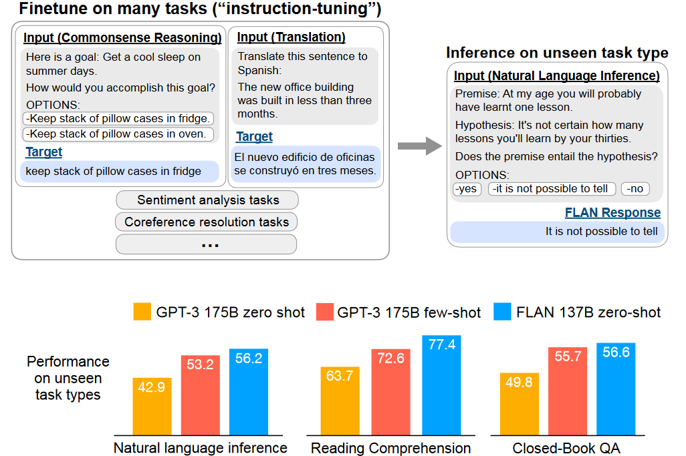
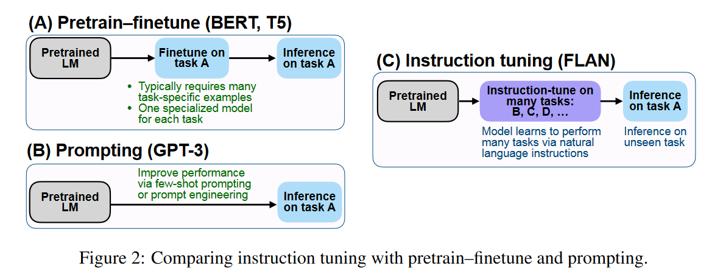
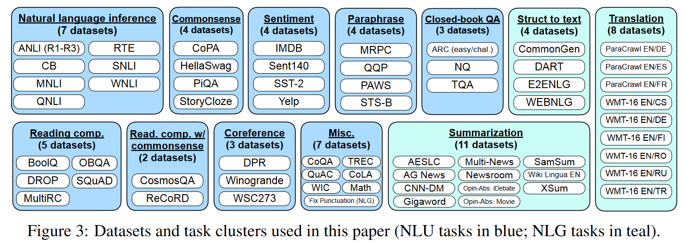
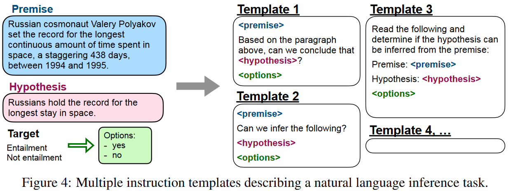

# FLAN
[Finetuned Language Models Are Zero-Shot Learners](https://arxiv.org/pdf/2109.01652.pdf) [ICLR 2022]
## 1. Introduction

大语言模型（LMs），如 GPT-3，已被证明能很好地完成 few-shot learning。然而，它们在 zero-shot learning 方面却不那么成功。例如，在阅读理解、问题解答和自然语言推理等任务上，GPT-3 的 zero-shot 的效果比 few-shot 的效果差很多。原因是，如果没有 few-shot 提供的少量示例，模型就很难在与预训练数据格式不相似的提示上表现出色。

在本文中，我们探索了一种简单的方法来提高大型语言模型的 zero-shot 效果，从而扩大其受众范围。

Key-Insight：

- **NLP 任务可以通过自然语言指令（natural language instructions）来描述**

- 通过使用监督学习来然**提高语言模型“执行指令描述的任务”的能力**

- 达到：甚至指令所要求的任务在训练数据集里**没有出现过，也能很好的完成指令所要求的任务**，即更好地zero-shot

例如 "这篇电影评论的情感是正面的还是负面的？"或 "将'你好吗'翻译成中文"。我们使用一个包含 137B 个参数的预训练语言模型，并在将 60 多个通过 **natural language instructions** 表达的 NLP 数据集进行混合后的大数据集上对模型进行 **instruction tuning**。我们将这一结果模型称为 FLAN，即 Finetuned Language Net。

为了评估 FLAN 在没见过的任务上的zero-shot performance，我们根据任务类型将 NLP 数据集划分为不同的cluster，使用一部分cluster对 FLAN 进行 instruction tuning，在另一部分clusters进行evaluation。

例如，如下图所示，为了评估 FLAN 执行自然语言推理的能力，我们在一系列其他 NLP 任务（如常识推理、翻译和情感分析）上对模型进行 instruction tuning。这种设置可确保 FLAN 在 instruction tuning 过程中不会遇到任何自然语言推理任务，并评估其在zero-shot下进行自然语言推理的能力

instruction tuning 是一种简单的方法，如下图所示，它结合了 "Pretrain–finetune"范式和 "Prompting "范式的优点。 

## 2. Method

### 2.1 Task & Template
从零开始构建 instruction tuning 数据集是比较麻烦的，本文将研究界现有的数据集转化为指令格式（instructional format）。我们将 Tensorflow Datasets 上公开提供的 62 个文本数据集（包括语言理解和语言生成任务）聚合成一个更大的Mixture

对于每个数据集，我们都会人工制作十个不同的的 template，使用自然语言指令来描述该数据集的任务。虽然这十个模板中的大多数都描述了原始任务，但为了增加多样性，我们还为每个数据集添加了最多三个 "turned the task around "的模板（例如，对于情感分类，我们添加了要求生成电影评论的模板）。

然后，我们在所有数据集的 Mixture 上对预训练好的语言模型进行 instruction tuning，每个数据集中的examples 都通过随机选择的instruction template 进行格式化。下图展示自然语言推理数据集的多个 instruction template。

### 2.2 Evaluation Splits
我们感兴趣的是 FLAN 如何执行 instruction tuning 中没见过的任务，因此定义什么算作未见的任务至关重要：

- 虽然之前的一些工作通过不允许相同的数据集出现在训练中来定义未见的任务
  
- 本文使用更保守的定义，利用Figure 3中的任务集群。就是说，不仅要求任务的数据集在预训练和instruction tuning过程中没有出现过，而且要求相同任务的类型的数据集在instruction tuning过程中也没有出现过。 

- 