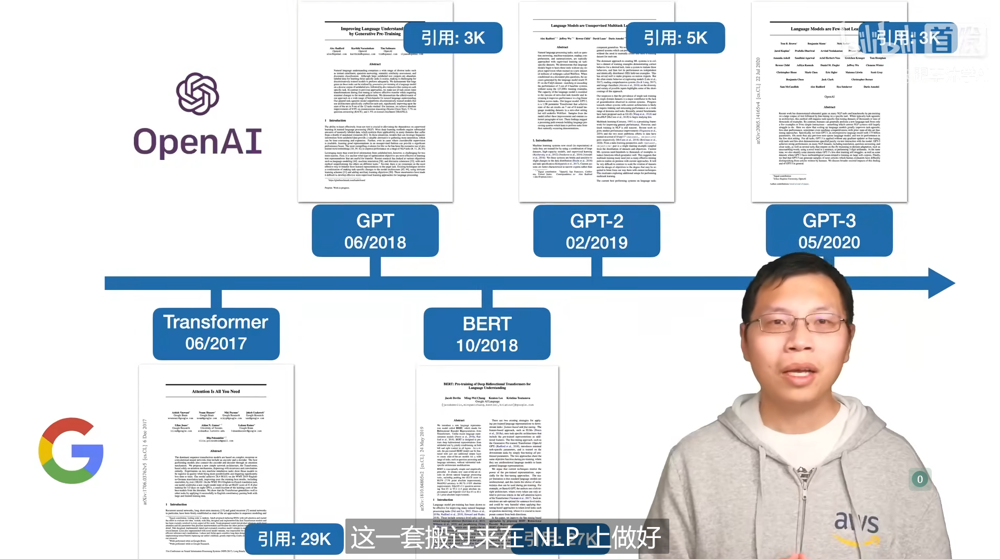

# GPT
总览一下发展历史

## 1. GPT-1
### 1.1 摘要

解决什么问题：

- 自然语言处理中,labeled text很少，unlabeled text很多

- 希望能在 unlabeled text上预训练一个语言模型，然后再在 labeled text上fine-tune

挑战：以前为啥没人做NLP的预训练？

- 上面提到的 labeled text很少，unlabeled text很多

- NLP中的模型，通常是用于特定任务的，比如机器翻译，问答系统等等。这些任务的输入都是有结构的，比如机器翻译的输入是一句话，问答系统的输入是一个问题。不容易以一种统一的方式进行预训练

创新：

- 使用Transformer而不是RNN（当时Transformer出来才几个月）

- **用 unlabeled text 来预训练一个通用的语言模型**

- 然后再用这个模型来做特定任务的fine-tune，**不需要大幅度改变模型的结构以适应不同的任务** 

### 1.2 具体方法
#### 1.2.1 Unsupervised pre-training

第一个目标函数：最大化训练文本出现的概率

使用的是Transformer的decoder，因为训练方式是用标准的语言模型（用前面的词预测之后的词），所以要使用decoder的掩码机制。具体流程：

!!! note "与BERT的区别"
    本质区别不是说一个选了Transformer encoder，一个选了Transformer decoder，而是说GPT预训练目标是做标准语言模型，而BERT预训练目标是做“完形填空”，所以GPT用的是decoder，BERT用的是encoder。标准语言模型是比“完形填空”更加困难的，所以GPT的技术路线更难，但是模型堆大了后天花板会更高。

#### 1.2.2 Supervised fine-tuning
在微调任务中，用的是labeled text。
以一种类似于文本分类的形式：

作者还发现把预训练时的目标也拿来，加到微调的目标里，效果会更好：

**那么，怎么办NLP中多种多样的子任务都转换为一个“文本分类”的形式呢？**下一小节就介绍了这个问题。

#### 1.2.3 Task-specific input transformations
NLP中四大类型的子任务：

- 分类（classification）：给一段文本，判断对应的标号（e.g. 将用户的评价分类为积极或消极）

- 蕴含（Entailment）：看Premise和Hypothesis两段文本，判断Premise是否蕴含（支持）Hypothesis（e.g. Premise: “A 送给 B 一束玫瑰” Hypothesis: “A 喜欢 B.”）

- 相似度（Similarity）：看两段文本，判断它们的相似度（e.g. 判断两个文本是否显相似以去重；判断搜索词与文本是否相似以进行文本检索）

- 多选题（Multiple choice）：给一段文本和几个选项，判断哪个选项最符合文本的意思（e.g. 给一段新闻，判断哪个选项是标题）

如何把这些都转换为1.2.2里的“文本分类”的形式呢？看一张图即可：

!!! note
    要注意上图中的`start`，`Delim`，`Extract`都是特殊的记号，与词典中的其他token不同。
### 1.3 实验
数据集：BooksCorpus（有七千个未发表的书籍）

模型大小（1亿个参数左右）：12 层 Transformer decoder，768 维的隐藏层，12 个注意力头

## 2. BERT

在GPT-1之后发表的，BERT-base的模型大小和GPT-1基本一致，BERT-large的模型大小是BERT-base的三倍左右，因为BERT使用的训练数据集更大一些，不只有BooksCorpus，还有Wikipedia。(大概是GPT-1使用的数据集的三倍左右)

BERT-large：3亿个参数
## 3. GPT-2

### 3.1 摘要

做了一个WebText数据集（百万级别的文本），比BERT用的数据集更大；同时模型大小达到了15亿参数（十亿级别的参数），但发现相比BERT的优势也没有很大，所以把Zero-shot 作为这篇论文的主要卖点。

**解决什么问题：**

现在的模型泛化性不是很好，一个数据集上训练好的任务很难直接用到别的数据集和任务上，所以需要fine-tune，但是：

- 微调时还得重新训练模型

- 微调时还得有标注数据

**创新：**

预训练模型拓展到一个新的任务上还是有一定的成本的，所以作者提出了Zero-shot的概念，即在一个任务上预训练好的模型，可以直接用到另一个任务上，而不需要重新训练模型，也不需要标注数据。

### 3.2 具体方法

训练方法和GPT-1的预训练方法一样，只是数据集更大，模型更大。

模型上有一些改变。

之前GPT-1在下游任务做微调的时候，引入了一些模型在预训练期间没有见过的符号，如`Start`, `Delim`, `Extract`，在fine-tune的时候模型才会逐步认识这些符号。由于GPT-2并不做fine-tune，所以在做下游任务的时候，不能通过这些符号来将下游任务进行转化了，而是要通过模型已经认识的，更加“自然语言”的方式对模型进行提示。

作者举了些例子：机器翻译

!!! Note
    后来，这样的方法被称为prompt

为什么这样是可行的？作者给出的解释是
- 模型足够强大，模型能够理解这些prompt
- 可能数据集里面本身就有这些prompt，比如数据集里面可能就有“Translate English to French”这样的prompt：
    

### 3.3 实验

模型规模：

最大可以达到15亿个参数

实验主要是和别的做Zero-shot的模型进行对比，而不是和BERT，GPT-1直接比。当然，比别的做Zero-shot的模型用的数据集大，模型大，效果自然更好，但与专门做下游任务的有监督训练的模型相比，效果只是略微好一点，或者还是差很多：

## 4. GPT-3
### 4.1 摘要
文章题目：Language Models are Few-Shot Learners

是技术报告，而不是一个论文。

GPT-2的效果一般，GPT-3不再追求完全的Zero-shot，而是追求Few-shot，即只用很少的下游任务样本就能做到很好的下游任务效果。

1750亿个参数，比GPT-2大了10倍。搞到这么大，还要在子任务上训练是很难的，所以作者提出了一种新的训练方法，叫做Few-shot learning。在针对子目录做微调的时候不对预训练的模型进行任何梯度计算和更新。

**想解决的问题：**
- 对子任务微调，需要子任务的标注数据
- 训练模型的泛华性：当你微调出来效果很好的时候，未必就是你微调地好，有可能是预训练的数据和你的子任务数据集很相似，所以你的模型在预训练的时候就已经学到了子任务的知识，所以当你把预训练模型换到一个和预训练数据集不相似的，专业性更高的子任务上时，效果可能就不好了。

**创新：**
- 就算是Few-shot，也不对预训练的模型进行任何梯度计算和更新。提出两个新名词：Meta-learning和in-context learning 
- Meta-learning：就是在大数据集上预训练一个模型

!!! note
    few-shot learning：给10-100个样本

    ont-shot learning：给1个样本

    zero-shot learning：不给样本

    如何区分Few-shot, One-shot, Few-shot, Fine-tune
    
    
    
    **one-shot, few-shot 都是希望模型在做前向推理的时候，通过attention抓取输入的例子中的一些上下文信息，然后结合这些上下文信息来做推理。**
  
### 4.2 具体方法

模型和GPT-2的模型比较相似，也借鉴了Sparse Transformer的一些改动

### 4.3 实验

!!! note
    为什么Batch size设置的这么大——因为批量大小一大，每台机器的计算量会变高，通信量也变小一些。小模型一般不用较大的batch size， 因为小模型容易过拟合，batch size一大。

数据是基于Common Craw的，GPT-2的时候觉得Common Craw太脏了。现在不得不用了，做了一些数据清洗（训练了一个分类器），去重（lsh算法）

分布式训练的时候做了张量并行，模型并行（流水线并行），用的是一个DGX-1的集群

### 4.4 局限性

- Few-shot是假如真的需要很多样本怎么办，难道要把子任务的数据集都放进去作为Few-shot的example吗？

- 我每一次都要在Few-shot里加上example，我上次加了这次能不能不加？

## 5. Instruct-GPT
### 5.1 摘要
**解决的问题：**GPT-3有的时候会输出一些“有毒”的内容，或者一本正经的胡说八道。

**Key-insight：**原本的语言模型的预训练目标函数是最大化训练文本出现的概率，但是这样的目标函数并不完全是我们想要的，我们想要的是让模型生成的文本更加符合我们的意图（alligned）。

**创新：**
- 还是要做fune-tuning
- 使用reinforcement learning from human feedback(RLHF)来做fine-tuning

**主要方法：**
!!! note "Three steps of method"

    === "Step 1"
        
        找了一些人来写问题，找一些人来写答案，然后把问题和答案拼接起来，来进行fine-tuning，得到的一个叫SFT（Supervised Fine-Tuning）的模型。
    
    === "Step 2"
        对一个问题，用SFT生成一些答案，然后招人来对这些答案进行排序。得到一个排序形式的标注，训练一个RM（Reward Model）。RM接受prompt和一个答案，输出一个分数，分数的相对高低符合人给出的排序。
        
    
    === "Step 3"
        
        用RM来对SFT生成的答案进行打分，利用这个打分来训练SFT

这么看来，通过训练一个RM模型，可以减少对人工标注数据的需求量，不然其实如果人工标注的答案够多，直接只做step1即可。

**效果：**
真实性比GPT-3好；有毒性比GPT-3低；但bias和GPT-3差不多；在某些问题下做微调，可能在另一些问题下效果会变差。但还是会犯简单的错误。

### 5.2 具体方法

使用的对齐方法其实是已有的方法，只是都用在别的领域。

