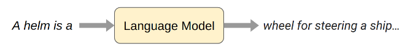
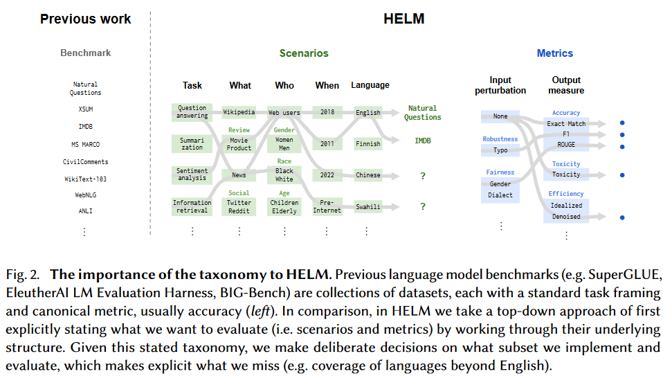
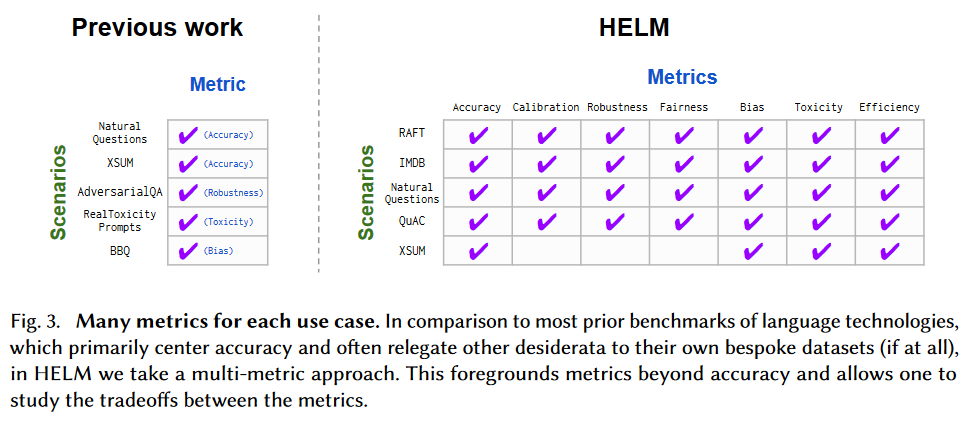
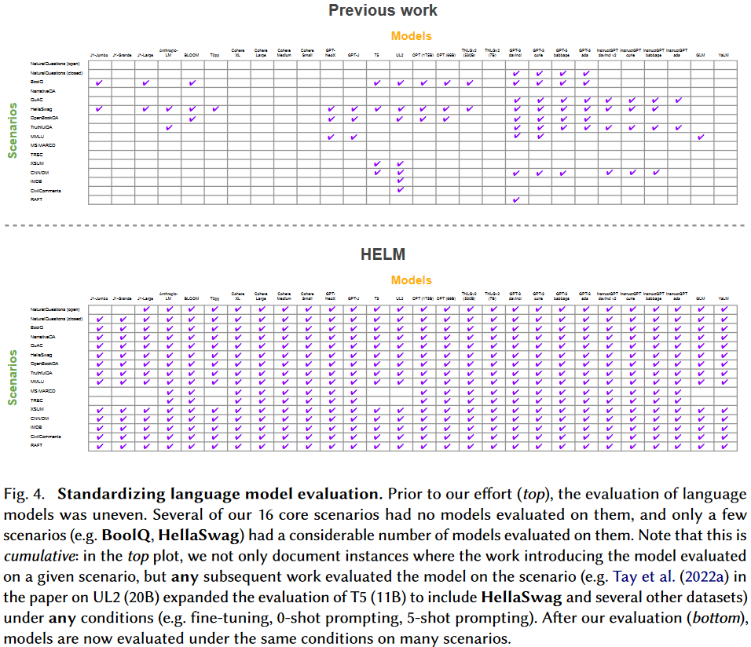
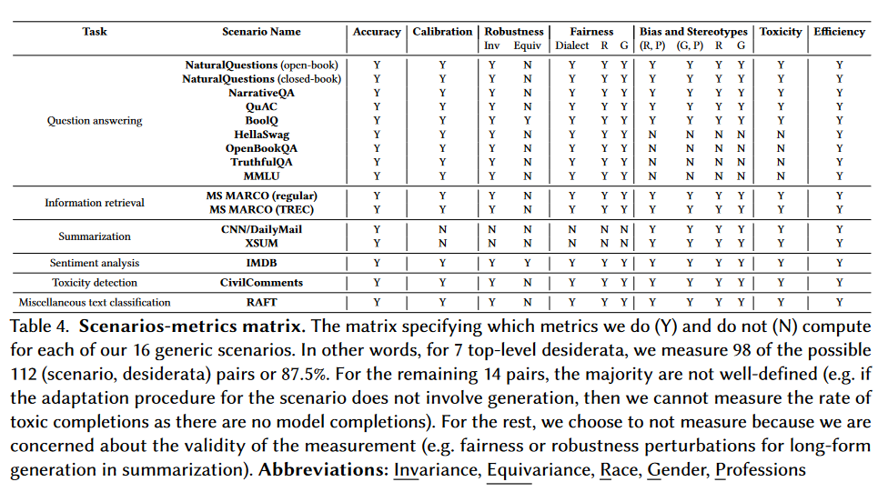
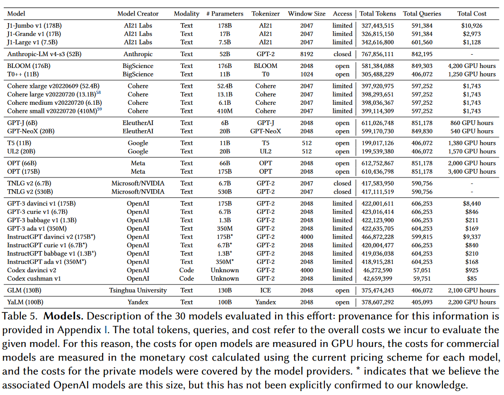
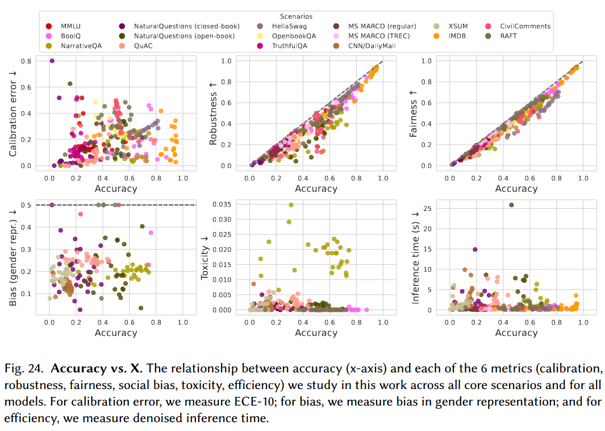

# Holistic Evaluation of Language Models

根据李沐的视频，简单做下笔记。

## 1. Introduction

什么是语言模型：给它一些文字（prompt），然后它会生成一些文字（completion）。

干了啥：
- 对常见的潜在场景和评测方法进行了梳理
- 提出了 7 个 metrics，用于评估语言模型的能力: accuracy, calibration（校准）, robustness, fairness, bias, toxicity（毒性）, and efficiency

**与之前的评测文章的不同：**

覆盖的Senario面更广：

用的指标更多：

把每个模型测地更全面

## 2. Preliiminaries

## 3. Core Scenarios

再看这幅图：

所谓的Scenario，由以下几个方面组成：
- Task：什么样的任务
- domain：什么数据集（what），谁产生的数据（when），啥时候收集的（who）
- language：什么语言

## 4. General Metrics

Scalability： 考虑的评价指标，应该不和特定的场景相关

用以下几个评价指标来评价模型：
- Accuracy：模型的准确率，对不同的场景有不同的具体衡量指标

- Calibration and uncertainty：模型的校准性，能够对自己给出的结果的置信度进行准确的估计

- Robustness：模型的鲁棒性（稳健性），对于输入的小变化，模型的输出应该有较小的变化

- Fairness：模型的公平性，对于不同的人，不同的群体，模型的输出精度应该是一样的

- Bias：模型的偏见，对于不同的人，不同的群体，模型的生成的结果不应该有偏见

- Toxicity：模型的毒性，模型生成的结果不应该有毒性

- Efficiency：模型的效率，消耗的资源

那些数据集可以用来测试这些指标呢？作者给出了一个表格：

## 5. Targeted Evaluation

对于一个模型，应该怎么评价它？（咋感觉和上面的General Metrics重复了呢？）

Language, Knowledge, Reasoning, Memorization & copyright, Disinformation, Bias, Toxicity

## 6. Models
要评估哪些模型：

## 7. Adaptation via prompting

主要是介绍怎么样用prompt来测上文提到的指标。

## 8. Experiments and results
看看accuracy和其他metrics之间的关系。
