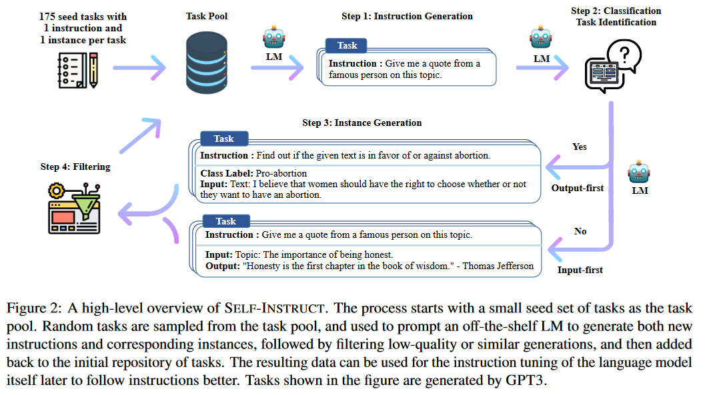
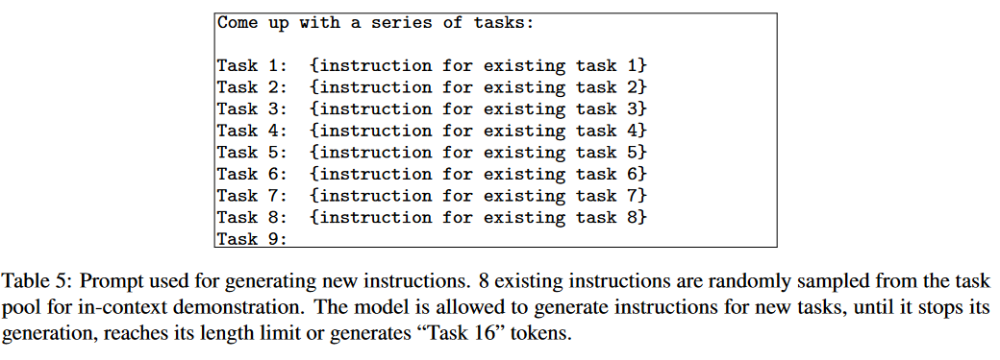

# Self-Instruct

[SELF-INSTRUCT: Aligning Language Models with Self-Generated Instructions](https://arxiv.org/pdf/2212.10560.pdf)[ACL 2023]

## 1. Introduction

目前的instruction tune 需要 human-written instruction data。然而，收集此类 instruction data：

- 成本高昂
  
- 多样性往往有限，大多数人都追逐热点 NLP 任务，因此目前的 dataset 无法涵盖所有的 NLP 任务。

在这项工作中，我们引入了 SELF-INSTRUCT，这是一种半自动化过程，用于使用模型本身的 instructional signals 对预训练的 LM 进行instruction-tuning。整个过程是一个 iterative bootstrapping 算法（见 Figure 2）。

- 从有限的（例如，在本文中为 175 个）手动编写的任务seed set开始，用于指导整个生成

- 在第一阶段，提示模型生成新任务的指令。此步骤利用现有的指令集合来创建覆盖范围更广的指令来定义（通常是新的）任务。给定新生成的指令集，框架还为它们创建输入输出实例，这些实例稍后可用于监督指令调整。最后，在将剩余的有效任务添加到任务池之前，使用各种启发式方法自动过滤低质量或重复的指令。这个过程可以重复多次迭代，直到达到大量任务。

**主要贡献:**

- 我们提出了 SELF-INSTRUCT，一种用少量的人类标记数据生成 instruction data 的方法，用于指导预训练的 LM 进行 instruction-tuning。

- 在实验上证明了方法的有效性

- 我们发布了一个包含 52K instruction data 的大型综合数据集和一组手动编写的novel task，用于构建和评估未来的instruction-following models。

## 2. Method
SELF-INSTRUCT 的大致流程是，它是指使用普通的预训练语言模型生成任务、过滤生成的数据，然后使用生成的数据进行instruction-tuning。

### 2.1 Defining Instruction Data
我们其实是想获得一个 set of instructions $\{I_t\}$，其中的每个 instruction 都对应地定义了一个任务（Task） t，这个任务 t 可以有 $n_t \ge 1$ 个 input-outout instances $D_t = \{ (X_i, Y_i) \}_{i=1}^{n_t}$，其中 $x_i$ 是输入，$y_i$ 是输出。

希望最后微调得到 model M， 可以做到给定一个 task 的 instruction 和 input，就可以输出对应的 output，即 $M(I_t, X_{t,i}) = Y_{t,i}$。

!!! note
    instruction和instances input 在许多情况下没有严格的边界。

    例如，“写一篇关于学校安全的文章”可以是我们期望模型直接响应的有效instruction，同时它也可以表述为“写一篇关于以下主题的文章”作为instruction，而“学校安全”作为instances input
    
    为了鼓励数据格式的多样性，我们允许不需要额外输入的指令（即 X 为空）。

### 2.2 Automatic Instruction Data Generation

Instruction Data Generation 的流程有四步：

1. generating task instructions

2. determining if the instruction represents a classification task

3. instance generation with either an input-first or output-first approach

4. filtering low-quality data

#### Instruction Generation
我们初始化包含 175 个task的task pool（每个task 有 1 个 instruction 和 1 个 instance）

对于每一轮 generation，我们都会从该task pool 中抽取 8 个 task 作为上下文示例。其中 6 个是 human-written 的，2 个是 model-generated 的（之前的轮产生的）。

然后用这 8 个 task 的 instruction 作为 prompt 来让 LLM 生成新的 instruction：

#### Classification Task Identification
因为我们需要两种不同的方法来处理分类和非分类任务，所以接下来我们要确定上一步抽取的instruction 是否代表分类任务。

我们使用 12 个分类指令和 19 个非分类指令，以few-shot prompt 的方式让 LM 来确定这一点。

#### Instance Generation

给定instruction 及其 task type(是否为分类任务)，我们独立地为每条指令生成实例。这我们发现，当使用来自其他任务的instruction-input-output 作为上下文示例进行 prompt 时，预训练的 LM 可以在很大程度上实现这一目标。

一种自然的方法是输入优先方法（**Input-first Approach**），我们可以要求 LM 首先根据 instruction 给出 input，然后生成相应的output。这种生成顺序类似于模型用于响应instruction 和 input 的方式，但这里有来自其他任务的上下文示例。

然而，我们发现这种方法可以生成偏向于一个标签的输入，特别是对于分类任务（例如，对于语法错误检测，它通常生成语法正确的输入）。因此，我们还提出了一种用于分类任务的输出优先方法（**Output-first Approach**），其中我们首先生成可能的类标签，然后根据每个类标签调节输入生成。

我们将输出优先方法应用于上一步中确定的分类任务，并将输入优先方法应用于其余的非分类任务。

#### Filtering and Postprocessing

为了鼓励多样性，只有当新指令与任何现有指令的 ROUGE-L 相似度小于 0.7 时，才会将新指令添加到任务池中。我们还排除了包含一些通常无法被 LM 处理的特定关键字（例如图像、图片、图形）的指令。当为每条指令生成新实例时，我们过滤掉完全相同的实例或具有相同输入但不同输出的实例。根据启发法识别并过滤掉无效的生成（例如，指令太长或太短，实例输出是输入的重复）。

### 2.3 Finetuning the LM to Follow Instructions

创建大规模的instruction data后，我们用它来微调原始LM（即SELF-INSTRUCT）。为此，我们将instruction和instance input concat起来作为prompt，并训练模型以标准监督方式生成 instance output。为了使模型对不同格式具有鲁棒性，我们使用多个模板将instruction和instance input 一起编码。例如，Instruction 可以带或不带“Task:”前缀，输入可以带或不带“Input:”前缀，提示末尾可以带或不带“Output:”，以及不同数量的break线可以放在中间等。

