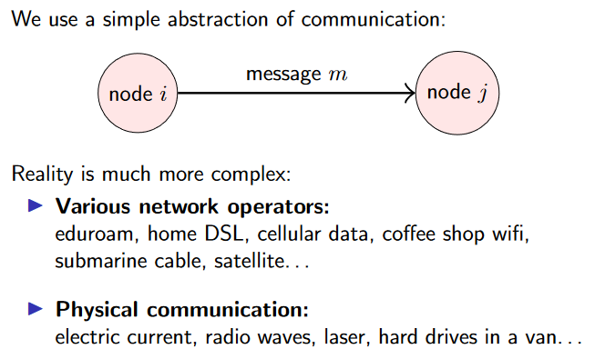
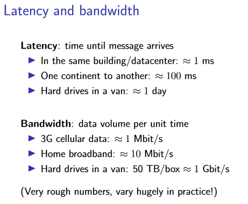

# 1. Introduction
这一节并没有太多实质性的内容，大部分都是一些介绍
## 1.1 About distributed systems
为什么需要分布式系统？

- 本身的应用情景就是分布式的（多台机器，一个系统），例如：互联网、云计算、物联网、区块链等

- 为了更高的可靠性——单机系统的可靠性不够

- 为了更好的性能

- 为了解决一个机器无法解决的问题——例如：一个机器的内存不够，无法处理大数据

## 1.2 Distributed systems and computer networking
分布式系统是在物理的网络之上的抽象：
例如最基本的node i 给 node j 发送一个 message m:
<figure markdown>
  {width = 200}
</figure>

对于网络而言，有吞延迟（Latency）和带宽（Bandwidth）两个指标：
<figure markdown>

</figure>

分布式算法设计的侧重点是：**决定发送哪些message，以及收到message后如何处理。**
