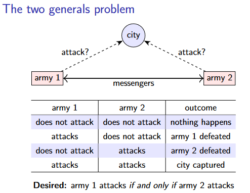
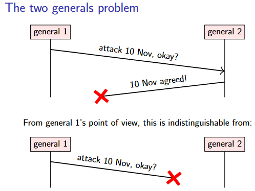
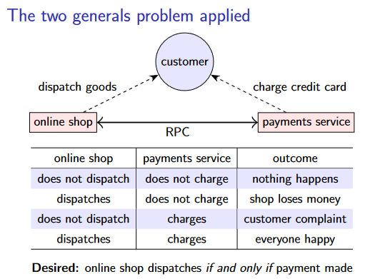
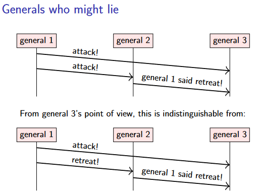
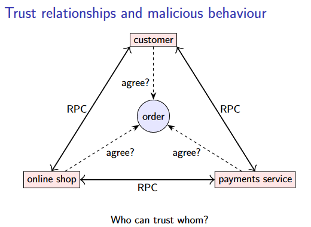
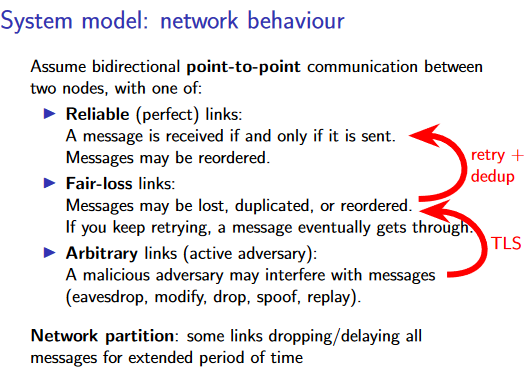
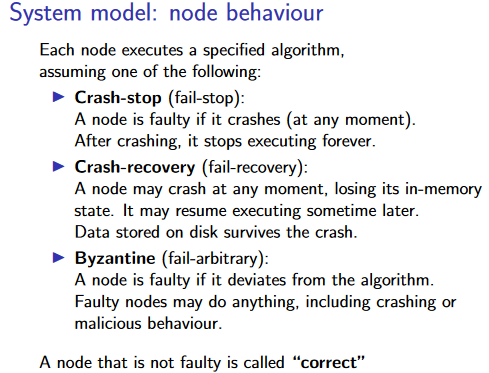
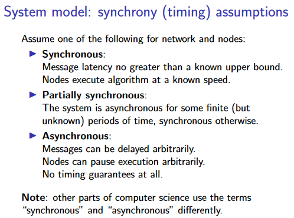
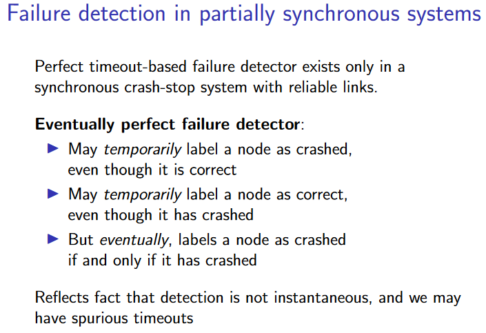

# 2. Models of distributed systems
我们将从分布式系统中的两个经典思想实验开始：两将军问题和拜占庭将军问题。
## 2.1 两将军问题（The two generals problem）
### 2.1.1 思维实验
在两将军问题中，我们设想有两位将军，他们各率领一支军队，想要攻占一座城市。这座城市的防御非常坚固，如果两支军队中只有一支军队进攻，那么这支军队就会失败。然而，如果两支军队同时进攻，他们将成功攻下该城。
<figure markdown>

</figure>
两位将军需要协调他们的进攻计划。由于两支军队的营地相距甚远，他们只能通过信使联系，这就给协调工作带来了困难。信使必须通过城市控制的领土，因此他们有时会被抓获。因此，一名将军发出的信息可能会被另一名将军收到，也可能不会被收到，除非收到对方的明确回复，否则发信人不知道他们的信息是否被送达。**如果一个将领没有收到任何信息，就不可能知道这是因为另一个将领没有发送任何信息，还是因为所有的信使都被抓获了。**
<figure markdown>

</figure>
两位将军应该使用什么协议来商定计划？对于**每个将领**来说都有两种选择：

- 要么该将领在发出信息后，无论之后有没有收到回复，都继续进攻——在这种情况下，承诺进攻的将军有可能独自进攻。

- 要么该将领在进攻之前等待确认。在这种情况下，等待确认的将军将问题转移给了另一个将军，后者现在必须决定是进行攻击（冒孤军奋战的风险）还是等待确认。

问题在于，无论交换多少信息，双方将军都无法确定对方军队是否会发起进攻。反复的来回确认可以逐渐增加将军们达成一致的信心，但可以证明他们无法通过交换任何有限数量的信息达到确定性。（有点像是黑暗森林的感觉，有无限延长的“猜疑链”）

这个思想实验表明，在分布式系统中，一个节点无法确定另一个节点的状态（**No common knowledge**）。一个节点要想知道某些事情，唯一的办法就是通过信息来传达这种知识。从哲学的角度来看，这也许与人类之间的交流类似：我们没有心灵感应，因此让别人知道你在想什么的唯一方法就是通过交流（通过语言、文字、肢体语言等）。

### 2.1.2 现实实例
看起来两将军问题似乎是没有办法被解决的，那现实中的系统就必须要忍受这种不确定性吗？这里举一个现实中的实例：

网上购物时，商家和支付处理服务通过RPC进行通信，其中一些消息可能会丢失。我们希望达到的效果是“商家发货”和“扣款”两件事应当同时发生/不发生（这里隐去例如店家接单这样的细节）：
<figure markdown>

</figure>

在现实中，网上购物的例子并不完全符合两将军问题的问题：在这种情况下，对于支付服务来说，在没有确定店家是否发货时，进行“扣款”是安全的，**因为如果商店最终无法发货，它可以退还付款。** 

事实上，“扣款”是可以撤销（undo）的（不像军队被打败），这使得问题是可以解决的。如果商店和支付服务之间的通信中断，在恢复通信后，商家和支付服务可以交流各自的状态，以

## 2.2 拜占庭将军问题（Byzantine generals problem）

### 2.2.1 思维实验
拜占庭将军问题（Byzantine generals problem）是由Lamport于1982年提出的。

假如我们想要攻占一座城市，有三支或更多的军队。将军们再次通过信使进行通信，不过这次我们假定如果发送了信息，它总是会被正确送达。

这个问题的挑战在于一些将军可能是 "叛徒"：也就是说，他们可能会故意和恶意地误导和混淆其他将军。我们称这些叛徒为恶意的（malicious），而其他将军则是诚实的（honest）。这种恶意行为的一个例子如下所示：

!!! example
    <figure markdown>
        
    </figure>
    将军3从将军1和2那里收到了两条相互矛盾的信息。将军1告诉将军3进攻，而将军2声称将军1命令撤退。将军3不可能确定将军2是否在撒谎（第一种情况），或者将军2是否诚实，而将军1却在发布相互矛盾的命令（第二种情况）

想要解决这个问题是很困难的：事实上，如果在有叛徒的背景下再加上不可预测通信延迟，可以证明拜占庭将军问题只有在严格少于三分之一的将军是恶意的情况下才能解决[^1] 。也就是说，在一个有3f + 1个将军的系统中，恶意的将军不超过f个。例如，一个有4个将军的系统可以容忍f = 1个恶意将军，一个有7个将军的系统可以容忍f = 2个恶意将军。

### 2.2.2 现实意义
拜占庭将军问题是否具有实际意义？实际的分布式系统往往涉及**复杂的信任关系**。例如：

- 客户需要相信网店会实际交付他们订购的货物，尽管如果货物从未到达或被收取过高的费用，他们可以通过银行对付款提出异议。但是，如果网上商店允许客户订购商品而不付款，这一弱点无疑会被欺诈者利用，因此商店必须假定客户可能是恶意的。

- 另一方面，对于在同一数据中心运行的隶属于商店的服务之间的RPC，一个服务可能会信任由同一公司运行的其他服务。

- 支付服务并不完全信任商店，因为有人可能建立一个欺诈性的商店或使用被盗的信用卡号，但商店可能信任支付服务。以此类推。最后，我们希望客户、网店和支付服务就任何订单达成一致。

<figure markdown>

</figure>
拜占庭将军问题是对这种复杂信任关系的简化，但它是研究某些参与者可能有恶意行为的系统的良好起点。

[^1]: https://groups.csail.mit.edu/tds/papers/Lynch/jacm88

## 2.3 System models
在设计分布式算法时，系统模型（system model）是我们对可能发生的故障进行假设的方式。

### 2.3.1 Network behaviour
大多数分布式算法假定网络在一对节点之间提供双向信息传递，也称为点对点或单播通信。真实网络有时允许广播或组播通信（同时向多个接收者发送一个数据包，例如用于发现本地网络中的打印机），但从广义上讲，假设仅提供单播通信是当今互联网的一个良好模型。在第4讲中，将介绍如何在单播通信的基础上实现广播。

没有一个网络是完全可靠的：即使是经过精心设计的具有冗余网络链接的系统，也有可能出错。然后，我们可以选择假定这些链接的可靠程度。大多数算法都会假设以下列出的三种选择之一：

<figure markdown>

</figure>

Arbitrary links 是互联网通信的精确模型：只要通信通过网络（无论是咖啡店的wifi还是互联网骨干网），该网络的运营商就有可能以任意方式干扰和操纵您的网络数据包。操纵网络流量的人也被称为主动对手。幸运的是，使用加密技术几乎可以将 Arbitrary links 变成Fair-loss links。传输层安全（TLS）协议在https://，它可以防止主动对手窃听、修改、欺骗或重放流量。

在不考虑延迟的情况下，可以通过重试和去重来将 Fair-loss links 转换为 Reliable links

### 2.3.2 node behaviour
<figure markdown>

</figure>

在 Crash-stop 模型中，我们假设节点 crash 后将永远无法恢复。对于无法恢复的硬件故障，或者手机掉进马桶后永久失灵的情况，这是一个合理的模型。对于软件崩溃，Crash-stop 模型似乎并不现实，因为我们可以直接重启节点，之后节点就会恢复。尽管如此，一些算法还是假设了 Crash-stop 模型，因为这使得算法更加简单。在这种情况下，崩溃并恢复的节点必须作为新节点重新加入系统。

Crash-recovery 模型明确允许节点在 crash 后重新启动并恢复处理。当节点 crash 并重新启动时，我们假设其内存中的所有状态都会丢失，但其在磁盘上持久存储的任何数据都会保留。**该模型没有假设崩溃节点需要多长时间才能恢复，而且崩溃节点有可能永远无法恢复。**

Byzantine model 是节点行为的最一般模型：在拜占庭将军问题中，故障节点不仅可能崩溃，还可能以任意方式偏离指定算法，包括表现出恶意行为。节点实现中的错误也可归类为拜占庭故障。然而，如果所有节点都运行相同的软件，那么它们都会出现相同的故障，因此任何以少于三分之一的节点出现拜占庭故障为前提的算法都无法容忍这种故障。原则上，我们可以尝试使用同一算法的多个不同实现，但这很少是一个实际的选择。因此，我们通常将 "拜占庭 "一词用于指代故意偏离协议的情况，而不是用于指代漏洞。

### 2.3.3 synchrony (timing) assumptions
!!! note
    “同步”和“异步”在不同的语境下常常有不同的含义，例如，在RPC和I/O操作的上下文中，"同步 "通常指 "调用者阻塞/等待操作完成"，而 "异步 "指 "调用者在发出请求后继续执行，而不等待结果"。在此处他们的语义又与此不同。

<figure markdown>

</figure>

Synchronous system 是我们最希望拥有的系统：通过网络发送信息的时间永远不会超过某个已知的最大延迟，节点总是以可预测的速度执行其算法。如果假设系统是同步的，那么分布式计算中的许多问题都会变得简单得多。假设同步是很有诱惑力的，因为网络和节点在大多数情况下都不会出太大问题，所以这种假设往往是正确的。

不幸的是，如果违反了有界延迟和有界执行速度的假设，即使只是很短时间，即使这种情况很少发生，为同步模型设计的算法也经常会出现灾难性的失败。在实际系统中，有很多原因导致网络延迟或执行速度有时会发生巨大变化，例如：

- Message loss requiring retry 

- Congestion/contention causing queueing

- Network/route reconfiguratio

节点执行代码的速度也不可以准确地预测，会有各种原因导致的停顿：

- Operating system scheduling issues, e.g. priority inversion

- Stop-the-world garbage collection pauses

- Page faults, swap, thrashing

这意味着在实际系统中，假设同步系统模型是非常不安全的。大多数分布式算法需要针对异步（Asynchronous）或部分同步（Partially synchronous）模型进行设计。

## 2.4 容错与高可用
在对分布式系统有了基本的模型后，我们来看看分布式系统的主要目标。
### 2.4.1 什么是可用性？
从商业角度来看，最重要的通常是网站等服务的可用性（availability of a service）。例如，网上商店希望能够在白天或晚上的任何时间销售产品：网站的任何中断都意味着失去赚钱的机会。对于某些服务，甚至与客户签订合同协议就要求服务持续可用。如果服务不可用，也会损害服务提供商的声誉。

服务的可用性通常是根据其**在一定时间内正确响应请求的能力**来衡量的。服务 "可用 "或 "不可用 "的定义可能有些武断：例如，如果加载一个页面需要 5 秒钟，我们还认为该网站可用吗？如果需要 30 秒呢？一小时呢？

通常情况下，服务的可用性预期被形式化为为服务级别目标（service-level objective，SLO），该目标通常规定了**在指定超时时间内返回正确响应的请求百分比**（直观的感觉就是每个任务有其ddl，在ddl前完成的任务占总任务的比），由特定客户在一定时间内进行测量。服务级协议（service-level agreement，SLA）是一种合同，规定了某些 SLO 以及未达到 SLO 的后果（例如，服务提供商可能需要向客户退款）。

## 2.4.2 容错以保证可用性
故障（如节点崩溃或网络中断）是造成系统不可用的常见原因。为了提高可用性，我们可以降低故障发生的频率，也可以**设计出在某些组件出现故障时仍能继续工作的系统——这种方法称为容错**。通过购买更高质量的硬件和引入冗余来降低故障频率是可行的，但这种方法永远无法将故障概率降为零。许多分布式系统都采用了容错方法。

容错总是相对于可容忍的最大故障数而言的：例如，一些分布式计算法在少于一半节点崩溃的情况下能够工作，但如果一半以上的节点崩溃，这些算法就会停止工作。想要容忍无限数量的故障是没有意义的：如果所有节点都崩溃并且无法恢复，那么无论多么聪明的算法都无法完成任何工作。

在某些系统中，单个组件出现故障会导致整个系统中断。这样的组件被称为单点故障（single point of failure，SPOF），容错系统一般会尽量避免出现任何单点故障。例如，互联网在设计上就没有单点故障：没有一个服务器或路由器的损坏会导致整个互联网瘫痪（尽管某些组件的丢失，如关键的洲际光纤链路，确实会造成明显的中断）。

## 2.4.3 如何容错
容错的第一步是检测故障，这通常是通过故障检测器（failure detector）来实现的。故障检测器通常检测崩溃故障。拜占庭故障并非总能被检测到，不过在某些情况下，拜占庭行为确实会留下证据，可用于识别和排除恶意节点。

在大多数情况下，故障检测器的工作原理是定期向其他节点发送信息，如果在预期时间内没有收到任何回应，则将该节点标记为崩溃。理想情况下，我们希望只有当节点真的崩溃时才会发生超时（这被称为完美的故障检测器）。然而，两将军问题告诉我们，这并不是一种完全准确的检测崩溃的方法，因为没有响应也可能是由于消息丢失或延迟造成的。

只有在具有 reliable links 的 synchronous crash-stop 中，才存在完美的超时故障检测器；在 Partially synchronous 系统中，不存在完美的故障检测器。此外，在Asynchronous 中，也不存在基于超时的故障检测器，因为超时在异步模型中毫无意义。然而，在部分同步系统中存在一种有用的故障检测器：eventually perfect failure detector[^2]——检测并非瞬时完成，可能会出现虚假超时的情况。

<figure markdown>
{width=600}
</figure>

我们之后会学习如何使用这种故障检测器来设计容错机制，并自动从节点崩溃中恢复。利用这种算法，我们就有可能构建出可用性极高的系统。

容错崩溃还能让日常操作变得更容易：例如，如果一项服务可以容忍三个节点中的一个节点不可用，那么就可以通过安装软件升级并一次重启一个节点来推出软件升级，而其余两个节点则继续运行服务。能够以这种方式推出软件升级，而客户不会察觉到任何中断，这对许多不断改进软件的组织来说非常重要。

[^2]: http://courses.csail.mit.edu/6.852/08/papers/CT96-JACM.pdf