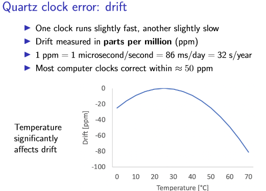
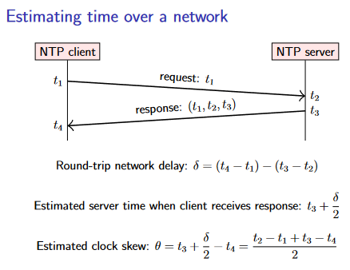
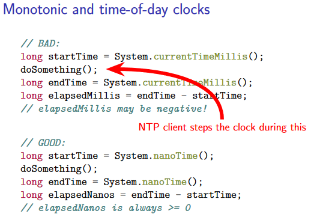
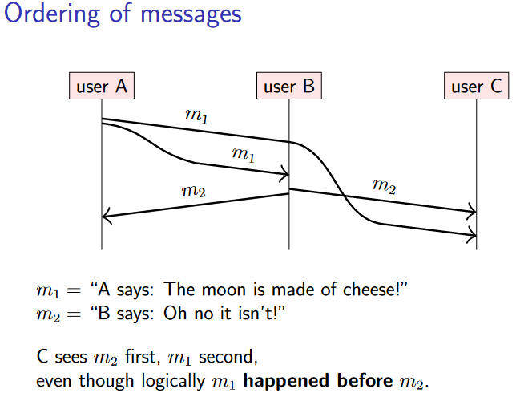
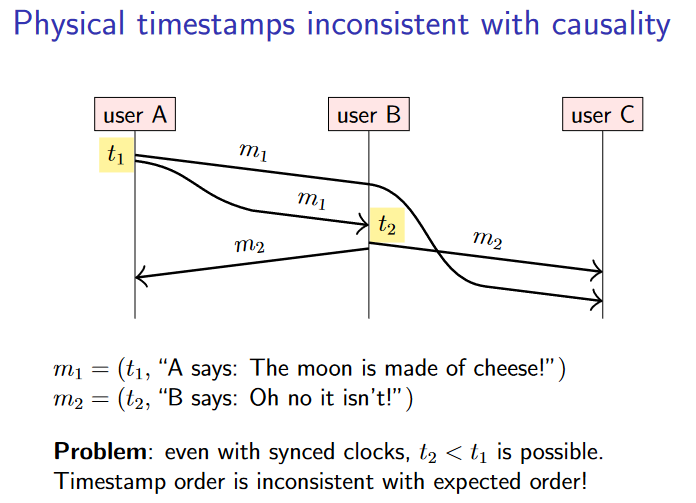
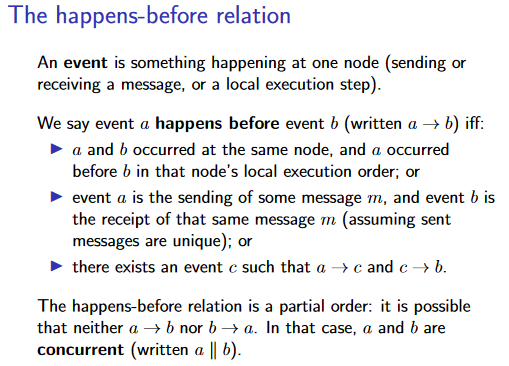
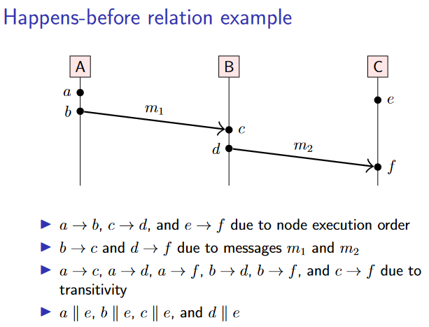
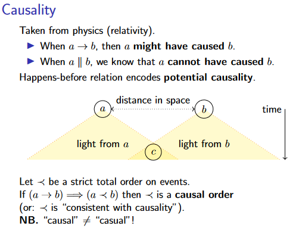

# 3. Time, clocks, and ordering of events
在本讲中，我们将探讨分布式系统中的时间概念，在前面，我们对时间的假设构成了分布式算法所依赖的系统模型的关键部分（同步、异步）。例如：

- 基于超时的故障检测器需要测量时间，以确定何时超时。

- 操作系统广泛依赖于定时器和时间测量，以便安排任务、跟踪 CPU 使用情况以及其他许多用途。

- 应用程序通常希望记录事件发生的时间和日期：例如，在调试分布式系统中的错误时，时间戳有助于调试，因为它们允许我们重建不同节点上同一时间发生的事件。

所有这些都需要或多或少的精确时间测量。

## 3.1 Physical clocks
### 3.1.1 物理上如何计时？
物理时钟以秒为单位测量时间。它们包括基于钟摆或类似装置的模拟时钟/机械时钟，以及基于振动石英晶体等的数字时钟。大多数腕表、每台电脑和手机、显示时间的微波炉以及许多其他日常用品中都有**石英钟（Quartz clocks）**。物理时钟有时也被称为 wall clocks（挂钟），尽管它们不需要固定在墙上。

石英钟很便宜，但并不完全准确。由于制造缺陷，某些时钟的运行速度略快于其他时钟。此外，振荡频率随温度变化。典型的石英钟在室温下调整得相当稳定，但明显较高或较低的温度会减慢时钟的速度。时钟运行快或慢的速率称为**漂移（drift）**。

<figure markdown>

</figure>

当需要更高的精度时，可以使用**原子钟（atomic clocks）**。这些时钟基于某些原子（例如铯或铷）的量子力学特性。事实上，国际单位制（SI）中一秒的时间单位被定义为铯133原子特定共振频率的9,192,631,770个周期。

另一种获取时间的高精度方法是依靠 GPS 卫星定位系统，或类似的系统，例如 Galileo 或 GLONASS。这些系统的工作原理是：

- 让一些卫星携带原子钟，并在地球轨道上运行。

- 卫星广播当前时间和位置

- 通过将 GPS 接收器连接到计算机，只要接收器能够从卫星获取清晰的信号，就可以获得精确到几分之一微秒的时钟。在数据中心中，通常存在过多的电磁干扰，无法获得良好的信号，因此 GPS 接收器需要在数据中心大楼的屋顶上安装天线。
### 3.1.2 常见时间标准
**基于原子钟（国际原子时，TAI）**的时间测量系统运行良好，但它与我们基于日出和日落的日常时间感知脱节。地球绕自身轴旋转一圈并不需要铯 133 共振频率的 24×60×60×9,192,631,770 个周期。事实上，地球的自转速度甚至不是恒定的：它会因潮汐、地震、冰川融化和一些无法解释的因素的影响而波动。**我们现在遇到一个问题：我们对时间有两种不同的定义——一种基于量子力学，另一种基于天文学——而这两种定义并不精确匹配。**

解决方案是**协调世界时（又称世界标准时间，UTC）**，它基于原子时，但包括考虑地球自转变化的修正。在日常生活中，我们使用本地时区的时间（local time zone），不同时区的时间即给UTC加上相应的偏移量，其中比较出名的有：英国当地时区在冬季称为格林威治标准时间 (GMT)，在夏季称为英国夏令时间 (BST)，其中 GMT 定义为等于 UTC，BST 定义为 UTC + 1 小时。

### 3.1.3 闰秒（Leap seconds）
由于地球自转速度的变化，每年都会有一些微小的变化。为了使 UTC 与地球自转保持同步，每隔几年就会插入一个**闰秒（leap second）**。闰秒的插入是由国际地球自转与参考系统服务（IERS）组织决定的，通常是在每年的 6 月 30 日或 12 月 31 日：

- 正闰秒的插入是在 UTC 23:59:59 之后插入一个额外的 UTC 秒，因此 UTC 23:59:59 后的时间是 UTC 23:59:60，然后是 UTC 00:00:00。

- 负闰秒是在 UTC 23:59:59 时直接跳到 UTC 00:00:00。

由于闰秒的原因，一小时并不总是 3600 秒，一天也不总是 86,400 秒。在 UTC 时间刻度中，由于闰秒，一天的长度可能为 86,399 秒、86,400 秒或 86,401 秒。**这使得需要处理日期和时间的软件变得复杂**。

时间戳（timestamp）是特定时间点的表示。常用的时间戳有两种表示形式：Unix 时间和 ISO 8601。对于 Unix 时间，零对应于 1970 年 1 月 1 日，称为纪元。有一些细微的变化：例如，Java 的 `System.currentTimeMillis()` 类似于 Unix 时间，但使用毫秒而不是秒作为单位。

为了正确起见，使用时间戳的软件需要考虑闰秒。例如，如果您想计算两个时间戳之间经过了多少秒，您需要知道这两个日期之间插入了多少闰秒。对于未来大约六个月以上的日期，这是不可能知道的，因为地球自转还没有发生！**软件中最常见的方法是简单地忽略闰秒**，假装它们不存在。 Unix 时间戳和 POSIX 标准采用了这种方法。对于只需要粗粒度计时（例如四舍五入到最近的一天）的软件来说，这很好，因为几秒的差异并不显着。

然而，操作系统和分布式系统通常依赖高分辨率时间戳来精确测量时间，其中一秒的差异是非常明显的。在这种情况下，忽略闰秒可能很危险。例如，假设您有一个 Java 程序，在正闰秒内（即时钟显示 23:59:60），两次调用 `System.currentTimeMillis()`，间隔 500 毫秒。这两个时间戳之间有什么区别？它不能是 500，因为`currentTimeMillis()` 不考虑闰秒（函数返回值语义上是指从调用函数时到纪元所经历地不考虑闰秒的毫秒数）。是不是应该让系统内时钟停止，因此两个时间戳之间的差异为零？文档对这个问题只字不提。

现实也因此出过实际的问题，2012 年 6 月 30 日闰秒处理不当导致当天许多服务同时失败。

如今，一些软件明确处理闰秒，而其他程序仍然忽略它们。目前广泛使用的一种务实解决方案是，当出现正闰秒时，不是将其插入到 23:59:59 到 00:00:00 之间，**而是故意将额外的秒分散在该时间前后的几个小时内。在此期间减慢时钟（或在负闰秒的情况下加快时钟）。这种方法称为涂抹（smearing）闰秒**，但并非没有问题。然而，它是一种实用的替代方案，可以让所有软件都意识到闰秒并且对闰秒具有鲁棒性，而这很可能是不可行的

## 3.2 Clock synchronisation and monotonic clocks
### 3.2.1 NTP for clock synchronisation
原子钟价格昂贵且体积庞大，无法内置于每台计算机和电话中，因此使用了石英钟。由于这些时钟会发生漂移，因此需要不时进行调整，这通常是使用网络时间协议 (Network Time Protocol，NTP) 来完成的。所有主流操作系统都内置了NTP客户端（NTP client）。

由于不可预测的网络延迟，网络上的时间同步变得困难。正如上一讲所提到的，网络延迟和节点的处理速度可能会有很大差异。为了减少随机变化的影响，NTP 会采集多个时间测量样本并应用统计过滤器来消除异常值。

下图显示了 NTP 如何估计客户端和服务器之间的时钟偏差（clock skew）。当客户端发送请求消息时，它会根据客户端的时钟包含当前时间戳t1。当服务器收到请求时，在处理请求之前，服务器会根据服务器的时钟记录当前时间戳t2。当服务器发送响应时，它会回显请求中的值 t1，并且还在回复中包含服务器的接收时间戳 t2 和服务器的响应时间戳 t3。最后，当客户端收到响应时，根据客户端的时钟记录当前时间戳t4。

<figure markdown>

</figure>

这样的估计方法依赖于一个假设：网络延迟在两个方向上大致相同。如果延迟主要由客户端和服务器之间的地理距离决定，则此假设可能是正确的。然而，如果网络中的排队时间是延迟的一个重要因素（例如，如果一个节点的网络链路负载很重，而另一节点的链路有大量空闲容量），则请求和响应延迟之间可能存在很大差异。不幸的是，大多数网络不会向节点提供特定数据包所经历的实际延迟的任何指示。

一旦 NTP 估计出客户端和服务器之间的时钟偏差，下一步就是调整客户端的时钟以使其与服务器保持一致。用于此目的的方法取决于偏差量：

- 客户端通过根据需要调整时钟速度以稍微加快或减慢运行来温和地纠正微小差异，从而在几分钟内逐渐减少偏差。这个过程称为 skewing the clock

- 但是，如果偏差较大，则转换时间会过长，因此 NTP 客户端会强制将其时钟设置为基于服务器时间戳的估计正确时间。这称为 stepping the clock。任何在客户端上监视时钟的应用程序都会看到时间突然向前或向后跳跃。

- 如果偏差非常大（默认情况下，超过大约 15 分钟），NTP 客户端可能会认为一定有问题，并拒绝调整时钟，将问题留给用户或操作员来纠正。因此，任何依赖于时钟同步的系统都需要仔细监控时钟偏差：仅仅因为节点正在运行 NTP，并不能保证其时钟是正确的，因为它可能会陷入 panic 状态并拒绝调整时钟。

### 3.2.2 单调时钟（monotonic clocks）
`currentTimeMillis()` 是一个时钟（也称为 **real-time clock**），它返回自固定参考点（在本例中为 1970 年 1 月 1 日的 Unix 纪元）以来经过的时间。当 NTP 客户端采用 stepping 的方法调整本地时钟时，时钟可能会跳变。因此，如果使用这样的时钟来测量经过的时间，则结束时间戳和开始时间戳之间的差值可能远大于实际经过的时间（如果时钟向前迈进），甚至可能是负数（如果时钟向前移动）。因此，这种类型的时钟不适合测量经过的时间。

在Java中，还有别的时钟函数，如`nanoTime()` 是一个单调时钟（**monotonic clocks**），不受 NTP 步进的影响：它仍然计算经过的秒数，但总是向前移动。只有向前移动的速率可以通过 NTP 转换进行调整。这使得单调时钟在测量经过的时间方面更加稳健。缺点是**单调时钟的时间戳本身没有意义**：它测量自某个任意参考点以来的时间，例如自该计算机启动以来的时间。当使用单调时钟时，只有来自同一节点的两个时间戳之间的差异才有意义。比较不同节点之间的单调时钟时间戳是没有意义的。
??? example
    <figure markdown>
    
    </figure>

## 3.3 Causality and happens-before
### 3.3.1 物理时钟可能导致的问题
在分布式系统中，时钟的一个很重要的用途就是给用于区分事件发生的前后顺序。

考虑下例中的场景，其中用户 A 做出声明 m1 并将其作为消息发送给其他两个用户 B 和 C。收到 m1 后，用户 B 的反应是向其他两个用户 A 发送回复 m2然而，即使我们假设网络链接是可靠的，它们也允许重新排序，因此如果 m1 在网络中稍微延迟，C 可能会在 m1 之前收到 m2。

!!! example
    <figure markdown>
    {width=400}
    </figure>

从 C 的角度来看，结果令人困惑：C 首先看到了 B 对 A 的回复，然后才看到了 A 对 B 的声明。因为 C 看到的事件顺序与实际发生的顺序相反。

将 m1 视为在数据库中创建对象的指令，将 m2 视为更新同一对象的指令。如果一个节点在 m1 之前处理 m2，它将首先尝试更新一个不存在的对象，然后创建一个随后不会被更新的对象。这显然是错误的。

C 如何确定消息的正确顺序？首先肯定不能用 monotonic clock，因为它的时间戳在节点之间不可比较。先尝试下使用普通的 real-time clock：当用户想要发送消息时从时钟获取时间戳，并将该时间戳附加到消息中。在这种情况下，我们可以合理地期望 m2 的时间戳晚于 m1，因为 m2 是对 m1 的响应，因此 m2 一定是在 m1 之后发生的。

不幸的是，在 partially synchronous 系统模型中，还是会出现意外情况。 NTP 和类似协议执行的时钟同步总是无法完全使得本地时钟和服务器时钟完全相同（特别是在两个方向上的网络延迟不对称的情况下），自然也**无法保证多个节点的时钟完全同步**。因此，我们不能排除以下情况：A 根据 A 的时钟发送带有时间戳 t1 的 m1。当 B 收到 m1 时，根据 B 时钟的时间戳为 t2，其中 t2 < t1，因为 A 的时钟稍微领先于 B 的时钟。因此，如果我们根据时钟的时间戳对消息进行排序，我们可能会再次得到错误的顺序。

!!! example
    <figure markdown>
    {width=400}
    </figure>

### 3.3.2 问题形式化
为了形式化上面例子中的“正确”顺序的含义，做如下规定：
- 每个节点只执行一个线程，这样同一节点上发生的事件（event）存在严格的全序（strict total order）。
- 可以通过使用单独的节点来表示每个线程来对多线程进程进行建模。
- 为了方便起见，我们假设每条发送的消息都是唯一可辨别的（通过在每条消息中包含发送者节点的ID和序列号），因此当收到消息时，我们总是明确知道该消息的发送地点和时间。
- 一个消息的发送事件早于这个消息的接收事件，以此将单节点上的 strict total order 拓展到整个系统。

最后，对事件之间的顺序做传递闭包，得到 **happens-before relationship**。这是一个偏序，这意味着对于某些事件a和b，有可能既没有a发生在b之前，也没有b发生在a之前。在这种情况下，我们称 **a 和 b 为并发（concurrent）**。请注意，这里的“并发”并不意味着字面上的“同时”，而是** a 和 b 是独立的**。

<figure markdown>

</figure>

!!! example
    <figure markdown>
    {width=400}
    </figure>

??? Info "因果关系（Causality）"
    Causality 的概念借用自物理学，人们普遍认为信息的传播速度不可能超过光速。因此，如果两个事件 a 和 b 在空间上相距足够远，但在时间上相距很近，那么从 a 发送的信号不可能在事件 b 之前到达 b 的位置，反之亦然。因此，a和b必定是因果无关的。事件 c 在空间上距离 a 足够近，并且在时间上晚于 a 足够长的时间，将位于 a 的光锥内：也就是说，来自 a 的信号有可能到达 c，因此 a 可能会影响 c。在分布式系统中，我们通常使用网络上的消息而不是光束，但原理非常相似。
    <figure markdown>
    
    </figure>