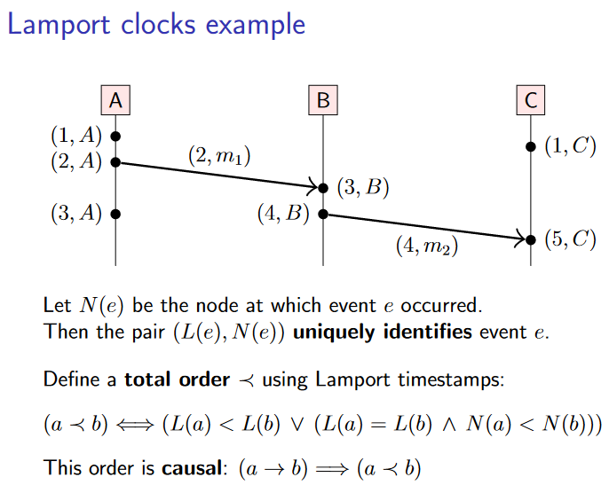
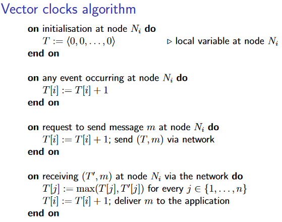
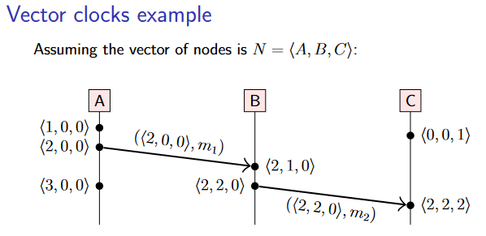

# 4. Broadcast protocols and logical time
在本讲座中，我们将研究广播协议（broadcast protocols）（也称为 multicast protocols），即向多个接收者发送一条信息的算法。它们是更层次分布式算法的有用构件，在之后会会被用到。在实际应用中，有几种不同的广播协议，它们的主要区别在于传递信息（deliver messages.）的顺序。正如我们在上一讲中看到的，顺序的概念与时钟和时间密切相关，而物理时钟又可能导致一系列问题。因此，在研究广播前，我们先看一看逻辑时钟。

## 4.1 Logical time
在上一讲中，即使使用类似 NTP 的方式同步过，我们看到来自物理时钟的时间戳可能与因果关系不一致。在这里我们讨论两种能解决此问题的逻辑时钟，当然也有一些物理和逻辑结合的混合时钟，但是我们不会在这里讨论。

### 4.1.1 Lamport clocks
我们要研究的第一种逻辑时钟是 Lamport 时钟，由 Lamport 在分布式计算的开创性论文之一中提出，简单的说明如下：

- Lamport 时间戳本质上是一个整数，用来计算已发生事件的数量。

- 每个节点维护一个本地时钟，每次有本地事件发生时，本地时钟就会 ==+1== 

- 我们使用 $L(e)$ 表示事件 $e$ 的时间戳，$L(e)$ 是一个非负整数

- 在节点发送消息时，在消息里带上“发送消息”这一事件的本地时间戳，即 $L(send(m))$ 

- 在节点接收消息时，比较自己的本地时间戳和消息里的时间戳，取两者中较大的一个，然后将本地时间戳设置为这个较大值加一，即  $L(receive(m)) = max(L(receive(m)), L(send(m))) + 1$ 

回忆起在上一节中，我们使用 `a->b`，`a||b`或`b->a`表示事件a，b之间的happens-before关系，表示Lamport 时钟有如下性质：

- 如果 `a->b`，则 $L(a) < L(b)$

- 但是，如果 $L(a) < L(b)$，则不一定有 `a->b`，也有可能是 `a||b`

**即 Lamport 时钟顺序是有happens-before关系充分非必要条件**，可以基于 Lamport 时间戳和节点的编号构造一个全序，但是这个全序不一定是happens-before关系，却是符合 causal order 的。（因为“因”的时间戳必然小于“果”）。

!!! example
    <figure markdown>
    {width=400}
    </figure>

可以将$\prec$（全序）看做是对$\to$（happens-before）（偏序）的一种线性扩展（linear extension），即$\to$是$\prec$的子集。

### 4.1.2 Vector clocks
因为给出 $L(a) < L(b)$，不能确定是 `a->b` 还是 `a||b`，因此我们需要更强大的逻辑时钟。我们将研究的第二种逻辑时钟是向量时钟（vector clocks），由 Fidge 在 1988 年提出，简单的说明如下：

- Lamport 时间戳只是一个整数（可能还附有节点名称），而向量时间戳则是一个整数向量，系统中的每个节点都对应向量中的一个元素。

- 对于一个事件，其向量钟时间戳可表示为 $V(e) = \left\langle t_1, t_2, \ldots, t_n\right\rangle$

- 节点$N_i$上发生了事件e，则节点将自身向量钟的第$i$个元素==+1==，作为事件$e$的时间戳

- 在节点发送消息时，在消息里带上“发送消息”这一事件的本地时间戳，即 $V(send(m))$

- 在节点接收消息时，比较自己的本地时间戳和消息里的时间戳，对于每个元素，取两者中较大的一个，然后将本地对应的元素==+1==

!!! note
    <figure markdown>
    {width=400}
    </figure>

!!! summry
    对于$V(e)$中的$t_i$，可以理解为当事件e发生，节点$N_i$上已经发生了$t_i$个事件了（如果e在i上，则包括e在内）。

!!! example
    <figure markdown>
    
    </figure>

根据向量钟我们可以定义如下的顺序：

- $T=T^{\prime}$ iff $T[i]=T^{\prime}[i]$ for all $i \in\{1, \ldots, n\}$

- $T \leq T^{\prime}$ iff $T[i] \leq T^{\prime}[i]$ for all $i \in\{1, \ldots, n\}$

- $T<T^{\prime}$ iff $T \leq T^{\prime}$ and $T \neq T^{\prime}$

- $T \| T^{\prime}$ iff $T \not \leq T^{\prime}$ and $T^{\prime} \not \leq T$于是则有

于是则有：

$V(a) \leq V(b)$ iff $(\{a\} \cup\{e \mid e \rightarrow a\}) \subseteq(\{b\} \cup\{e \mid e \rightarrow b\})$

更详细地说明的话:

- $(V(a)<V(b)) \Longleftrightarrow(a \rightarrow b)$

- $(V(a)=V(b)) \Longleftrightarrow(a=b)$

- $(V(a) \| V(b)) \Longleftrightarrow(a \| b)$

**向量时间戳的偏序与 happens-before 关系所定义的偏序完全一致**。因此，向量时钟算法为我们提供了在实践中计算 happens-before 关系的机制。

## 4.2 Delivery order in broadcast protocols