## 1. Process of forward and backward 
!!! note "$O = relu(XW_1) W_2$"
    === "forward"
        <figure markdown>
        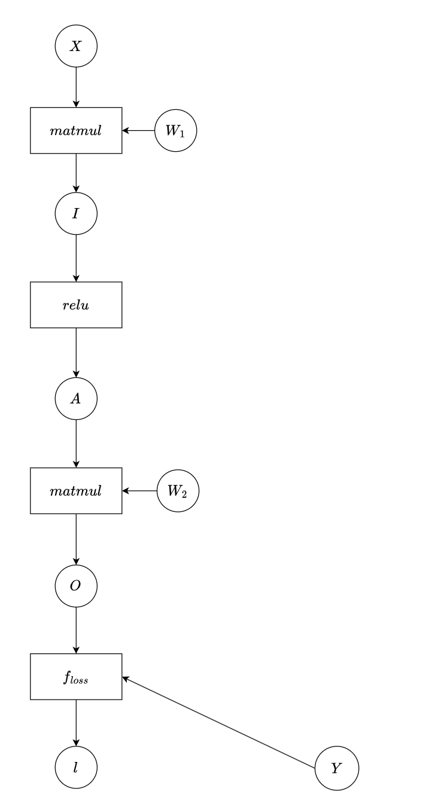{ width="300" }
        </figure>
    === "backward 1"
        for example: 
        $$
        f_{loss} = (O - Y)^2, \frac{\partial l}{\partial O} = 2(O - Y)
        $$

        <figure markdown>
        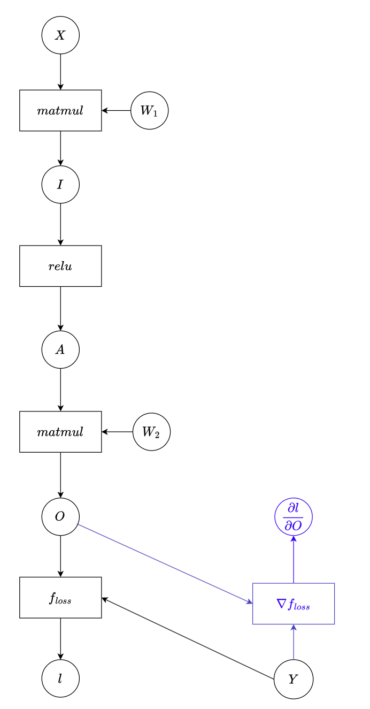{ width="300" }
        </figure>
    === "backward 2"
        $$
        O = AW_2, \frac{\partial l}{\partial W_2} = \frac{\partial l}{\partial O} \frac{\partial O}{\partial W_2} = A^T \frac{\partial l}{\partial O} 
        $$

        <figure markdown>
        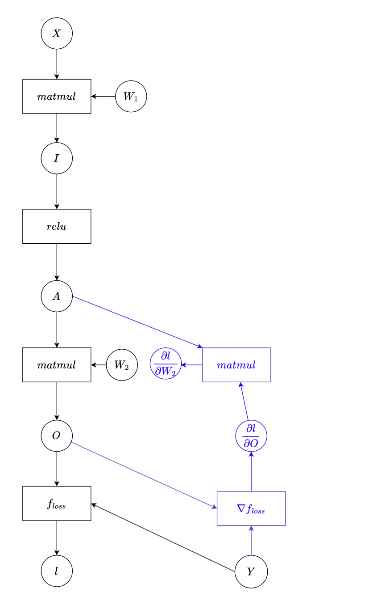{ width="300" }
        </figure>

    === "backward 3"
        $$
        O = AW_2, \frac{\partial l}{\partial A} = \frac{\partial l}{\partial O} \frac{\partial O}{\partial A} = \frac{\partial l}{\partial O} W_2^T
        $$

        <figure markdown>
        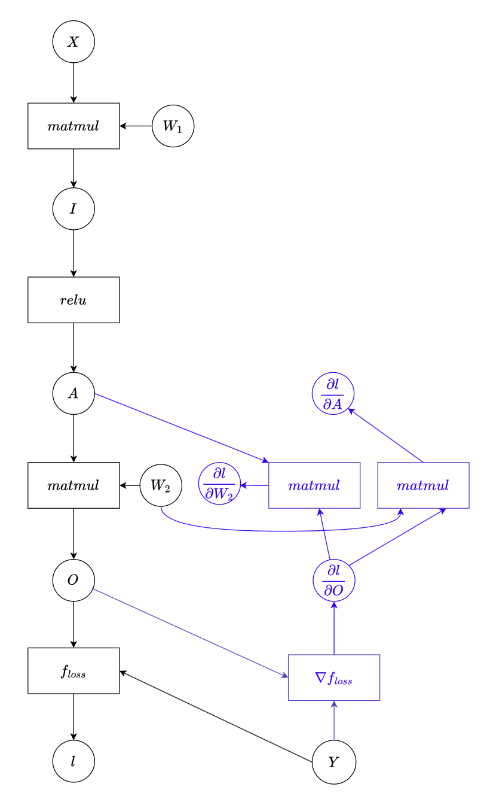{ width="300" }
        </figure>

    === "backward 4"
        $$
        A_i = relu(I_i) = \begin{cases}
        0 & \text{if } I_i < 0, \\
        x & \text{if } I_i \geq 0.
        \end{cases} \\
        $$

        $$
        \frac{\partial l}{\partial I_i} = \frac{\partial l}{\partial A_i} \frac{\partial A_i}{\partial I_i} = \frac{\partial l}{\partial A_i} \times \begin{cases} 0 & \text{if } A_i < 0, \\ 1 & \text{if } A_i \geq 0. \end{cases}
        $$

        <figure markdown>
        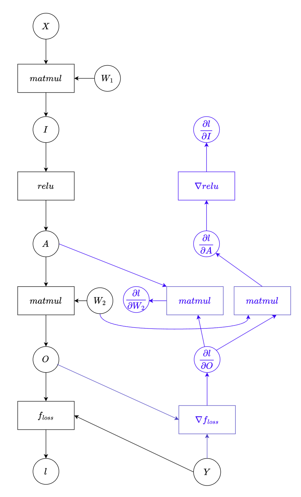{ width="300" }
        </figure>
    
    === "backward 5"
        <figure markdown>
        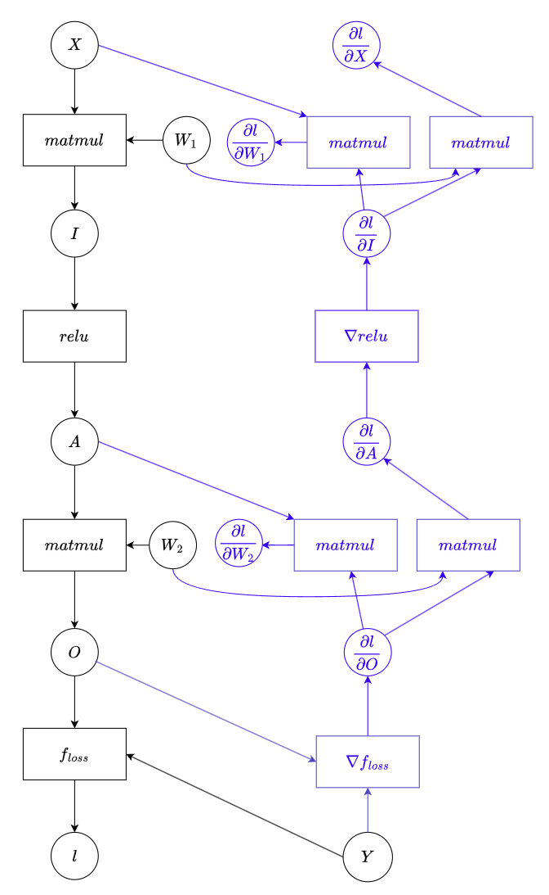{ width="300" }
        </figure>
    
    === "Simplied"
        <figure markdown>
        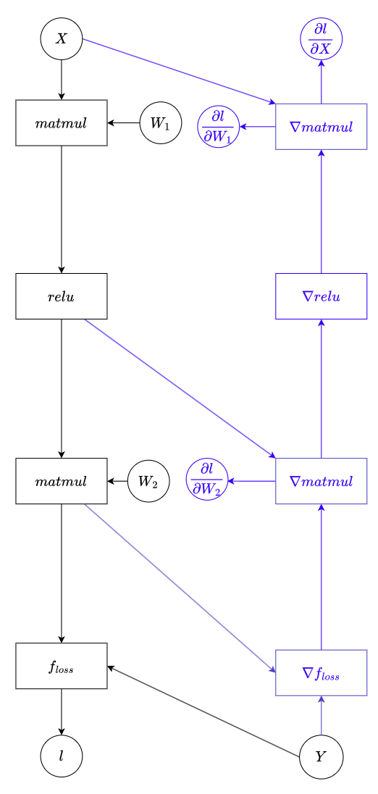{ width="300" }
        </figure>

!!! success "Takeway"
    -  Backward pass in a neural network take about twice as long as the forward pass. Beacuse almost every $matmul$ in forward pass corresponds to two $matmul$ in backward pass. **One for get gradient of parameter. One for get gradient of input.** 
    ??? Tip "Related Reading"
        [(Stack Exchange)Why should one expect the backward pass to take twice as long as the forward pass?](https://ai.stackexchange.com/questions/38085/why-should-one-expect-the-backward-pass-to-take-twice-as-long-as-the-forward-pas)
    
    - Not all intermediate results of the forward pass will be used in the backward pass, so **only the "activations" from the forward pass need to be stored**

## 2. Memory consumption

**Adam —— The most commonly used optimization algorithm in LLM:**

$$
\begin{align*}
m &= \beta_1 m + (1 - \beta_1) g, \\
v &= \beta_2 v + (1 - \beta_2) g^2, \\
w &= w - \frac{\alpha}{\sqrt{v} + \epsilon} m,
\end{align*}
$$

**Mix Precision Training: FP16 + FP32**

<figure markdown>
  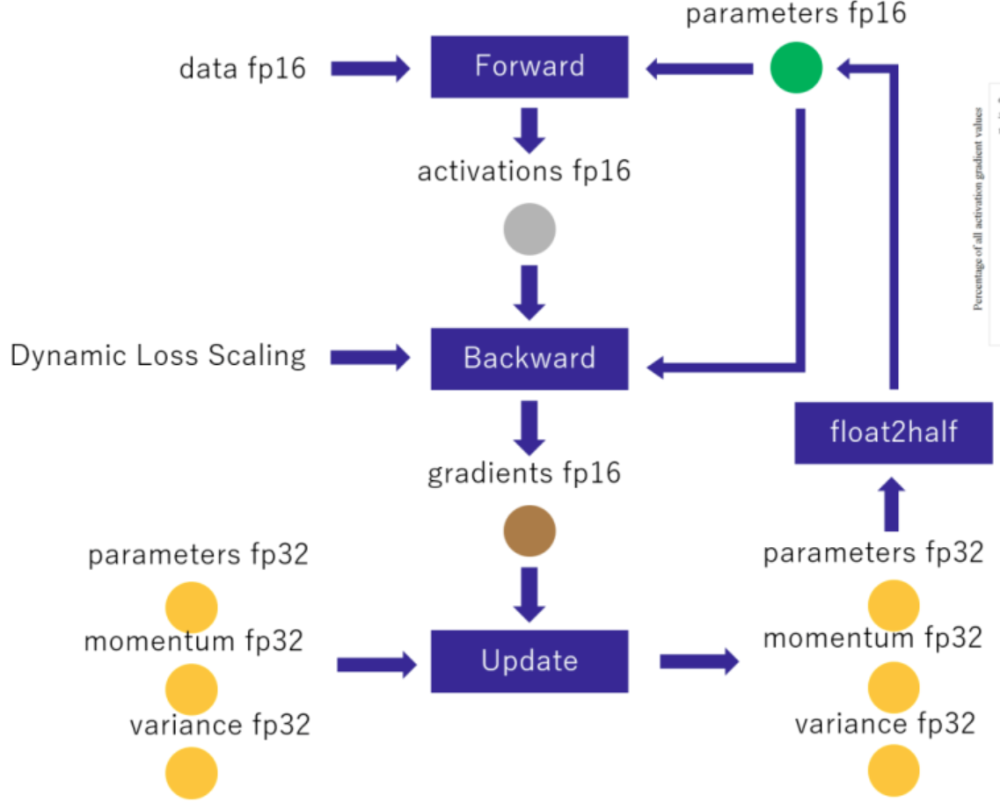{ width = "200" }
</figure>

??? Tip "Why Update Use FP32?"
    - Magnitude is smaller than $2^{-24}$ becomes zero in FP16, $learning rate \times gradient$ will be zero.

    - The ratio of the weight value to the weight update is very large

!!! success "Takeway"
    Memory consumption:
    
    - Model:
        
        * parameters(fp16) : 2 bytes
        
        * gradients(fp16) : 2 bytes

    - Optimizer status:
  
        * momentum(fp32) : 4 bytes
        
        * variance(fp32) : 4 bytes
        
        * parameters(fp32) : 4 bytes
    
    - Activations(fp16) : 2 bytes

        * for GPT architecture, the size of activations is about $12 \times hidden dim \times batch \times seq length \times transf ormer layers$
    - Buffer & Fragmentation

    ??? Example "GPT-2 1.5B example"
        sequence length of 1K and batch size of 32
        
        - Model: 4 bytes $\times$ 1.5B $\approx$ **6GB**
        
        - Optimizer status: 12 bytes $\times$ 1.5B $\approx$ **18GB**
        
        - Activations: 2 bytes $\times$ 12 $\times$ 1600 $\times$ 32 $\times$ 1024 $\times$ 48 $\approx$ **60.3GB**, use Activation Checkpointing can reduce to **8GB**
        
        - Total: **32GB**

??? note annotate "Activation Checkpointing (1)"
    Key idea: During the forward computation, only store activations for some layers, and then recompute the other required activations during the backward pass, **trading storage for computation**.
    === "frame 1"
        
    === "frame 2"
        recompute：
        
    === "frame 3"
        backward pass：
        
    === "frame 4"
        
    === "frame 5"
        

    Memory consumption：
    

    - Take $K = \sqrt{N}$, get $O(\sqrt{N})$ Space Complexity。

    - 33% re-computation time overhead
  
1.  also known as "Activation Recomputation", "re-materialization"... First proposal in [Training deep nets with sublinear memory cost(arxiv'16)](https://arxiv.org/pdf/1604.06174.pdf).

## 3. Parallelism

### 3.1 overview

<figure markdown>
  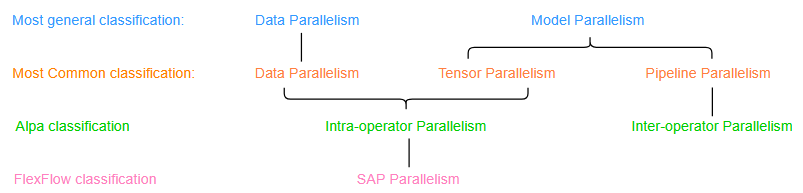
</figure>

**Most general classifcation:**

- Data parallelism(Too much data): Different device, Different data from same batch, Same model parameter, execute simultaneously

- Model parallelism(Too large model): Others

**Most Common classifcation:**

<figure markdown>
  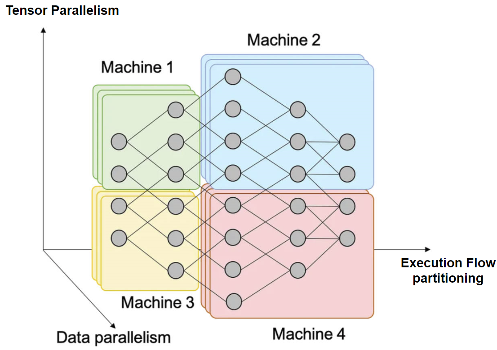
</figure>

- Pipeline Parallelism: Execution flow partitioning + batch partitioning + microbatch pipeline excution

- Tensor Parallelism: Partitioning layer/operator into multiple sections, execute simultaneously

### 3.2 Pure Data Parallelism
!!! example "DP"
    === "Parameter server"
        <figure markdown>
        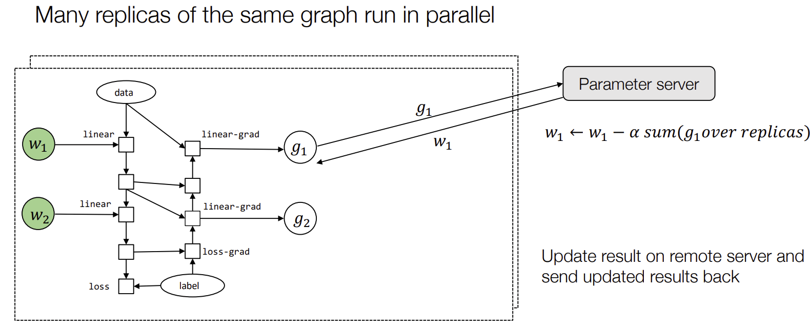
        </figure>

    === "Allreduce"
        <figure markdown>
        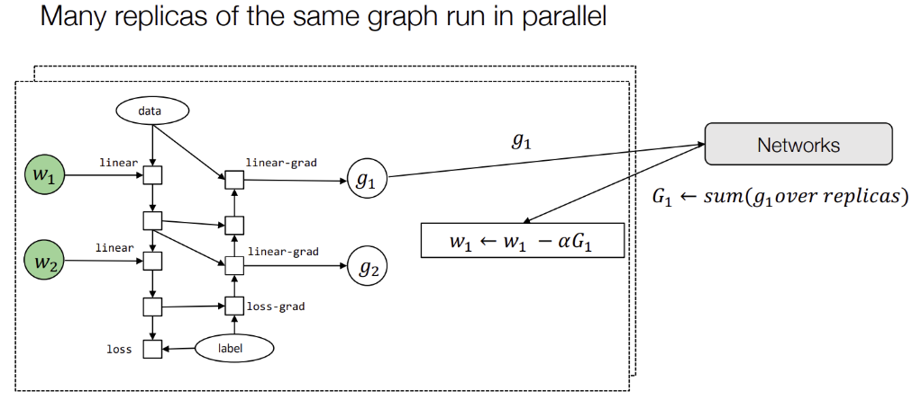
        </figure>

- Communication Volume(all-reduce): $O(Parameter\_num \times 2 \times \frac{d - 1}{d})$ for each batch, each GPU, here $d$ is the number of devices

!!! tip
    for transformer-architechture model, $O(Parameter \_num) = O(hidden\_dim^2 \times layer\_num)$

- **Can achieve Communication-Computation Overlap**

### 3.3 Pure Pipeline Parallelism
<figure markdown>
  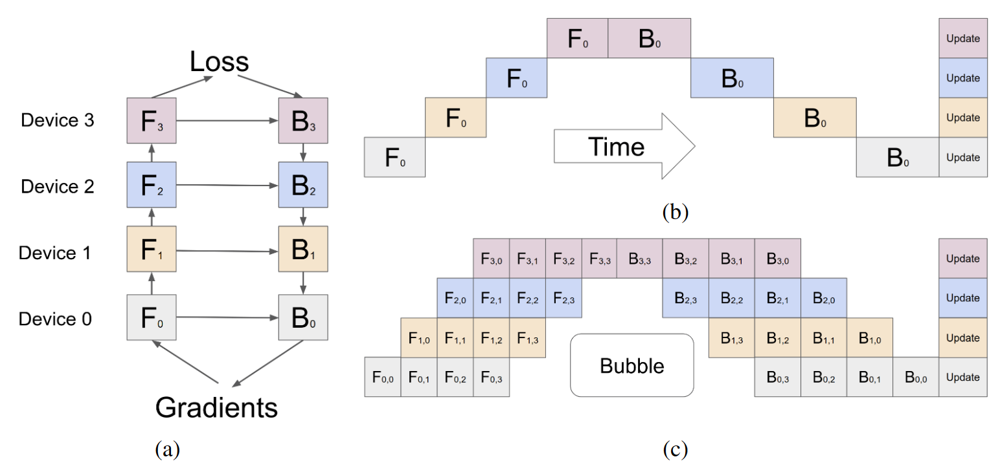
</figure>

!!! note "Pipeline Schedule Strategy"
    Assume 1 batch partitioned to $m$ mirco-batch, there are $p$ devices

    === "all-forward, all-backward"
        <figure markdown>
          
        </figure>
        
        <figure markdown>
          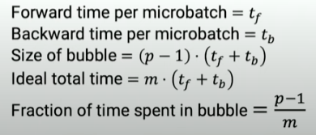{ witdh="250" }
        </figure>
        
        - bubble ratio(bubble/not-bubble): $\frac{p-1}{m}$, where p is the number of devices, m is the number of micro-batch

    === "1F1B"
        <figure markdown>
        
        </figure>

    === "1F1B with Interleaved Stages"
        <figure markdown>
        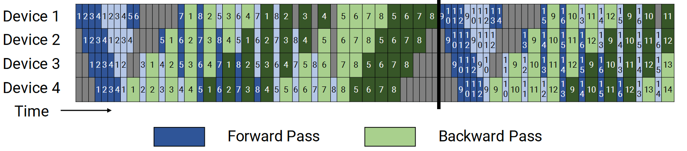
        </figure>

- Communication Volume: $O(stage\_output)$ per GPU for each batch for point to point communication

- **Can achieve Communication-Computation Overlap**

- For less idle time caused by bubble, need to increase the number of micro-batch $m$ or decrease the number of devices $p$

### 3.4 Pure Tensor Parallelism(Megatron-LM)

#### 3.4.1 Basics of Transformer 
!!! note "Transformer-Architechture"
    === "Overall Architechture"
        <figure markdown>
          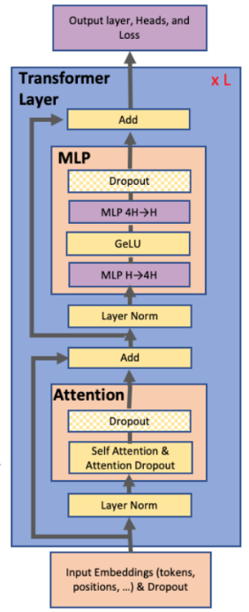{ height ="500" }
        </figure>

    === "Attention"
        <figure markdown>
          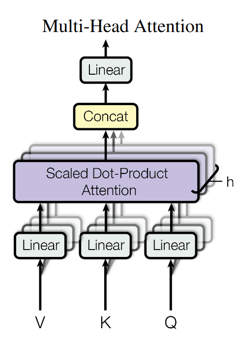{ width="250" }
        </figure>
        
        $$
        \operatorname{Attention}(X) = \operatorname{Dropout}(\operatorname{MultiHead}(X, X, X))
        $$

        $$
        \begin{aligned}
        \operatorname{MultiHead}(Q, K, V) & = \left[\operatorname{head}_1, \ldots, \text { head }_{\mathrm{h}}\right] W^O \\
        \text { where head } & =\operatorname{Attention}\left(Q W_i^Q, K W_i^K, V W_i^V\right)
        \end{aligned}
        $$

    === "MLP"
        $$
            \operatorname{MLP}(X)=\operatorname{Dropout} \left(\operatorname{GeLU} \left(X A\right) B \right)
        $$
        ??? tip "GeLU"
            <figure markdown>
              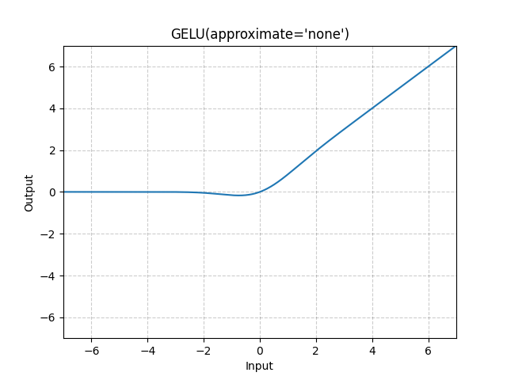{ width="300" }
            </figure>

#### 3.4.2 Attention Partition

- Every GPU has same input $X$ 

- Distribute computations of different heads to different GPUs

- Splitting $W^O$ by rows and placing them on different GPUs

!!! example
    4 heads, 2 GPUs:

    $$
    \left[H_1, H_2\right]\left[\begin{array}{l}
    W_1^0 \\
    W_2^0
    \end{array}\right]=\left[H_1 W_1^0+H_2 W_2^0\right]
    $$

    <figure markdown>
      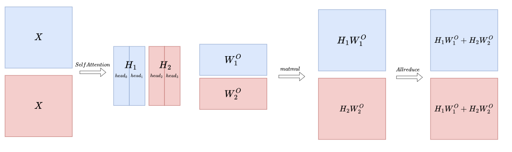
    </figure>

#### 3.4.3 MLP Partition

- Every GPU has same input $X$ 

- Splitting $W_1$ by column and placing them on different GPUs

- Splitting $W_2$ by row and placing them on different GPUs

!!! example
    2 GPUs:

    $$
    \begin{aligned}
    G e L U(X A) B & =G e L U\left(\left[X A_1, x A_2\right]\right) B=\left[G e L U\left(X A_1\right), G e L U\left(X A_2\right)\right]\left[\begin{array}{l}
    B_1 \\
    B_2
    \end{array}\right] \\
    & =\left[\operatorname{GeLU}\left(X A_1\right) B_1+G e L U\left(X A_2\right) B_2\right]
    \end{aligned}
    $$

    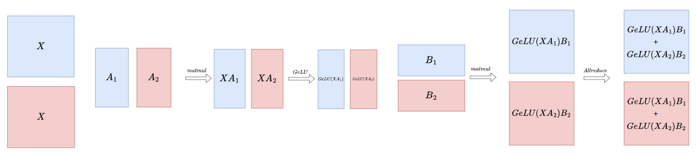

#### 3.4.5 Put them together
!!! note "number of Allreduce"
    
    $f$ is an identity operator in the forward pass and all reduce in the backward pass while $g$ is an all reduce in the forward pass and identity in the backward pass

    === "Attention"
        <figure markdown>
          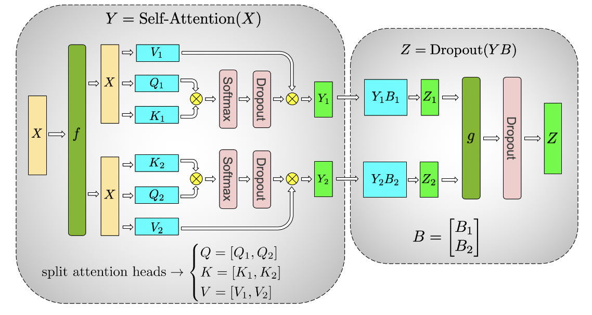{ width="400" }
        </figure>
    === "MLP"
        <figure markdown>
          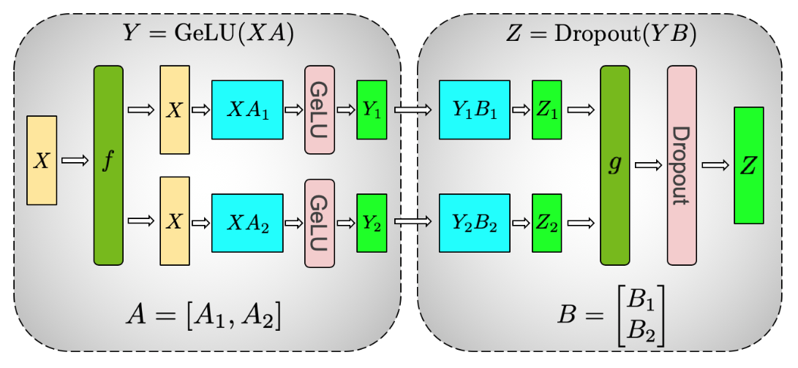{ width="400" }
        </figure>
    === "transformer layer"
        <figure markdown>
          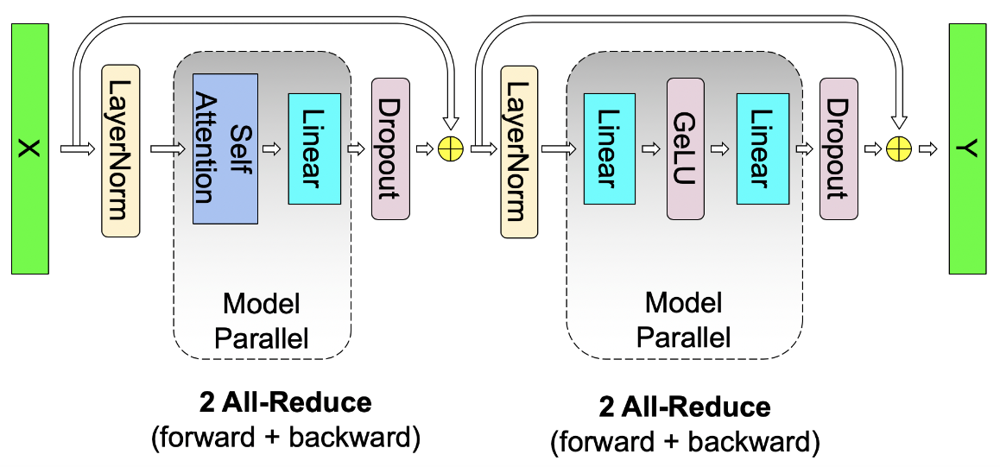{ width="400" }
        </figure>

- **Communication Volumn**: $8 \times batch\_size \times 𝑠eq\_len \times ℎidden\_size \times \frac{t - 1}{t}$ per layer per GPU for each batch, where $t$ is the number of GPUs. 

- Communication and computation can't overlap

!!! Example
    === "Device"
    - 32 DGX-2H servers (a total of 512 Tesla V100 SXM3 32GB GPUs)

    - 300 GB/sec bandwidth between GPUs inside a server via NVSwitch

    - 100 GB/sec of interconnect bandwidth between servers using 8 InfiniBand adapters per server.

    === "Scalability result1"
        <figure markdown>
          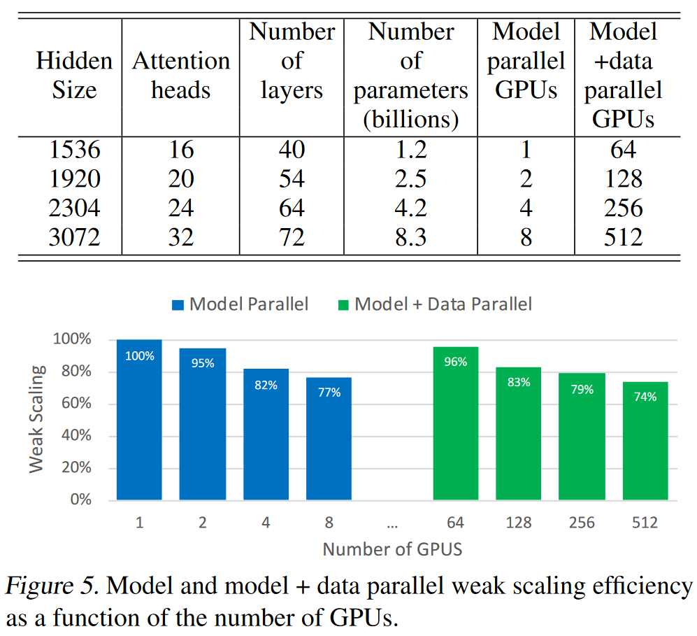    
        </figure>

    === "Scalability result2"
        > We sustain 15.1 PetaFLOPs across the entire application with 76% scaling efficiency when compared to a strong single GPU baseline that sustains 39 TeraFLOPs, which is 30% of peak FLOPs.

        <figure markdown>
          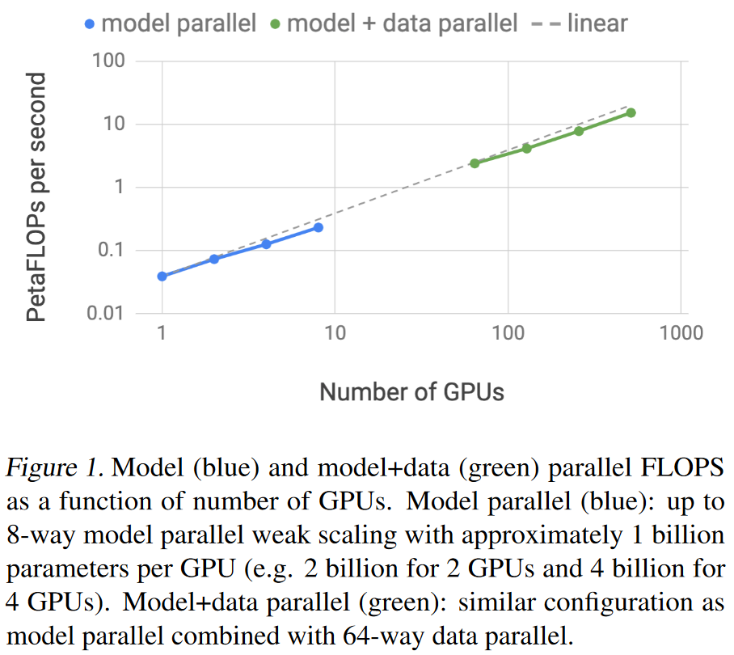
        </figure>

### 3.5 hybrid parallelism

#### 3.5.1 DP + PP

[HetPipe(ATC'20)](https://www.usenix.org/conference/atc20/presentation/park)

<figure markdown>
  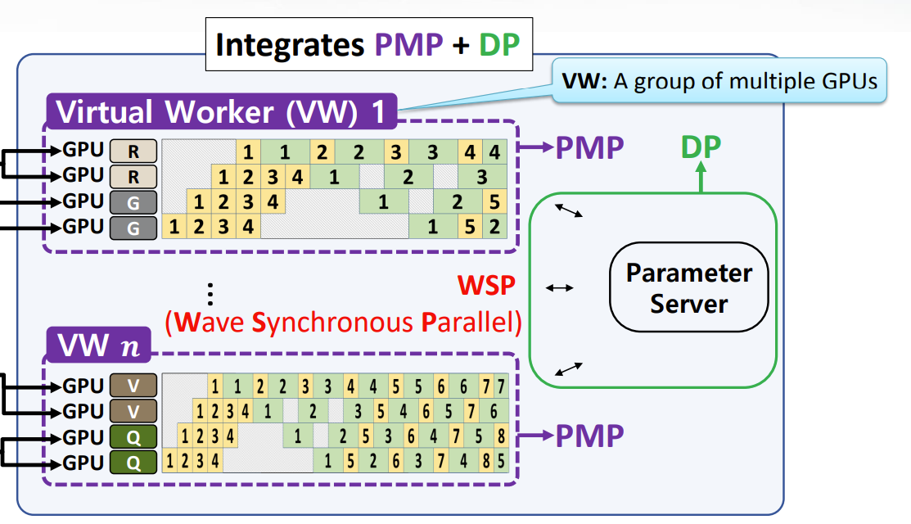 
</figure>

#### 3.5.2 PP + DP

[PipeDream(SOSP'19)](https://dl.acm.org/doi/10.1145/3341301.3359646)

<figure markdown>
  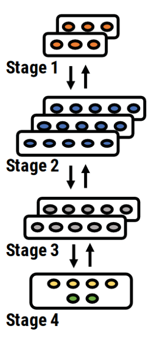{ width="200" }
</figure>

#### 3.5.3 DP + TP
[Megatron-LM(arxiv'19)](https://arxiv.org/pdf/1909.08053.pdf)

<figure markdown>
  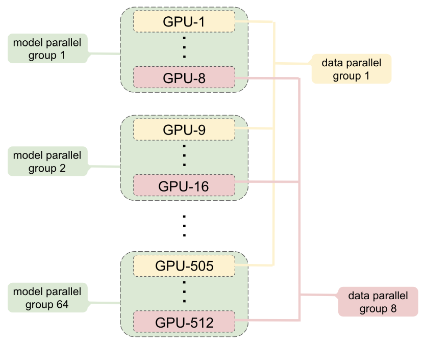{ width="400" }
</figure>

#### 3.5.4 PP + TP
<figure markdown>
[Megatron-LM-v2(SC'21)](https://dl.acm.org/doi/10.1145/3458817.3476209)
  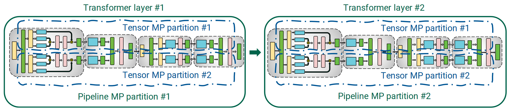
</figure>

#### 3.5.5 DP + PP + TP
[Megatron-LM-v2(SC'21)](https://dl.acm.org/doi/10.1145/3458817.3476209)
<figure markdown>
  
</figure>

### 3.6 Takeaway

<figure markdown>
  
</figure>

<figure markdown>
  
</figure>

- **Data parallelism**: Different device, Different data from same batch, Same model parameter, execute simultaneously
    
    * Communication Volume(all-reduce): $O(Parameter\_num \times 2 \times \frac{d - 1}{d})$ for each batch, each GPU, where $d$ is the number of GPU
    
    * Can achieve Communication-Computation Overlap

- **Pipeline Parallelism**: Execution flow partitioning + batch partitioning + microbatch pipeline excution
    
    * Communication Volume(point to point): $O(stage\_output)$ per GPU for each batch for  communication

    * Can achieve Communication-Computation Overlap

    * For less idle time caused by bubble, need to increase the number of micro-batch $m$ or decrease the number of devices $p$

- **Tensor Parallelism**: Partitioning same layer/operator into multiple Parts, execute simultaneously

    * Communication Volumn(all-reduce): $8 \times batch\_size \times 𝑠eq\_len \times hidden\_size \times \frac{t - 1}{t}$ per layer per GPU for each batch, where $t$ is the number of GPUs. 

    * Communication and computation can't overlap