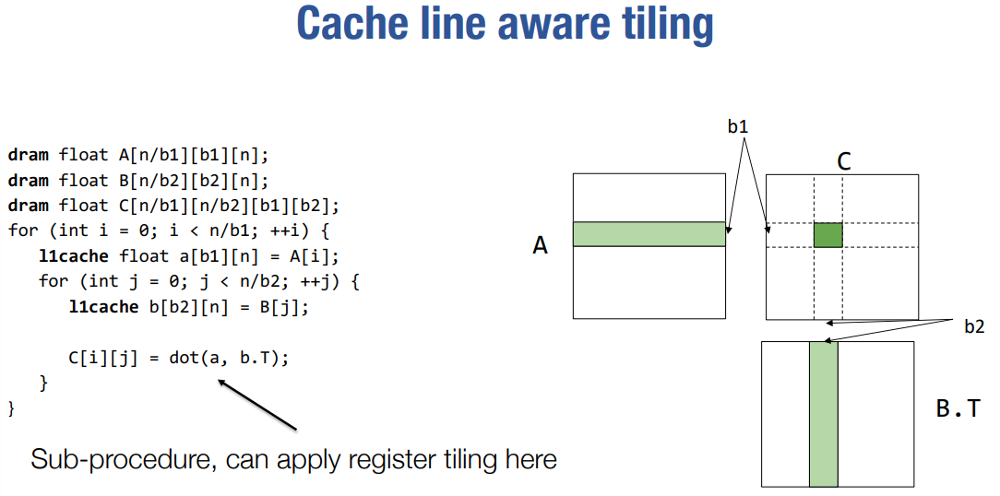

# HardWare acceleration

## 1. General acceleration techniques
### 1.1 Vectorization

看这段伪代码：

这样的操作显然是可以向量化的

### 1.2 Data layout and strides


Strides format 和 row-major format 的区别：more general，可以通过设置不同维度的strides值来决定放置方式，可以表示更高维度的数据。


### 1.3 Parallelization


## 2. Case Study: matrix multiplication

### 2.1 Vanilla matrix multiplication
最朴素的实现方式：


要对朴素的方式进行优化，还要考虑到Memory hierarchy:


先不考虑cache，对朴素方法进行分析：


### 2.2 Reister tiled matrix multiplication
一个朴素的思想：load了，就尽可能多用几次 => 想多用，就要在下次被用之前不要被替换出去 => 所以每次计算一个可以被register/cache覆盖住的区域，这个区域就是一个tile，然后把这个tile放到register/cache里面，这样就可以多次使用了。
#### 2.2.1 不考虑Cache
先不考虑Cache，只考虑寄存器：

其中`dot(a, b.T)`的计算方法可以采取前面提的Vanilla matrix multiplication的方法。


可以看到v3对load cost没有影响，为了使Register cost尽可能低，一般设置v3 = 1;

一个直观的理解：对`A[i][k]`的一次load，可以让里面的每股元素都参与v2次计算，所以相比每参加一次计算就要load一次的朴素方法，这种方法对A中元素的的load cost就降低了v2倍。


#### 2.2.2 考虑Cache



A's dram -> l1 time cost：

- 直观的想，A中的所有元素只需要被load一次即可

- 直接计算: n/b1 * b1*n
B's dram -> l1 time cost：

- 直观的想，A中每load b1行，都要完整load一遍B，所以是n^3 / b1

- 直接计算：n/b1 * n/b2 * b2*n

#### 2.2.3 Putting it togerther


是通过reuse来节省的load次数：


## 2.3 GPU Programming

GPU programming model： CUDA

CPU有强大的Control Unit，重点在于灵活地control，而GPU的Control Unit弱一些，不需要太多的控制逻辑，重点在于并行。


- SIMT：每个Thread执行相同的code，但是有自己的context(thread id等)

- Thread的组织层次：Thread -> Block -> Launch Grid

- 同一个Block中的Thread有shared memory

看一段CUDA代码：

!!! example "vector add"

    === "CPU code"
        ```c
        void vecAdd(float* A, float* B, float* C, int n) {
            for (int i = 0; i < n; i++) {
                C[i] = A[i] + B[i];
            }
        }
        ```
    
    === "CUDA code"
        
        ```cuda
        __global__ void vecAddKernel(float* A, float* B, float* C, int n) {
            int i = blockDim.x * blockIdx.x + threadIdx.x;
            if (i < n) {
                C[i] = A[i] + B[i];
            }
        }
        ```
        `threadIdx.x`: relative position of a thread within a block

        `blockIdx.x`: relative position of a block within a grid

        `blockDim.x`: number of threads in a block

        => `i`: global position of a thread within a grid
        
        所有的Thread都会跑这段代码，但是每个Thread都有自己的threadIdx.x, blockIdx.x, blockDim.x, 所以每个Thread都会计算出自己的i，然后根据i来计算自己要做的事情。

    === "OpenCL(used in ARM GPU)"
        ```cuda
        kernel void VecAdd(__global float *a, 
                           __global float* b,
                           __global float* c,
                           int n) {
            int gid = get_global_id(0)
            if (gid < n) {
                c[gid] = a[gid] + b[gid];
            } 
        }
        
        ```

    === "Metal(Apple devices)"
        ```cuda
        kernel void VecAdd(float* a [[buffer(0)]], 
                            float* b [[buffer(1)]],
                            float* c [[buffer(1)]],
                            uint gid [[thread_position_in_grid]] 
                            int n) {
            if (gid < n) {
            c[gid] = a[gid] + b[gid];
            } 
        }
        ```
vector add之所以可以用GPU并行，是因为每个`c[i]`的计算是独立的

!!! example "host cpu code for vector add"
    
    **在实际场景中，GPU memory和CPU memory之间的数据交换一般会成为bottleneck，所以一般会追求“keep data in gpu memory as long as possible.”**

## 2.4 GPU memory hierarchy


前面提到了Thread的组织是两层的（block, grid），这是为什么呢，因为 GPU 实际的存储层次。

在编程模型中的block可以被map到实际GPU硬件中的SMP（stream micro multiprocessor），有的时候甚至可以将多个block map到统一个SMP上。在一个SMP中，会有一个Shared memory。

编程模型中的thread可以被map到SMP中的computing core

当在host代码里调用`cudaMalloc`或`cudaFree`时，控制的都是Global memory

!!! example "window sum"
    可以看作是一维的卷积
    === "朴素写法"
        
        ```cuda
        #define RADIUS 2
        __global__ void WindowSumSimpleKernel(float* A, float *B, int n) {
            int out_idx = blockDim.x * blockIdx.x + threadIdx.x;
            if (out_idx < n) {
                float sum = 0;
                for (int dx = -RADIUS; dx <= RADIUS; ++dx) {
                    sum += A[dx + out_idx + RADIUS];
                }
                B[out_idx] = sum; 
            }
        }
        ```

        每个thread负责一个位置的卷积，但是每个thread都要load整个window，所以load cost是 n * (2 * RADIUS + 1)
    === "使用shared memory"
        
        ```cuda
        __global__ void WindowSumSharedKernel(float* A, float *B, int n) {
            __shared__ float temp[THREADS_PER_BLOCK + 2 * RADIUS];
            int base = blockDim.x * blockIdx.x;
            int out_idx = base + threadIdx.x;
            if (base + threadIdx.x < n) {
                temp[threadIdx.x] = A[base + threadIdx.x];
            }
            if (threadIdx.x < 2 * RADIUS && base + THREADS_PER_BLOCK + threadIdx.x < n) {
                temp[threadIdx.x + THREADS_PER_BLOCK] = A[base + THREADS_PER_BLOCK + threadIdx.x];
            }
            __syncthreads();
            if (out_idx < n) {
                float sum = 0;
                for (int dx = -RADIUS; dx <= RADIUS; ++dx) {
                    sum += temp[threadIdx.x + dx + RADIUS];
                }
                B[out_idx] = sum; 
            }
        }
        ```
        对于每个block，首先从share memory中分配一个`temp`，用于放置这个block所需要的输入（绿色部分）
        
        然后block中的thread一起把绿色的部分load到`temp`中（上面的代码似乎有些问题？似乎只适用于图中的这个具体情形）

        然后通过`__syncthreads()`来同步，保证每个thread都已经load完了

        然后每个thread负责一个位置的卷积

        这样来看，每个thread负责 (THREADS_PER_BLOCK + 2 * RADUIS) / THREADS_PER_BLOCK个元素的load，所以load cost是 
        (1 + 2 * RADIUS / THREADS_PER_BLOCK) * n

## 2.5 Case study: matrix multiplication on GPU


### 2.5.1 Thread-level: register tiling

要计算：`C = dot(A.T, B)`


其实与2.2.1别无二致，就是取了2.2.1中的v3 = 1，此处的并行性体现在，上图中的灰色小块表示的的计算由一个thread负责
```cuda
__global__ void mm(float A[N][N], float B[N][N], float C[N][N]) {
    int ybase = blockIdx.y * blockDim.y + threadIdx.y;
    int xbase = blockIdx.x * blockDim.x + threadIdx.x;
    float c[V][V] = {0};
    float a[V], b[V];
    for (int k = 0; k < N; ++k) {
        a[:] = A[k, ybase*V : ybase*V + V]; 
        b[:] = B[k, xbase*V : xbase*V + V]; 
        for (int y = 0; y < V; ++y) {
            for (int x = 0; x < V; ++x) {
                c[y][x] += a[y] * b[x];
            }
        }
    }
    C[ybase * V : ybase*V + V, xbase*V : xbase*V + V] = c[:];
}
```

!!! question
    如何理解`blockIdx.y`, `blockDim.y`, `threadIdx.y`?（之前没讲过呀）

    感觉是把Block也视为二维的？

### 2.5.2 Block-level: shared memory tiling

一个Block计算下图中灰色部分的计算，Block里有 (L/v) * (L/v) 个thread，每个thread负责一个灰色小块的计算


**注意到，上图中的红1，红2部分的计算，都要用到A.T中同样的部分，所以可以考虑把这种多个thread都要使用的数据放到shared memory中，这样就可以减少load次数。**

```cuda
__global__ void mm(float A[N][N], float B[N][N], float C[N][N]) {
    __shared__ float sA[S][L], sB[S][L];
    float c[V][V] = {0};
    float a[V], b[V];
    int yblock = blockIdx.y;
    int xblock = blockIdx.x;
    for (int ko = 0; ko < N; ko += S) {
        __syncthreads();
        // needs to be implemented by thread cooperative fetching
        sA[:, :] = A[k : k + S, yblock * L : yblock * L + L]; 
        sB[:, :] = B[k : k + S, xblock * L : xblock * L + L]; 
        __syncthreads();
        for (int ki = 0; ki < S; ++ ki) {
            a[:] = sA[ki, threadIdx.y * V : threadIdx.y * V + V];
            b[:] = sA[ki, threadIdx.x * V : threadIdx.x * V + V];
            for (int y = 0; y < V; ++y) {
                for (int x = 0; x < V; ++x) {
                    c[y][x] += a[y] * b[x];
                }
            }
        } 
    }
    int ybase = blockIdx.y * blockDim.y + threadIdx.y;
    int xbase = blockIdx.x * blockDim.x + threadIdx.x;
    C[ybase * V : ybase*V + V, xbase*V : xbase*V + V] = c[:];
}
```
上面的代码段中，两个`__syncthreads()`之间的部分其实应该是所有thread协同地把数据从global memory load到shared memory中，但是这里没有给出具体的实现方法。下一小节会给出。

global memory -> shared memory: 2 * N^3 / L

shared memory -> register: 2 * N^3 / V

!!! note
    - 每个SMP中的register是有限的，如果一个thread使用的register比较多，那么thread的总数就会减少。所以这里需要做trade off.

    - 每个SMP中的shared memory也是有限的，如果一个block使用的shared memory比较多，那么SMP中可以放的block的数量就会减少。所以这里需要做trade off.

这里其实还可以考虑，某些thread在等待load 到shared memory的数据的时候，可以先context switch到别的thread上去做计算，这样可以进一步提高并行性。

### 2.5.3 Expand Cooperative Fetching


上面这段代码的大义就是
- 统共有 L * S 个元素要 load，每个thread负责load其中的 L * S / nthreads 个，所以每个thread会做一个for循环，依次将这 L * S / nthreads 个元素load到shared memory中。
  
- 每个thread，以自己的thread_id为初始偏移，每隔 nthreads 个元素，就load一个元素到shared memory中。