# Neural Network Abstraction
省流图：

## 1. Programming abstractions
以Caffe，TensorFlow，PyTorch为例，介绍神经网络的编程抽象：
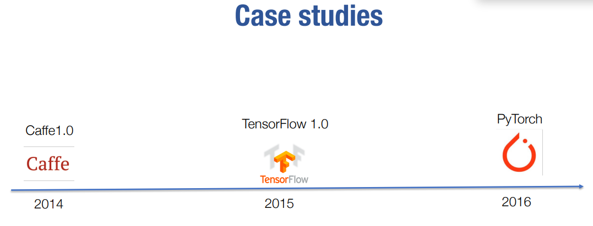
### 1.1 Caffe
**单纯的前向传播和反向传播**
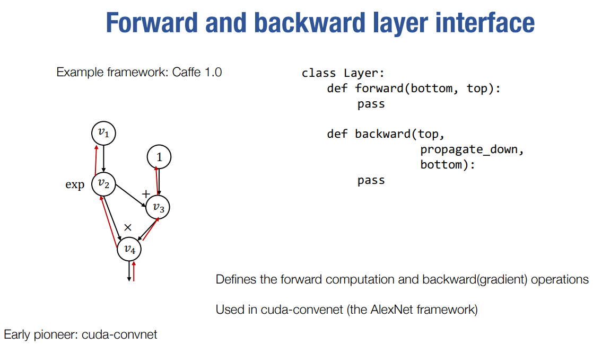

### 1.2 TensorFlow
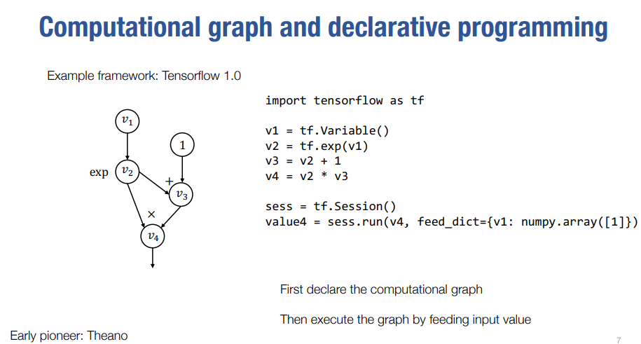

### 1.3 PyTorch
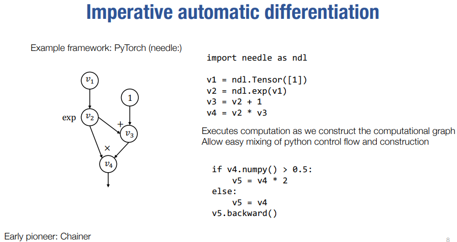

## 2. High level modular library components
### 2.1 三大组件
**主要要实现三大类组件：**
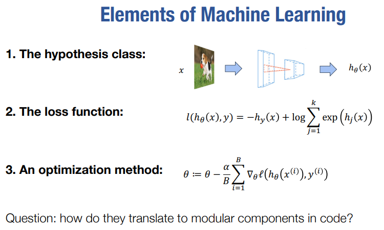

**深度学习本身就是很模块化的，所以用模块化的方式来构建深度学习库是很自然的事情。**

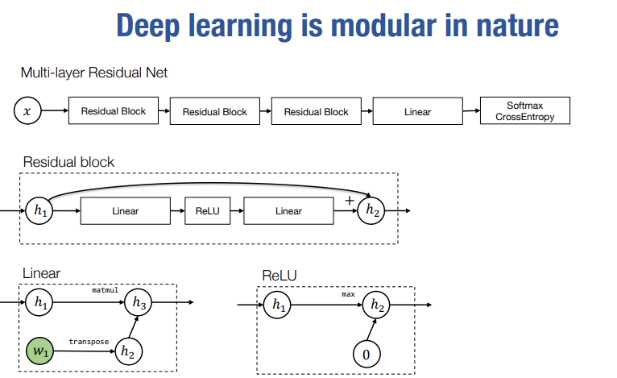

**使用nn.Module作为基础。**
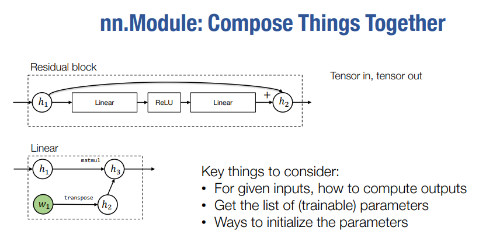

**损失函数也可以被视为一个nn.Module。**
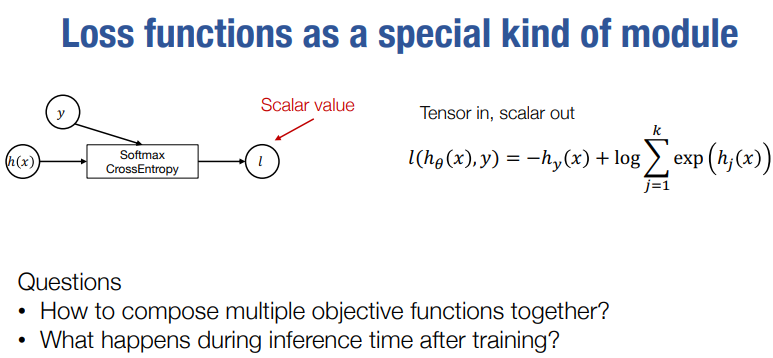

**优化器：更新权重，以及维护用于更新权重的其他一些“状态”（不同的优化算法的怎神的要求）。**
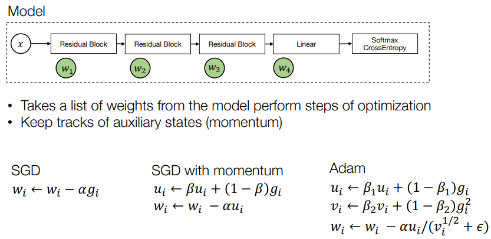

??? Note "优化器喝喝实现REgularization"
    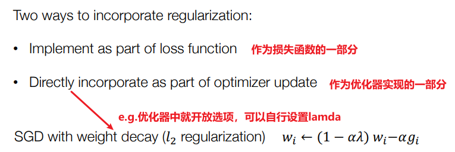

### 2.2 Initialization
既不能太小——可能梯度消失；也不能太大——可能梯度爆炸。

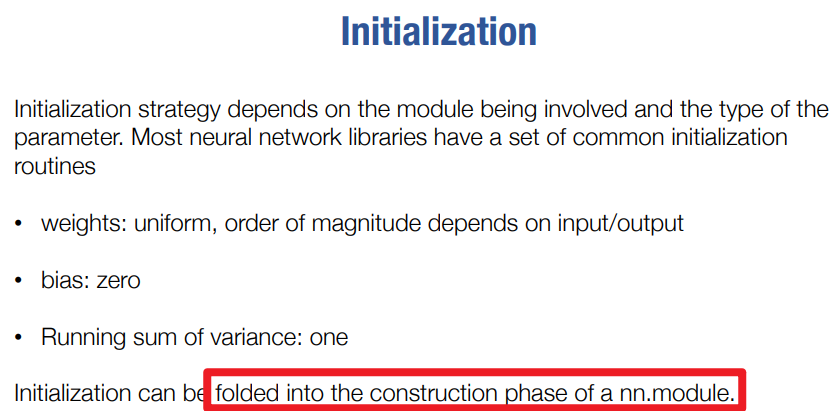

### 2.3 Data loader and preprocessing
**Tianqi在这里也只是简单提了一下，感觉没说啥**
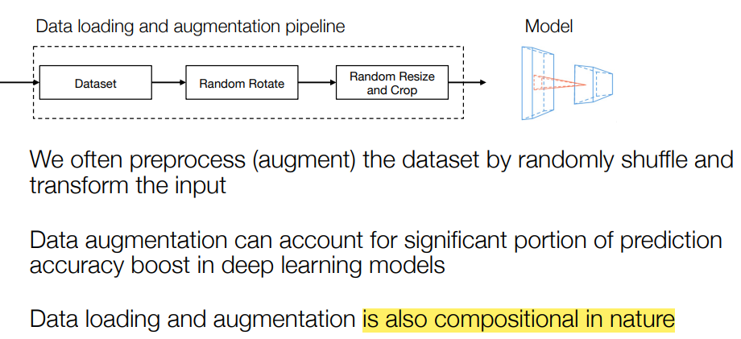

## 3. Summary
能看到现在的pytorch相较于caffe的优越性：

- Caffe 使用的Layer，既是梯度计算的基本组件，也是模型组合的基本组件，没有把这两者解耦开来(我的理解是：我自己写个Module还得负责写它的bakcward？)
  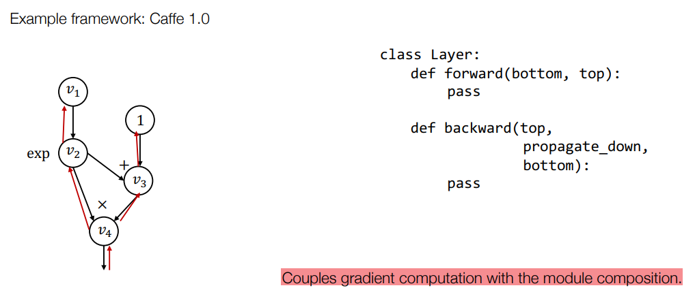

- Pytorch 使用的Module，把梯度计算和模型组合解耦开来了，这样就可以更加灵活的组合模型了。
  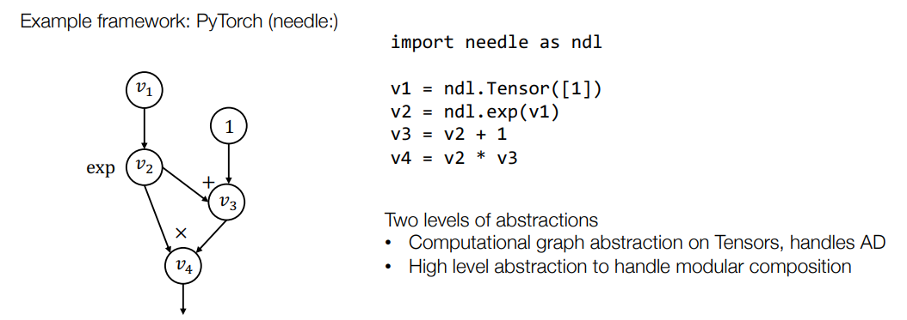