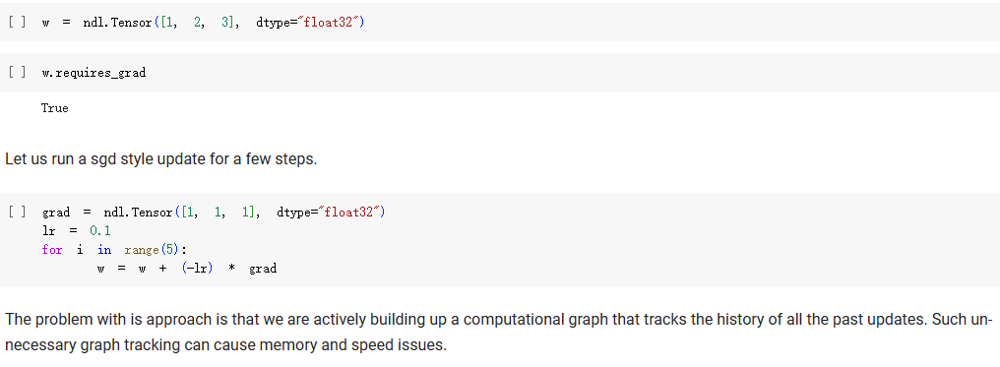
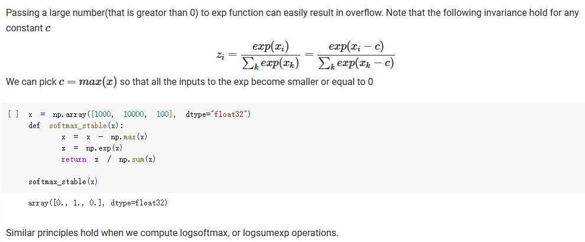
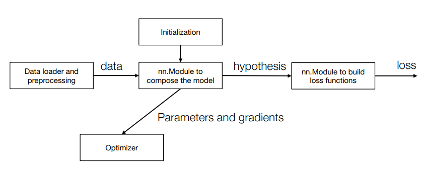

# Neural Network Implementation
## 1. Mutating the data field of a needle Tensor
直接按照下图这样写代码，会有什么问题吗？


会有，因为grad也是`Tensor`，所以每次做`w = w + (-lr) * grad`时，也构造了计算图。 

!!! note "1. Weight update doesn't need to be tracked"
    不需要把weight update也加到计算图中，因为weight update不需要梯度。

正确的做法是：只改值，不创造计算图：


## 2. Numerical Stability

浮点数的精度有限，浮点运算例如`0.4 - 0.1`得到的结果可能不是`0.3`，而是`0.2999993`。

以最常见的`softmax`操作为例，其中的`exp`如果输入的值很大，那么`exp`的结果就会是`nan`,所以需要一些技巧性的操作：



## 3. Design a Neural Network Library
回顾这张图：


用`Parameter`类来包装`Tensor`，这样可以把`Parameter`类的`grad`属性设置为`None`，这样就不会把`grad`也加到计算图中了。

### 3.1 nn.Module
构建`nn.Module`的基础是`Parameter`类，用`Parameter`类继承自`Tensor`，是一种特殊的`Tensor`，


```python
def _get_parameters(value):
    if isinstance(value, Parameter):
        return [value]
    if isinstance(value, dict):
        res = []
        for k, v in value.items():
            res += _get_parameters(v) # python 中的 list 相加即为合并 
        return res
    if isinstance(value, Module) 
        return value.parameters()

class Module:
    def parameters(self):
        return _get_parameters(self.__dict__) # self.__dict__是一个字典，包含了所有的属性, key是属性名，value是属性值

    def __call__(self, *args, **kwargs): # 重载了__call__方法，使得Module的实例可以像函数一样被调用
        return self.forward(*args, **kwargs)
```
这里的`_get_parameters`函数，间接“限制”了`Module`的属性必须是`Parameter`或者`Module`，否则就其调用`parameters`方法时就会有问题。

试试在这个基础上做一些具体的Module:

```python
class ScaleAdd(Module):
    def __init__(self, init_s = 1, init_b = 0):
        self.s = Parameter([init_s], dtype = "float32")
        self.b = Parameter([init_b], dtype = "float32")
    
    def forward(self, x):
        return x * self.s + self.b


class MultiPathScaleAdd(Module):
    def __init__(self):
        self.path0 = ScaleAdd()
        self.path1 = ScaleAdd()
    
    def forward(self, x):
        return self.path0(x) + self.path1(x)
```


### 3.2 Loss Function

Loss Function可以看作是没有任何参数的`Module`，所以可以直接继承`Module`类，然后实现`forward`方法即可。

```python
class L2Loss(Module):
    def forward(self, x, y):
        z = x + (-1) * y
        return s * z

loss_func = L2Loss()
loss = loss_func(x, y)

loss.backward()
```
一旦执行了`loss.backward()`，就会把计算图中的所有节点的`grad`属性都计算出来，然后可以用`grad`属性来更新参数。

### 3.3 Optimizer
 


Optimizer的作用是更新参数，主要方法：

- `__init__`：初始化，指明要更新哪些参数

- `step`：更新参数

- `zero_grad`：把所有参数的`grad`属性清零


```python
class Optimizer:
    def __init__(self, parameters):
        self.parameters = parameters

    def reset_grad(self):
        for p in self.parameters:
            p.grad = None

     def step(self):
        for p in self.parameters:
            raise NotImplementedError
```
实现一个SGD：

```python
class SGD(Optimizer):
    def __init__(self, parameters, lr = 0.01):
        super().__init__(parameters) # 调用父类的__init__方法
        self.lr = lr

    def step(self):
        for w in self.parameters:
            w.data = w.data + (-self.lr) * w.grad.data
```

实现一个SGD with Momentum：

```python
class SGDWithMomentum(Optimizer):
    def __init__(self, parameters, lr = 0.01, momentum = 0.9):
        super().__init__(parameters)
        self.momentum = momentum
        self.lr = lr
        self.u = [ndl.zeros_like(p) for p in parameters]
    def step(self):
        for i, w in enumerate(self.parameters):
            self.u[i] = self.u[i] * self.momentum + w.grad.data
            w.data = w.data + (-self.lr) * self.u[i]
```
**可以看到，optimizer需要保存一些额外的状态**