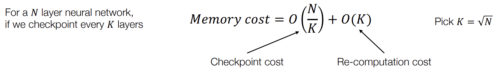

回顾一下GPU hierarchy：

可以看到GPU memory是主要的瓶颈，限制了太大的模型是放不进去的。

到底是哪些东西会消耗内存呢：

## 1. Techniques for memory saving
### 1.1 Inference Only

其实只用两个buffer就可以了，一个是当前这一步计算需要的东西，一个是计算出来的结果（也是下一步计算需要的东西）。通过这样的方法交替向前，就可以保证O(1)的内存占用。

### 1.2 Activation memory cost for training

在训练的过程中，每一层的output都要被存储下来，不能在下一层的output计算出来后就把上一层的output给释放掉，因为在反向传播的时候还要用来计算梯度（回忆 [Automatic Differentiation里的包含反向传播的计算图](AD.md)）。

所以如果要训练N layer的模型，那么需要的内存是O(N)的。 

这里介绍一下**Gradient Checkpointing**，可以有效的减少内存的使用：
!!! note "Gradient Checkpointing"
    key idea: 在forward计算时只存一些layer的activation，然后在backward的时候再 recompute 其他需要的activation，**用计算换存储**。
    === "frame 1"
        
    === "frame 2"
        recompute一下白色的：
        
    === "frame 3"
        进行反向传播：
        
    === "frame 4"
        
    === "frame 5"
        

空间复杂度分析：

第二项是因为recomputation的时候中间结果也不能丢

取 $K = \sqrt{N}$，那么空间复杂度就是 $O(\sqrt{N})$ 了。

实际上又做了一遍forward computation，但由于forward的计算量一般比backward的计算量小，所以整体上增加了大概25%的计算时间。

一般选择那些算起来比较快的layer来做recomputation，比如ReLU就比卷积recomputation快很多。

## 2. Parallel and distributed training

### 2.1 Model parallel training

!!! note "Break up"
    === "frame 1"
        
    === "frame 2"
        Partition the graph, put send/recv pairs in the boundary
        

还可以在此基础上加上micro-batch的概念，把一个batch分成多个micro-batch，形成Pipeline parallelism：

### 2.2 Data parallel training

#### 2.2.1 Allreduce abstraction

有很多种实现方式和实现的库

通过Allreduce让每个worker都有所有worker的梯度，然后每个worker都可以更新自己的参数：

#### 2.2.2 Parameter server abstraction

- 本质上和KV-store很像

- 可以允许一定程度的异步 weight update

- 有一定程度的 fault tolerance

#### 2.2.4 Communication computation overlap

- 同步g2的时候，可以同时进行计算g1的backward

- 算好g1的时候，g2还没发送好，可以抢占通信，优先发送g1，这样g1先同步好就可以先进行下一个epoch的forward了

