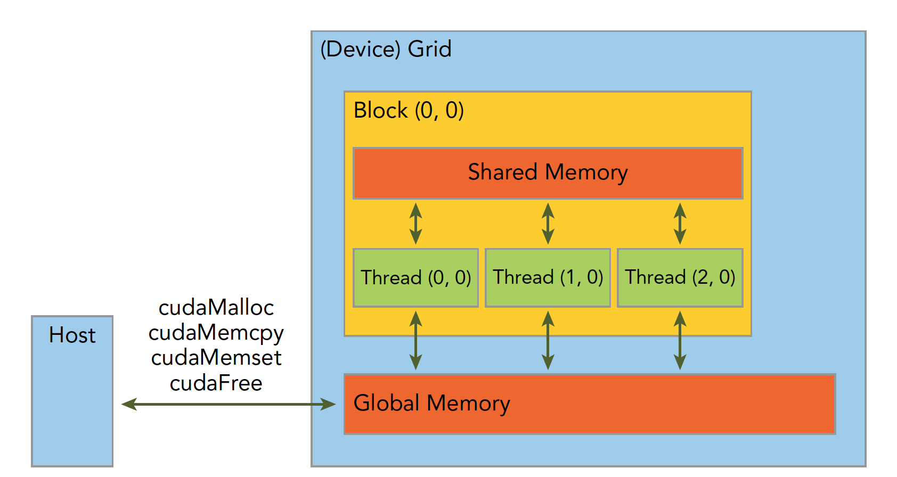
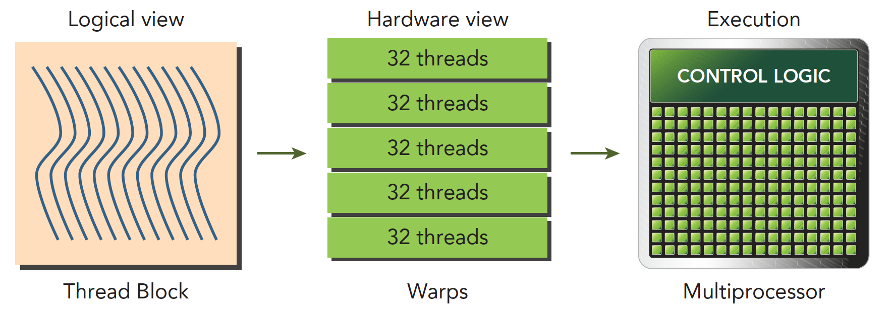

# ARK: GPU-driven Code Execution for Distributed Deep Learning
[NSDI'23](https://www.usenix.org/conference/nsdi23/presentation/hwang)

<figure markdown>
  
</figure>

**Abstract:**
we observe that the collective communication overhead across GPUs is often the key limiting factor of performance for distributed DL. It under-utilizes the networking bandwidth:


- GPU-controlled DMA and GPU-driven Execution system design

## 1.Background

### 1.1 CUDA and GPU architecture

**Programming model: SIMT**
<figure markdown>
  { width="400"}
</figure>

??? example "CUDA code example"
    ```CUDA

    __global__ void vecAddKernel(float* A, float* B, float* C, int n) {
      int i = blockDim.x * blockIdx.x + threadIdx.x;
      if (i < n) {
          C[i] = A[i] + B[i];
      }
    }

    void VecAddCUDA(float* Acpu float *Bcpu, float* Ccpu, int n) {
      float *dA，*dB，*dC;
      cudaMalloc(&dA，n * sizeof(float));
      cudaMalloc(&dB，n * sizeof(float));
      cudaMalloc(&dC，n * sizeof(float));
      cudaMemcpy(dA，Acpu，n * sizeof(float)，cudaMemcpyHostToDevice)
      cudaMemcpy(dB，Bcpu，n * sizeof(float)，cudaMemcpyHostToDevice);
      
      int threads per block = 512;
      
      int nblocks = (n + threads per block - 1) / threads per block;
      
      VecAddKernel<<<nblocks, thread per block>>>(dA，dB，dc，n);
      
      cudaMemcpy(Ccpu，dC，n * sizeof(float)，cudaMemcpyDeviceToHost)
      
      cudaFree(dA); 
      cudaFree(dB); 
      cudaFree(dc);
    }
    ```

**GPU architecture:**

!!! info "NVIDIA Kepler architecture"
    === "Overview"
        <figure markdown>
          
        </figure>
    === "SM"
        <figure markdown>
          
        </figure>
    === "Memory Model"
        <figure markdown>
          
        </figure>
**Execution model:**

<figure markdown>
  { width="400"}
</figure>

!!! info "CUDA execution model"
    
    === "Ordinary CUDA execution model"
        <figure markdown>
          { width="400"}
        </figure>
    
    === "Dyamic Parallelism"
        <figure markdown>
          { width="400"}
        </figure>        

    === "Warp Scheduling"
        <figure markdown>
          { width="400"}
        </figure>
        
        <figure markdown>
          { width="400"}
        </figure>
    
    === "Stream and Hyper-Q"
        <figure markdown>
          { width="400"}
        </figure>  
    
### 1.2 GPUDirect

!!! info ""
    === "GPUDirect P2P"
        <figure markdown>
          { width="400"}
        </figure>
        Enables GPU-to-GPU copies as well as loads and stores directly over the memory fabric (**PCIe, NVLink**). GPUDirect Peer to Peer is supported natively by the CUDA Driver.

    === "GPUDirect RDMA(GDR)"
        <figure markdown>
          { width="400"}
        </figure>
        
        Remote direct memory access (RDMA) **enables peripheral PCIe devices direct access to GPU memory**. Designed specifically for the needs of GPU acceleration, GPUDirect RDMA provides direct communication between NVIDIA GPUs in remote systems

??? tip "Related Reading"
    [【研究综述】浅谈GPU通信和PCIe P2P DMA](https://zhuanlan.zhihu.com/p/430101220)

### 1.3 CPU-control Communication vs. GPU-control Communication

#### 1.3.1 intra-node communication
!!! info "Comunication Method"
    === "CPU-control Communication"
        <figure markdown>
          { width="300"}
        </figure>
        
        1. CPU is notified when the data is ready
  
        2. **CPU initiates the DMA engine**(e.g., call cudaMemcpy)
        
        3. DMA copies the data.
  
    === "Ideal GPU-control Communication"
        <figure markdown>
          { width="300"}
        </figure>

        !!! warning "But commodity GPU hardware disallows GPU threads to initiate its own DMA engine"
          
    === "Real GPU-control Communication"
        **GPU-controlled communication leverages MMIO, which will implicitly conduct DMA when GPU threads write data on the mapping**

        <figure markdown>
          { width="400"}
        </figure>

        4. CPU creates a memory map (mmap) of the destination GPU’s address space **prior to runtime execution**
  
        5. the data is ready at runtime,
        
        6. GPU threads copy the data into the mmap, which implicitly conducts DMA copy.


#### 1.3.2 inter-node communication
In the entire paper, there is no specific explanation of the details regarding inter-machine communication. It is speculated that only the sender/receiver was changed from GPU to RNIC.

## 2. Motivation

### 2.1 Small data transfer
Small data transfer (down to ~10s KB), because of:

- Model architecture

- Multi-stage collective communication (ring, tree, hierarchical, ...)

- Large-scale: more partion, smaller size per transfer

!!! info "CPU-control Communication: Event handling"
    Event handling such as:

    - Signaling the completion of a send

    - launching of follow up GPU task

    !!! example
        Common scenario: one GPU receives computation results of another GPU to feed them as input to its own computation.
        <figure markdown>
            
        </figure>
    
        ??? tip "Overhead Breakdown"
            

            - The event polling loop of TensorFlow uses only one CPU thread, which incurs a ∼58.3μs of polling gap on average

            - it takes time to wake up the CPU thread that invokes the callback function of the triggered event. In TensorFlow, it takes ∼58.7μs for the callback thread to acquire the mutex lock from when it is released by the polling thread. This delay could be reduced to as low as 5μs if both threads are running on the same CPU core

            - Delivering the event signal to GPU B would take only 2∼3μs if implemented efficiently,3 but we need to deliver the callback command binary as well. 

### 2.2 Overlapping computation and communication

Data-/pipeline-parallelism can overlap computation and communication, but:

!!! info "GPU-control Communication: I/O interference"
    NCCL use GPU threads for data I/O, which incurs I/O interference on GPU cores, especially due to:
    
    - L2 cache pollution

    - warp scheduler operations
    
    <figure markdown>
      
    </figure>

    ??? tip "Details"
        === "GPU-control Communication"
            <figure markdown>
                { width="400"}
            </figure>
        
        === "L2 cache pollution"
            Data-copy GPU thread needs to load the data onto its register file for data transfer, but this pollutes the L2 cache as one cannot bypass the L2 cache when reading from DRAM on commodity GPU

            <figure markdown>
                
            </figure>

        === "warp scheduler operations"
            The copying threads frequently issue ’load/store’, instructions that drive warp schedulers busy, which makes other threads for parallel computation yield their clock cycles.
            <figure markdown>
                { width="400"}
            </figure>


### 2.3 Takeaway


## 3. Design


### 3.1 GPU-controlled DMA engine


The GPU-controlled DMA engine enables a GPU thread to directly initiate DMA operations when the data is ready①, which will immediately push the data into the I/O bus(PCIe or NVLink) without wasting GPU threads to do "load/store" operations②.

In this paper, we present both a software implementation and a hardware prototype of GPU-controlled DMA engine.

#### 3.1.1 Software DMA Engine
Our software engine works over any existing systems without additional hardware:

- Leverages host CPU cores – busywaiting CPU threads read DMA requests from GPU and initiate DMA accordingly.

- **CPU threads only mechanically initiate data copies without any GPU event handling or GPU resource consumption.**

- Use MMIO for the CPU-GPU communication that delivers SR(Send Request), SC (Send Completion), and RC (Receive Completion) signals, which takes only 2∼3μs.

<figure markdown>
  { width="400"}
</figure>

#### 3.1.2 Hardware DMA Engine
!!! info ""
    Intel Arria 10 FPGA Implementation
    === "Overview"
        <figure markdown>
          { width="400"}
        </figure>
    
    === "Detailed Design"
        <figure markdown>
          { width="400"}
        </figure>

        Our DMA stack is designed to **pipeline** multiple DMA requests with different SIDs to be handled simultaneously. This is implemented by **splitting a long-length request into multiple short-length sub-requests**(Fetch Splitter).

!!! tip "Limitation"
        Note that our FPGA prototype is limited to **support the communication between only two GPUs** and it **does not support NVLink** as there is no programmable hardware (or an off-the-shelf device) that can connect to NVLink.
        
### 3.2 Autonomous GPU Execution Control

- Existing systems would not fully exploit the benefit of GPU-controlled communication.

- Our key observation is that online dynamic scheduling is unnecessary as DL workloads are typically deterministic at runtime.

!!! info ""
    === "ordinary execution"
        <figure markdown>
          { width="400"}
        </figure>
    
    === "Loop kernel"
        <figure markdown>
          { width="400"}
        </figure>        

        Instead of dynamically launching GPU kernels with CPU at runtime, our GPU-driven system **automatically merges all kernels into a loop kernel (one for each GPU) at compile time and launches it only once at application start**. Then, **the loop kernel runs continuously during the entire lifetime of the application**. 


A loop kernel is generated by our **code generator** that reads an operational graph of a DL application and automatically assembles corresponding code snippets of GPU operators to build loop kernel code.


#### 3.2.1 CTA(Cooperative Thread Array)

CTA is conceptually and functionally the same as a **thread block** in CUDA or a workgroup in OpenCL

<figure markdown>
  { width="400"}
</figure> 

??? example "kernel code example"

    ```CUDA
    __global__ void vecAddKernel(float* A, float* B, float* C, int n) {
      int i = blockDim.x * blockIdx.x + threadIdx.x;
      if (i < n) {
          C[i] = A[i] + B[i];
      }
    }

    void VecAddCUDA(float* Acpu float *Bcpu, float* Ccpu, int n) {
      ...
      int threads_per_block = 512;

      int nblocks = (n + threads_per_block - 1) / threads per block;

      VecAddKernel<<<nblocks, thread_per_block>>>(dA，dB，dc，n);

      cudaMemcpy(Ccpu，dC，n * sizeof(float)，cudaMemcpyDeviceToHost)
      ...
    }
    ```

#### 3.2.2 Offline Scheduling vCTAs to SMs

!!! info "what is vCTA?"
    === "Map CTA to SM"
        

    === "online HW schedule"
        <figure markdown>
            { width="300"}
        </figure> 

    === "offline SW schedule"
        <figure markdown>
          { width="300"}
        </figure> 
        Run one CTA per SM

!!! info "how does offline scheduler work?"
    === "step1"
        **Abstract all GPU operators into a set of virtual CTAs (vCTAs)**
        <figure markdown>
            { width="300"}
        </figure>

    === "step2"
        **Analyze the operator graph to grep dependencies between vCTAs**

        <figure markdown>
            { width="300"}
        </figure>

    === "step3"
        **Schedule vCTAs across SMs considering their orders & dependencies (leveraging an existing graph partitioning algorithm)**
        <figure markdown>
          { width="400"}
        </figure>
    
    === "step4"
        **Generate loop kernel code according to the scheduling**

        <figure markdown>
          { width="400"}
        </figure>
    
    === "put together"
        <figure markdown>
          { width="400"}
        </figure> 
        
        - While a CPU-driven system relies on the non-programmable hardware scheduler that distributes the CTAs across SMs at kernel launch
        
        - a GPU-driven system implements a custom logic that distributes vCTAs across CTAs
## 4. Evaluation
### 4.1 Eval of Design 1
!!! example "DMA Engine Performance"
    Used 2x NVIDIA V100 GPUs (PCIe v3.0, PIX linked) + Intel Xeon Gold 6240R CPU @ 2.40GHz + Intel Arria 10 FPGA

    Both GPUs and the FPGA are behind the same PCIe v3 switch.

    === "Latency"
        **We implement a ping-pong application and report one-way latency.**
        <figure markdown>
          { width="300" }
        </figure>
        - G-Drv-S and G-Drv-H achieve **3.5x** and **9.1x** better latency, respectively.

        - This is because our DMA engines handle the communication events directly in GPU threads while C-Drv relies on the **cudaEvent interface that suffers from large overhead to trigger the events and synchronize streams**.
  
    === "Throughput"
        We measure the throughput by **sending many parallel messages at the same time and reporting the maximum throughput** achieved with varying message sizes.

        <figure markdown>
          { width="300" }
        </figure>

        - software engine (G-Drv-S) shows the same throughput as that of C-Drv, since both use cudaMemcpy for the data-plane

        - hardware engine (G-Drv-H) shows huge throughput improvement, saturating the bandwidth with only 8 KB messages while G-Drv-S needs 4 MB messages for saturation. This is because the hardware DMA engine pipelines processing multiple DMA requests while cudaMemcpy cannot.

### 4.2 Eval of Design 2
**Compare inference latency of 1-GPU models**


- GPU-driven system achieves comparable or better perf than baselines

- **1.1x ~ 3.5x** faster than TensorRT
### 4.3 Eval of Distributed Training/Inference
#### 4.3.1 Data Parallelism Training
!!! info ""
    === "Single Node"
        Used 8x NVIDIA V100 GPUs (PCIe Gen3, single NUMA domain), mixed-precision, sequence length 384, per-GPU batch size 10
        <figure markdown>
          { width="400" }
        </figure>

        BERT-Large(300M): **2.1x** faster than PT-TRT (PyTorch+TensorRT+NCCL) 
        
    === "Mutiple Nodes"
        Used 4x Azure NDv4 SKUs (8x NVIDIA A100-NVLink GPUs per node), mixed-precision, sequence length 384, per-GPU batch size 4
        
        All results use only InfiniBand for communication (no NVLink) and use the ring reduction algorithm

        <figure markdown>
          { width="400" }
        </figure>

        GPT-2 XL(1.5B): **1.7x** faster than SuperBench (PyTorch+NCCL) using 32x A100
#### 4.3.2 Tensor-parallel Inference

Since we do not have enough GPUs to run the entire model, we evaluate the tensor-parallel inference of the model using **two GPUs**

Used 2x NVIDIA V100 GPUs (PCIe Gen3, PIX linked) + Intel Xeon Gold 6240R CPU @ 2.40GHz + Intel Arria 10 FPGA, mixed-precision, batch size 1


??? tip "MoE-model parallelsim" 
    <figure markdown>
      { width="400" }
    </figure>
    
    <figure markdown>
      { width="400" }
    </figure>

#### 4.3.3 Pipeline-parallel Training
Used 8x NVIDIA V100 GPUs (PCIe Gen3, single NUMA domain) + Intel Xeon Gold 6240R CPU @ 2.40GHz

We train the GPT-3 6.7B model, which is the largest variation of GPT-3 that can fit the memory of eight V100 GPUs via pipeline-parallel training

Mixed-precision, sequence length 2048, 5 micro-batch, micro-batch size = 1

Message Size: 16 MB
<figure markdown>
  { width="400" }
</figure>

<figure markdown>
  { width="400" }
</figure>

!!! tip "Megatron-LM"
    Megatron-LM here refers to a PyTorch-based framework that supports large-scale training of NLP models

Most improvement comes from computational gain due to large message sizes.(Event handling overhead is much smaller than data copy latency)


## 5. Conclusion


!!! info "Limitaion"
    === "Design1"
        - Note that our FPGA prototype is limited to support the communication between only two GPUs and it does not support NVLink as there is no programmable hardware (or an off-the-shelf device) that can connect to NVLink. Instead, we consider it as a proof-of-concept that demonstrates the ideal benefit rather than a practical device that can be deployed on a large scale. A more practical implementation would be realized by future advances in CPU, GPU, or SmartNICs.

    === "Design2"
        - ARK currently does not implement vCTAs specialized for large matrix multiplications (one side of the unit operator’s output is larger than 256 elements), so it is often slower than existing kernels when the model consists of large matrix multiplications.

        - The vCTA-based scheduling takes a whitebox approach that assumes all operators to be open-sourced, thus ARK cannot schedule close-sourced binaries such as cuDNN

        - the offline scheduler of ARK only supports static computational graphs, which is less flexible comparing to e.g. PyTorch’s dynamic graph

!!! info "Future work"
    - Our design considers leveraging DUA([Direct universal access: Making data center resources available to FPGA(NSDI'19)](https://www.usenix.org/conference/nsdi19/presentation/shu)) to support routing between multiple stacks (either intra- or inter-machine), but we leave it as future work.