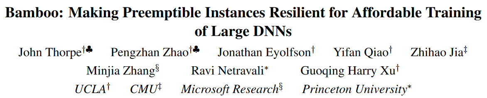

[NSDI'23](https://www.usenix.org/conference/nsdi23/presentation/thorpe)
## 1. Background

- major public clouds provide spot instances with a price much cheaper than on-demand instances

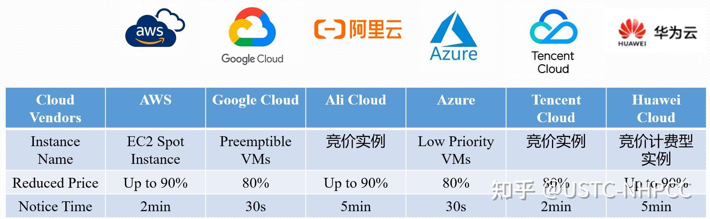

- large datacenters often maintain certain amounts of compute resources that can be allocated for any non-urgent tasks but will be preempted as urgent tasks arise

- Similarly, recent ML systems allow training jobs to use inference-dedicated machines to fully utilize GPU resources but preempts those machines when high-priority inference jobs arrive.

## 2.Motivation:

### 2.1 high preemption rates and unpredictability of spot instances

!!! example "real preemption traces"
    - traces for a 24-hour window

    - used an **autoscaling group** to maintain a cluster of 64/80

    ??? info "autoscaling group"
        automatically allocates new instances upon preemptions to maintain the user specified size
    
    === "Amazon EC2"
        <figure markdown>
          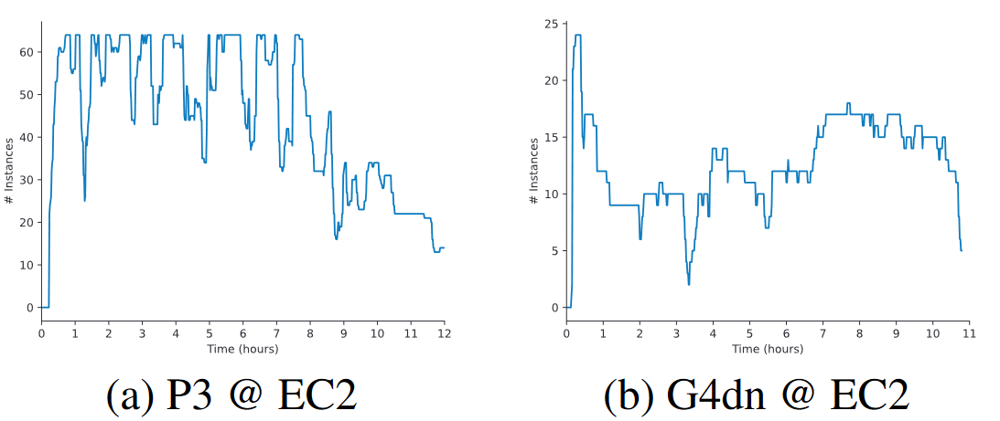{ width = 500 }
        </figure>
        P3: NVIDIA V100 GPUs with 32GB of memory
        
        G4dn: NVIDIA T4 GPUs with 16GB of memory

    === "Google Cloud Platform"
        <figure markdown>
          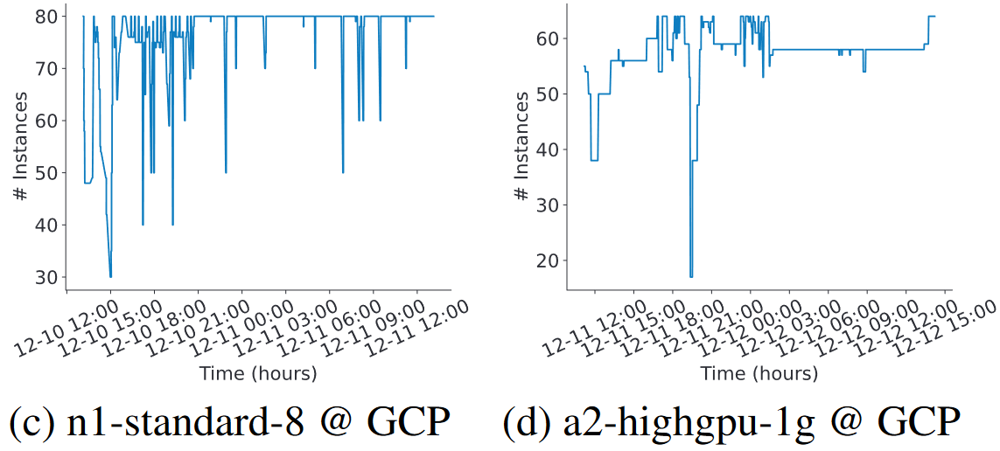{ width = 500 }
        </figure>
        n1-standard-8: NVIDIA V100 GPUs with 16GB GRAM
        
        a2-highgpu-1g: NVIDIA A100 GPUs with 40GB GRAM

    - frequent, bulky and unpredictable        

### 2.2 high performance overheads of strawman approaches

**Strawman 1: Checkpointing**

Each **worker** moves a copy of any relevant model state to **CPU memory** whenever the state is generated; the **CPU** then asynchronously writes it to **remote storage**

!!! example ""
    train GPT-2 over 64 p3.2xlarge GPU spot instances
    <figure markdown>
      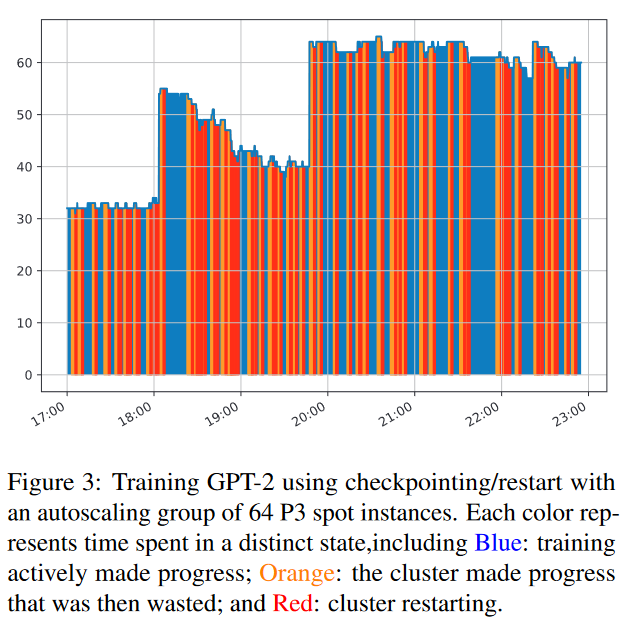{ width = 400 }
    </figure>

As shown, although checkpointing itself can be done efficiently, the restarting overheads (i.e., for adapting existing checkpoints to new pipeline configurations) and the wasted computations take 77% of the training time.

**Strawman 2: Sample Dropping**

Take advantage of the statistical robustness of DNN training and allow some samples to be dropped so that training can continue.

We ran a pre-training benchmark with GPT-2 using 16 on-demand instances from the same EC2 family, which form four data-parallel pipelines, each with four stages.

<figure markdown>
  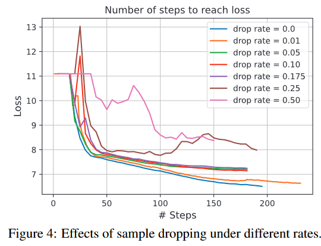{ width = 400 }
</figure>

## 3. System overview

**User Interface:**

- To use Bamboo, a user specifies two system parameters $D$ and $P$ , as they normal would to use other pipeline-parallel systems

- Due to the need of storing redundant layers, Bamboo requires a larger pipeline depth $P$ than a normal pipeline-parallel system such as PipeDream

- We observed, empirically, that to avoid swapping data between CPU and GPU memory on the critical path, Bamboo’s pipeline should be ∼1.5× longer than an on-demand pipeline

<figure markdown>
  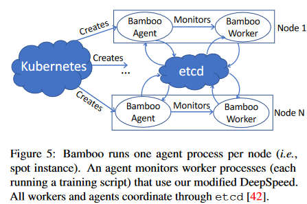
</figure>

<figure markdown>
  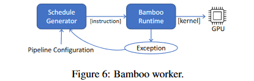
</figure>
??? info "Details"

    - Our spot instances are managed by Kubernetes, which is configured to automatically scale by launching a Bamboo agent on each new allocation.

    - Bamboo agent: Agent monitors a Bamboo worker process on the same node, runs on each node to kill/add a data-parallel pipeline, on top o f TorchElastic.

    - Agents communicate and store cluster state on etcd, a distributed key-value store.

    - Each Bamboo worker uses a runtime to interpret the schedule, which produces a sequence of instructions.

## 4. Design
!!! summary "High level idea"
    - **Redundant Layers**

    - **Redundant Computation**
    
    === "frame1"
        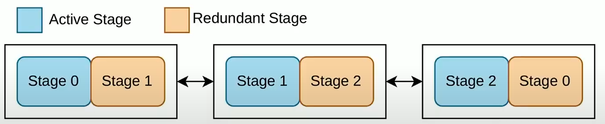{ width = 300 }

    === "frame2"
        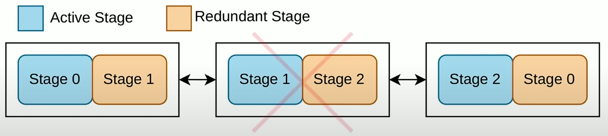{ width = 300 }

    === "frame3"
        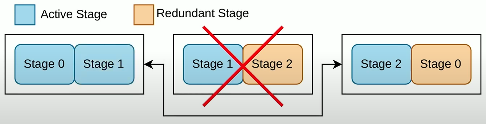{ width = 300 }

    === "frame4"
        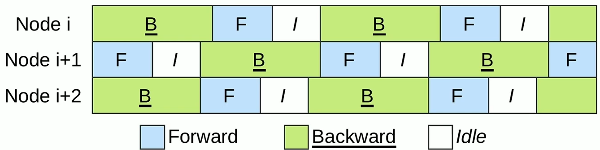{ width = 300 }

    === "frame5"
        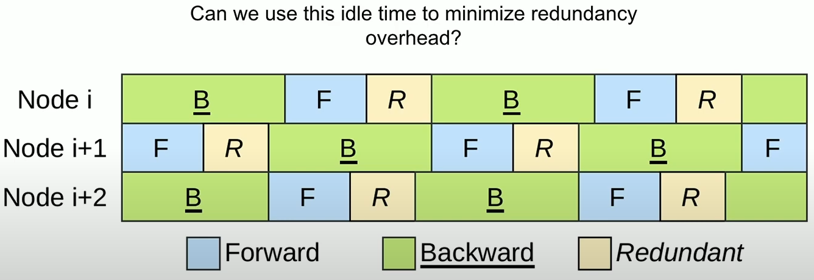{ width = 300 }

    ??? question "parameter update of redundant stage"
        before each iteration starts, Bamboo should update the parameters of the redundant stage to be the same as the normal stage.
        
### 4.1 Redundant Computation
Our discussion focuses on one node running one stage in the pipeline, Support for multi-GPU nodes will be discussed shortly.

Key idea is to let each node run normal (forward and backward) computation over its own layers and redundant (forward and backward) computation over the replica layers for its successor node.

- $FNC_n$/$BNC_n$ denote the forward/backward normal computation on node n

- $FRC_n^m$/$BRC_n^m$ denote the forward/backward redundant computation on node m for node n. In Bamboo, n = (m + 1) mod P where P is the pipeline depth.

!!! info "Dependency graph"
    === "normal pipeline stages"
        <figure markdown>
            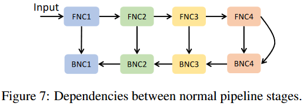{ width = 300 }
        </figure>
    
    === "RC-enabled pipeline stages"
        <figure markdown>
            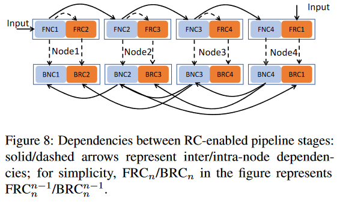{ width = 300 }
        </figure>

### 4.2 Schedule Redundant Computation
RC incurs an overhead in both **time** and **memory**.

#### 4.2.1 Eager FRC

**schedule FRC into the pipeline bubble to reduce forward computation overhead**

!!! info ""
    === "start up phase"
        <figure markdown>
          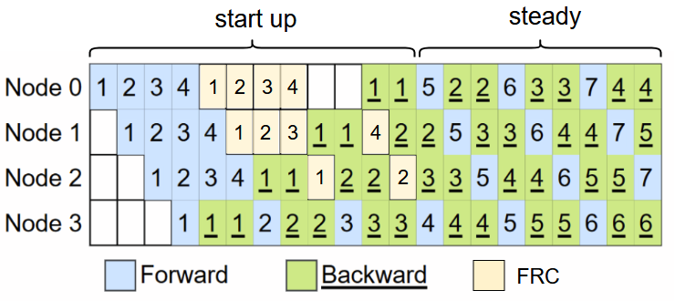{ width=400 }
        </figure>

    === "steady phase"
        <figure markdown>
          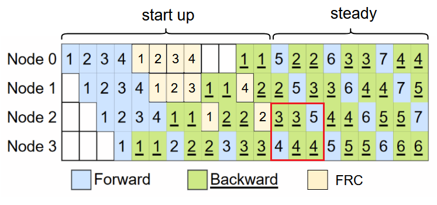{ width=400 }
        </figure>
        
        However, even for 1F1B, bubbles widely exist in a pipeline—as a microbatch passes different pipeline stages, the later a stage, the longer the (backward and forward) computation takes.
        
        <figure markdown>
          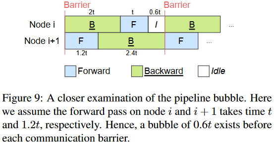
        </figure>
        
        This is because for the 1F1B schedule, the number of active microbatches in a later stage is always smaller than that in an earlier stage. To balance memory usage, the layer partition on a later node is often larger that that on an earlier node in the pipeline, and hence a later stage runs slower.
        
        !!! example
            measured the sizes of the pipeline bubble and forward computation of BERT, 
            
            <figure markdown>
              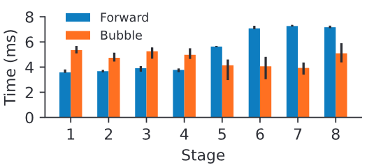
            </figure>
        !!! example ""
            Bamboo schedules $FNC_n$ for the k-th microbatch and $FRC_n^(n+1)$ for its previous (k − 1)-th microbatch to run in parallel.
            === "frame 1"
                <figure markdown>
                  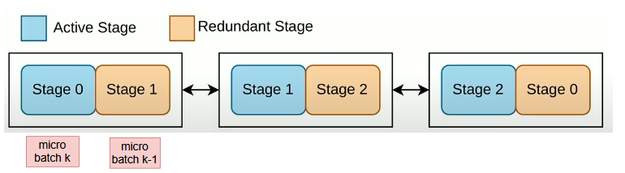{ width=400 }
                </figure>
            
            === "frame 2"
                <figure markdown>
                  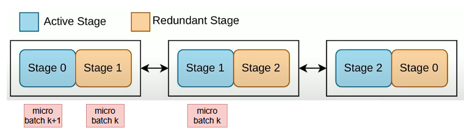{ width=400 }
                </figure>
        - Based on this observation, we schedule FRC on a node before the node starts communicating with its successor node. 

        - This is where a bubble exists. In cases where the FRC cannot fit entirely into the bubble, we overlap FRC and FNC as much as we can.

        - Eager FRC incurs an overall ∼1.5× overhead in GPU memory (that is why Bamboo recommends creating pipelines with 1.5× more nodes)
  
#### 4.2.2 Lazy BRC
perform BRC lazily to reduce backward computation/communication overhead:

- corresponding bubble does not exist

- communication between nodes

#### 4.2.3 reduce memory overhead
- Note that the major source of the memory overhead is storing intermediate results (activations and optimizer state) from FRC, not the redundant layers.

- Bamboo swaps out the intermediate results of each node’s FRC into the node’s CPU memory, leading to substantial reduction in GPU memory usage.

### 4.3 Recovery from non-fatal preemptions

!!! example "Lazy BRC execution"
    === "frame 1"
        <figure markdown>
          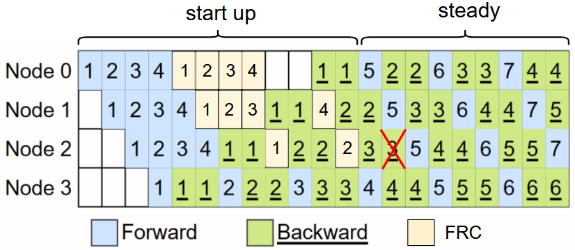{ width=400 }
        </figure>
    === "frame 2"
        detecting its successor node fails
        <figure markdown>
          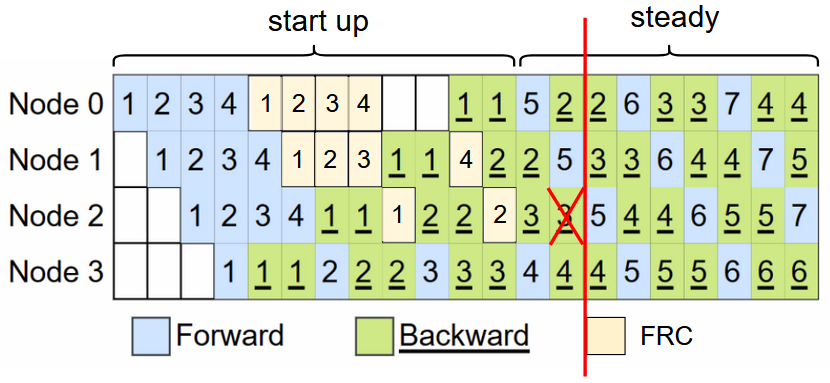{ width=400 }
        </figure>
    === "frame 3"
        for the current iteration, all the lost gradients must be re-computed
        <figure markdown>
          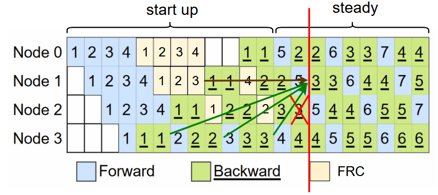{ width=400 }
        </figure>

**Merge instruction groups:**

<figure markdown>
  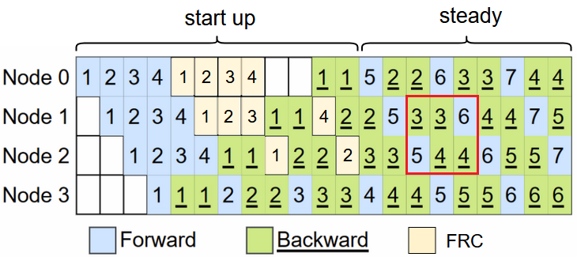{ width=500 }
</figure>

<figure markdown>
  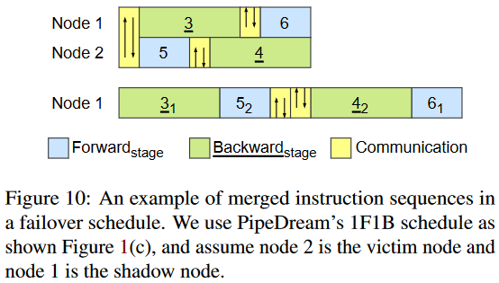{ width=500 }
</figure>

When the two instruction groups are merged, the instructions are interleaved with the following rules: Omitted here, see the paper for details.

### 4.4 Consecutive preemptions and reconfiguration

**Consecutive Failures Are Fatal:**

<figure markdown>
  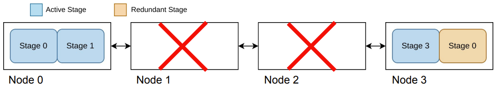{ width=500 }
</figure>

**Avoid consecutive preemptions：**

!!! info "Observation"
    <figure markdown>
      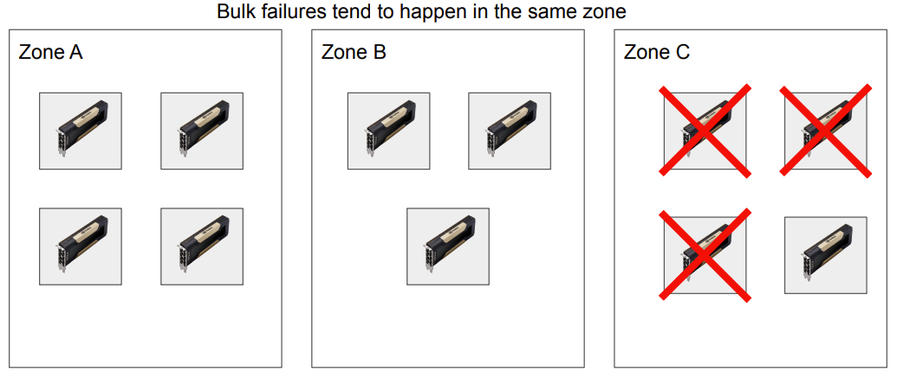{ width=400 }
    </figure>

    - analyzed two 24-hour preemption traces collected respectively from EC2 and GCP

    - EC2: 7 out of 128 timestamps see cross-zone preemptions

    - GCP: 12 out of 328 timestamps see cross-zone preemptions

    - preemptions tend to be independent based on each individual spot market and each availability zone has a different and independent spot market.

<figure markdown>
  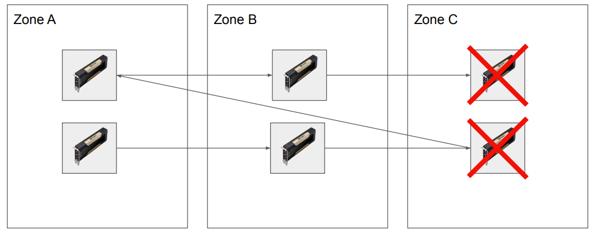{ width=400 }
</figure>

<figure markdown>
  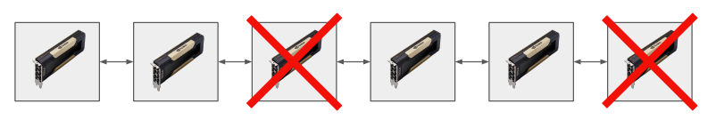{ width=400 }
</figure>

??? info "cross-zone data transfer overhead"
    Although cross-zone data transfer can incur an overhead, this overhead is negligible (e.g., <3%)
    <figure markdown>
      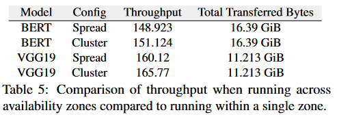{ width=400 }
    </figure>

    - Spread: nodes distributed across all zones

    - Cluster: in a single availability zone with AWS’s "Placement Group" option set to "Cluster"

**Pipeline Reconfiguration:**

- Bamboo periodically checkpoints the model state. These checkpoints will not be used unless Bamboo restarts the training from a rare fatal failure.

- Reconfiguration Policy: Bamboo attempts to maintain the pipeline depth $P$ specified by the user. 
  
  - Sometimes need to decrease $P$ to decrease the total number of data-parallel pipelines. The remaining nodes are placed in a standby queue to provide quick replacement upon future failures.

  - The number of nodes joining, together with those in the standby queue, can form a new pipeline, and in this case we add a new pipeline to the system.

### 4.5 Support for Multi-GPU Nodes

- Bamboo's RC works for multi-GPU settings—this requires replicating all layers that belong to the GPUs of one node in the GPUs of its predecessor node. In other words, we use “**group replicas**” as opposed to individual replicas.

- However, in the presence of frequent preemptions, **using multi-GPU would yield poorer performance**:

    - losing one node (with multiple GPUs) is equivalent to losing multiple nodes in the single-GPU setting. 

    - It is much harder to allocate new multi-GPU nodes during training than single-GPU nodes.

## 5.Evaluation

**Setup.**

- **On top of TorchElastic and DeepSpeed**, we implemented Bamboo ∼7K LoC as a standard Python library

- models:
<figure markdown>
  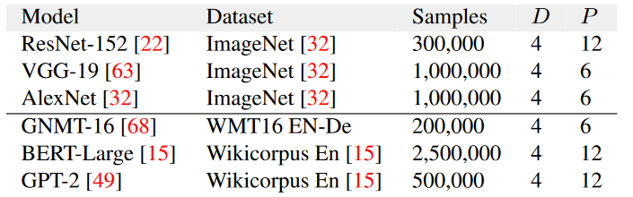{ width=400 }
</figure>

- We trained these models on a spot cluster from EC2’s p3 family where **each instance has V100 GPU(s) with 16GB GPU memory and 61GB CPU memory.**

- Each On-demand instance costs 3.06 USD/hr per GPU while the price of its spot counter-part (at the time of our experiments) is 0.918 USD/hr.

??? info "EC2 p3 family"
    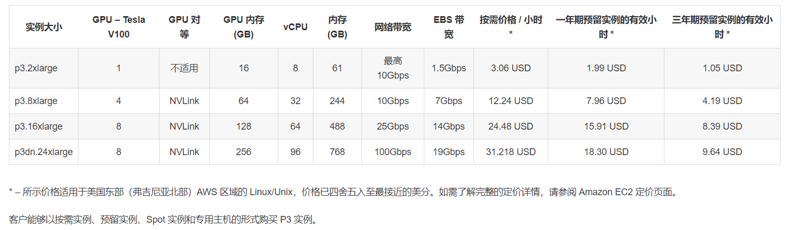

- Baselines:

    - p3 instances each with four V100 GPUs (Demand-M)

    - p3 instances each with one V100 GPU (Demand-S)

- we trained each model to a target validation accuracy, which is a particular number of samples for the model.

- metric: Value = Throughtput (samples/sec) per dollar

### 5.1 Overall performance with respect to training costs

??? info "Details"
    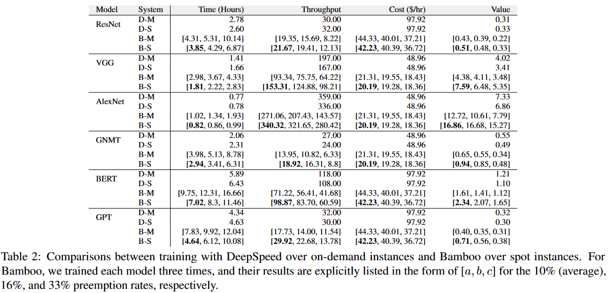

!!! example "BERT-Large(300M)"
    === "Trace"
        <figure markdown>
            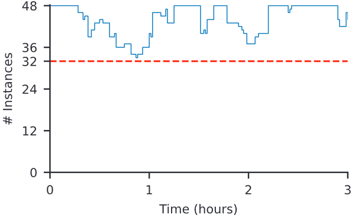{ width = 400 }
        </figure>

    === "Throughtput"
        <figure markdown>
            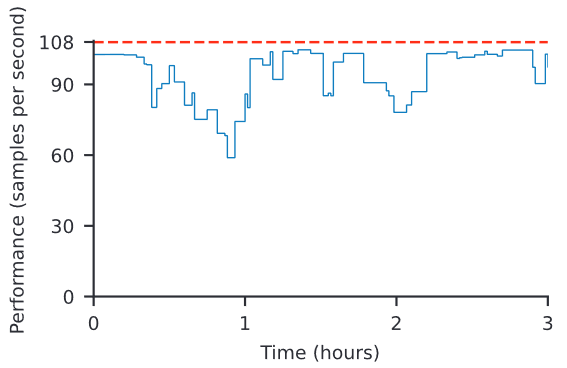{ width = 400 }
        </figure>

    === "Cost"
        <figure markdown>
            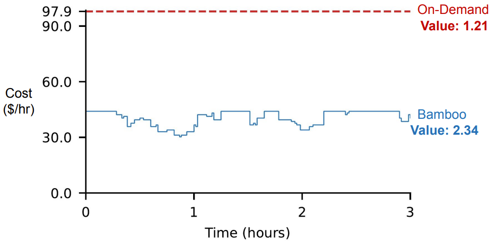{ width = 400 }
        </figure>

### 5.2 Full simulations at different preemption rates

- Simulated BERT-large training until completion at different levels of preemption

- Even at high preemptions Bamboo maintains high value

<figure markdown>
  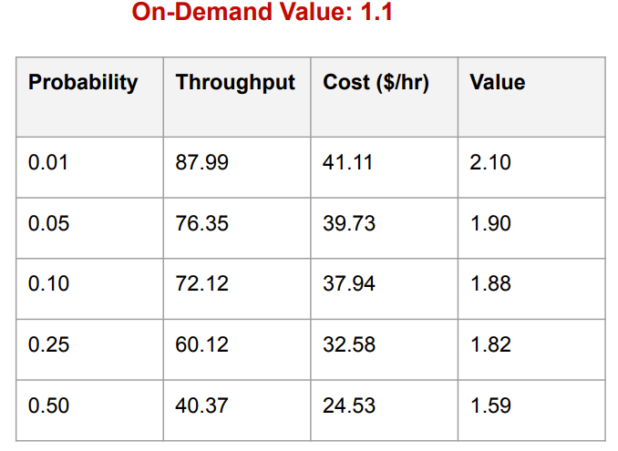{ width=400 }
</figure>

### 5.3 Comparison against existing systems

- Varuna(Eurosys'22) provides resilience with checkpointing.

- We set up Varuna on the same spot cluster on AWS EC2

<figure markdown>
  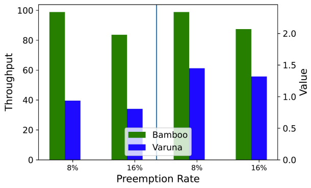{ width=400 }
</figure>

### 5.4 Microbenchmarks of Redundant Computation

<figure markdown>
  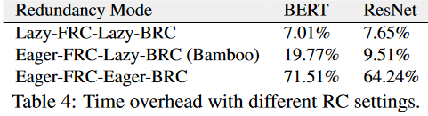{ width=400 }
</figure>

<figure markdown>
  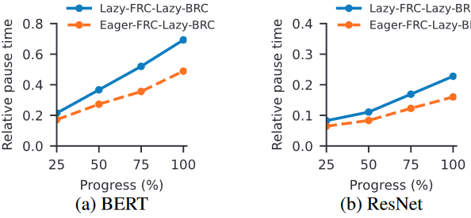{ width=400 }
</figure>

As shown, lazy FRC reduces pause time by **∼35%** despite the slightly higher per-iteration overhead it introduces. In summary, eager-FRC-lazy-BRC strikes the right balance between **overhead and pause time**.