## Flash Attention
[FlashAttention: Fast and Memory-Efficient Exact Attention with IO-Awareness](https://arxiv.org/pdf/2205.14135.pdf)
### 1. Introduction
#### 1.1 Motivation: Modeling Longer Sqquences

动机很简单，就是想要等接受比较长的序列作为泛Transformed架构的输入：

- NLP中：接收到更长的文本，可以理解书，戏剧...

- CV中：可以接受更高分辨率的图像（ViT），更好的理解图像

- 时间序列，音频，视频：都是非常长的序列

**Challenge: How to scale Transformers to longer sequences?**

Transformer的部分结构，这里以Encoder为例：
<figure markdown>
  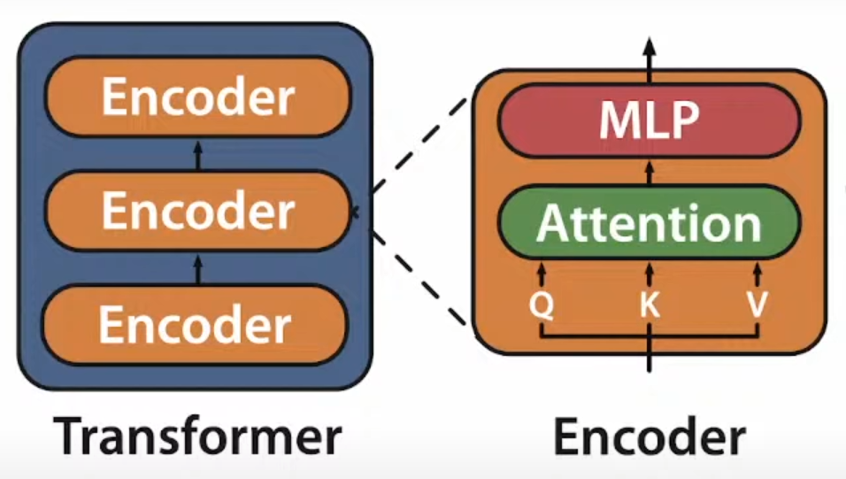{ width="300" }
</figure>
- Attention在sequence变长时，计算的拓展性并不好

- MLP 在sequence变长时，计算的拓展性还不错

所以主要关注对Attention的优化
 
!!! example 
    <figure markdown>
        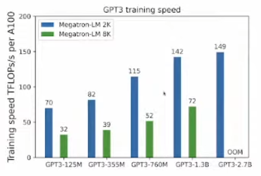
    </figure>
    使用Megatron的方法训练，序列长度从2K-8K，训练时间显著降低

    这里剧透一下用了Flash Attention之后的效果：
    <figure markdown>
        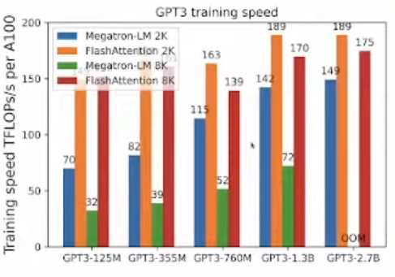
    </figure>

#### 1.2 Method Summary

Tiling & recomputation: 可以有效降低 GPU memory IO

一张图省流概括：
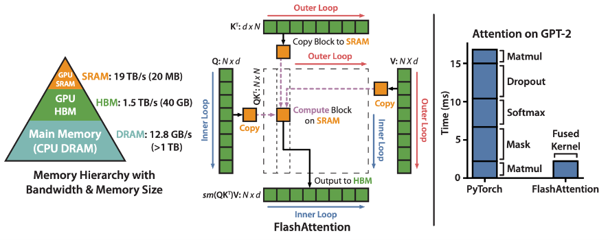

#### 1.3 Background
##### GPU的存储层次：
A100 GPU 为例：
<figure markdown>
  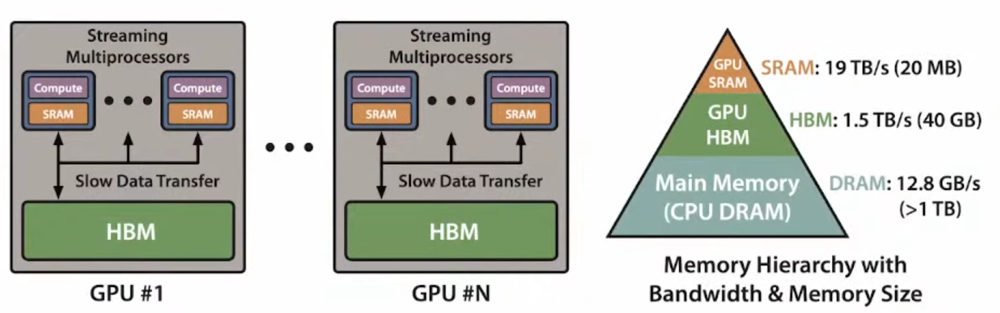
</figure>

- 有 40-80GB 高带宽内存 (HBM)，带宽为 1.5-2.0TB/s

- 108 个流式多处理器（SMP）中的每个都有 192KB on-chip SRAM，带宽约为 19TB/s(似乎就是CUDA编程抽象中的shared memory)

!!! Tip "相关阅读"
    [Making Deep Learning Go Brrrr From First Principles](https://horace.io/brrr_intro.html)

##### Performance characteristics

GPU 有大量的线程来执行opertaion（也被成为 kernel）。每个kernel 将input从HBM load到寄存器和 SRAM，进行计算，然后将output写入 HBM。

根据计算和内存访问的平衡，operations 可分为compute-bound和memory-bound操作。这通常用arithmetic intensity来衡量，即 number of arithmetic operations per byte of memory access

1. Compute-bound：operations持续时间取决于运算次数的多少，而访问 HBM 的时间要短得多。典型的例子是matrix multiply with large inner dimension, convolution with large number of channels.

2. Memory-bound: operations持续时间取决于内存访问次数，而计算耗时要少得多。这方面的例子包括大多数其他操作：elementwise（如activation、dropout）和reduction（如sum、softmax、batch norm、layer norm）。

##### Kernel fusion
加速Memory-bound operation 的最常见方法是 Kernel fusion：如果相同的input会连续经历多个operation，可以从 HBM 一次load输入，而不是为每个operation结束都将结果写入 HBM, 下个operation开始再load。编译器可以自动进行 Kernel fusion

但是，在模型训练的情况下，中间值仍然需要写入 HBM 以供backward计算梯度时使用，导致Kernel fusion效果变差（每次必须store了）。
##### Attention 的计算与瓶颈
!!! important
    Attention is bottlenecked by memory bandwidth

<figure markdown>
  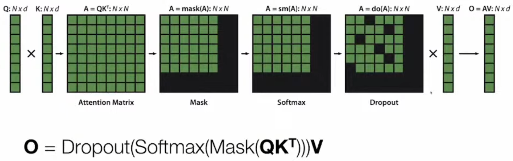
</figure>

上图中的N表示sequence length，一般2K，4K等，d表示Transformer中的每个head的输出维度, d = d_model / #head；**一般d << N**，以GPT-2为例，N = 1024, d = 768/12 = 64

可以观察到，其实Q,K,V,O的大小都不算太大（N * d），但是四个中间结果都是$N^2$的大小，所以序列长度N一大，就会有问题—。

最朴素的实现方式需要重复地对 GPU HBM 进行读写，读写HBM成为主要瓶颈：

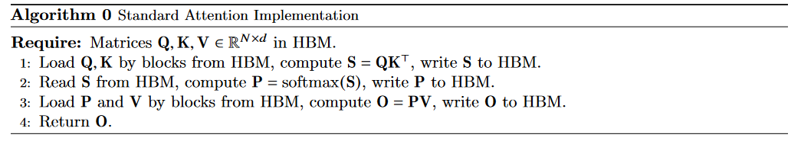

从下图中可以看到，matmul部分(Compute-bound)其实占用的时间并不多，Dropout, softmax, Mask等(Memory-bound)操作占用了大部分时间：

<figure markdown>
  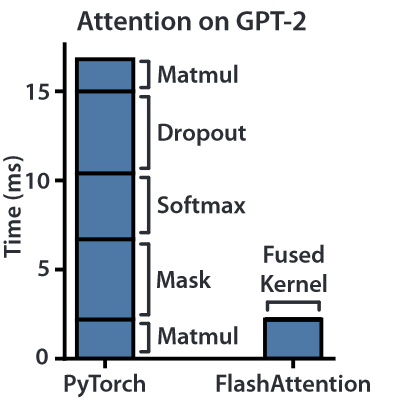{ width="300" }
</figure>

!!! Tip "相关阅读"
    [Data Movement Is All You Need: A Case Study on Optimizing Transformers](https://arxiv.org/pdf/2007.00072.pdf)

##### Approximate Attention
之前也有一些工作，为了加快计算速度，不做全量的计算，而是做近似计算，但都没有被大规模采用，毕竟大家还是比较关注于精度的。

<figure markdown>
  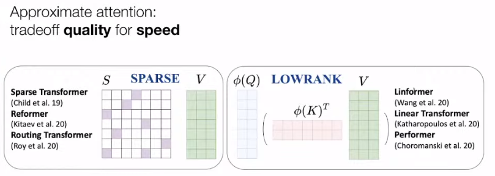
</figure>

!!! Tip "相关阅读"
    可以看一篇综述：[Long Range Arena: A Benchmark for Efficient Transformers(ICLR'20)](https://arxiv.org/pdf/2011.04006.pdf)

### 2. Method

其实就是最基本的tiling的思路，但是会有一些挑战：

- 计算softmax的时候，需要一整行一起计算

- 反向传播的时候，需要比较大的中间结果

解决方法：

- 改进tiling的方式，减少SRAM和HBM之间的数据传输

- 使用经典的Recomputation的方式，不存储中间结果，反向传播需要的时候再冲算一遍

!!! quesiton
    实现方式：fused CUDA kernel for fine-grained control pf memory accesses

    还不懂是啥

#### Tiling
一个将softmax拆开计算的想法：

$\operatorname{softmax}\left(\left[A_1, A_2\right]\right)=\left[\alpha \operatorname{softmax}\left(A_1\right), \beta \operatorname{softmax}\left(A_2\right)\right]$

$\operatorname{softmax}\left(\left[A_1, A_2\right]\right)\left[\begin{array}{l}V_1 \\ V_2\end{array}\right]=\alpha \operatorname{softmax}\left(A_1\right) V_1+\beta \operatorname{softmax}\left(A_2\right) V_2$

所以$\alpha$, $\beta$分别是什么？

这样的话，一个Block的计算流程都可以在SRAM中完成，只需最后再进行一个缩放即可：
<figure markdown>
  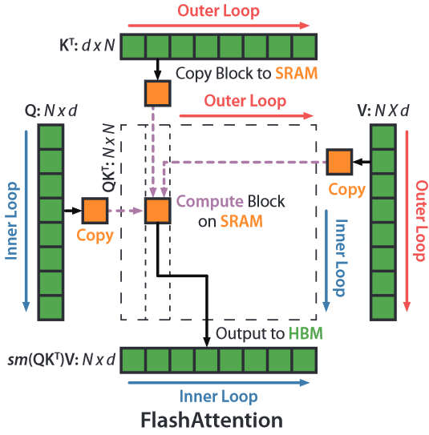{ width=400 }
</figure>
!!! note "更便于理解的动态演示"
    === "frame1"
        <figure markdown>
            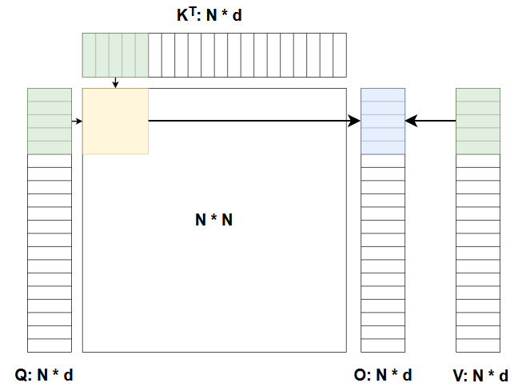
        </figure>

    === "frame2"
        <figure markdown>
          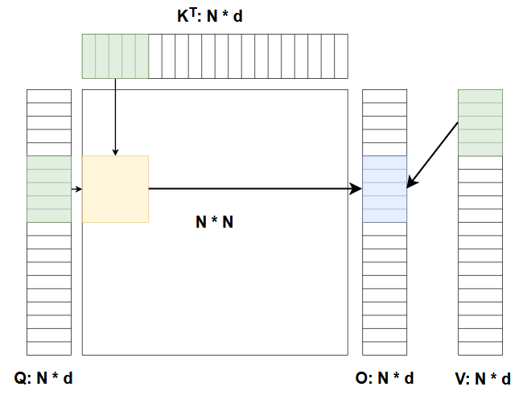
        </figure>

    === "frame3"
        <figure markdown>
          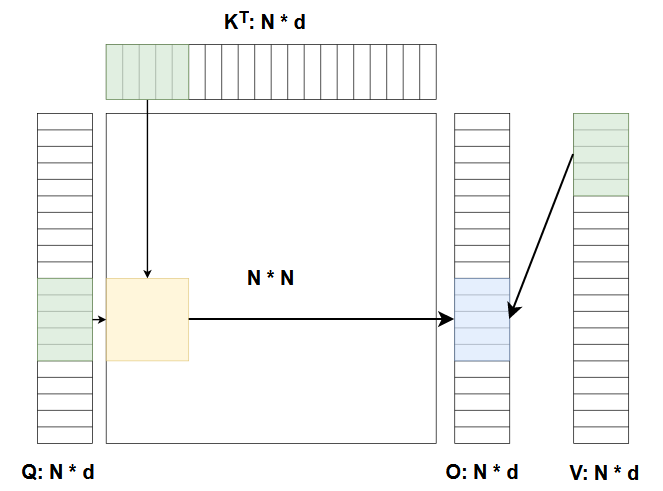
        </figure>

    === "frame4"
        <figure markdown>
          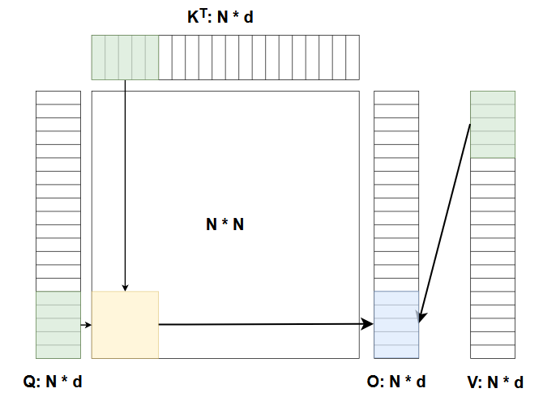
        </figure>
    
    === "frame5"
        <figure markdown>
          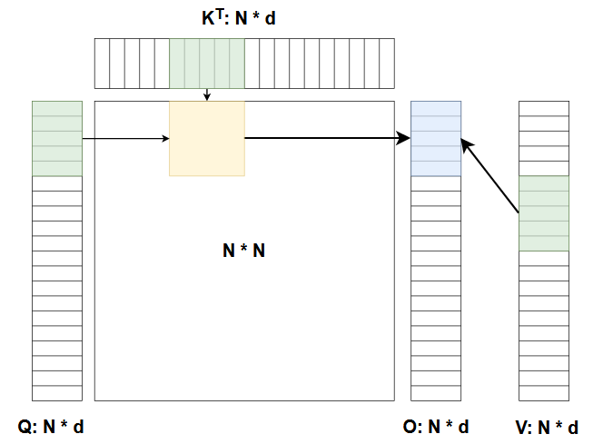
        </figure>
    
    === "frame6"
        <figure markdown>
          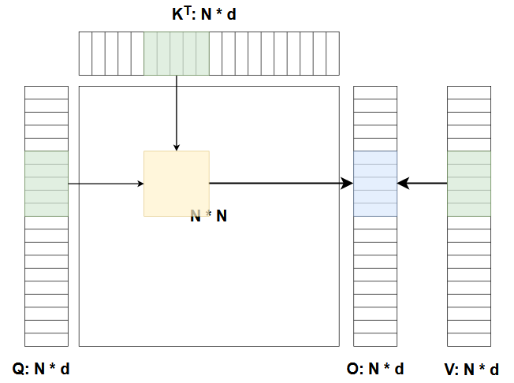
        </figure>

    === "frame7"
        <figure markdown>
          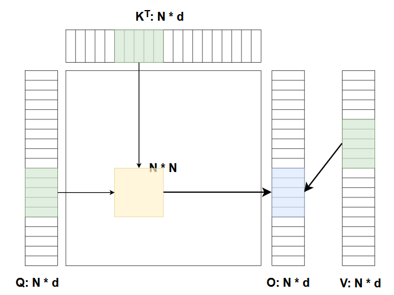
        </figure>

    === "frame8"
        <figure markdown>
          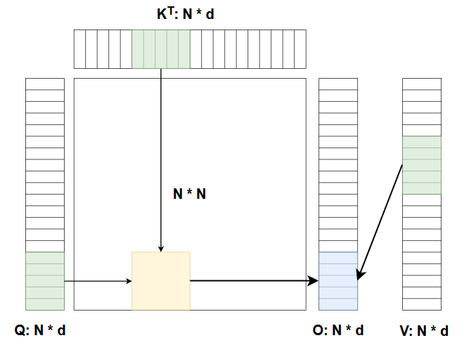
        </figure>

#### Recomputation
其实也是借鉴了gradient checkpointing的想法，不过不同的是:

- gradient checkpoint 常被认为是在maximum amount of memory required 和 speed 之间的trade off

- 在计算能力足够的情况下，通过更大的FLOPs(floating point operations per second)，recomputation甚至比从HBM中读取更快；比如看下表，多做些计算，少些对HBM的读写，总的Runtime会更短

<figure markdown>
  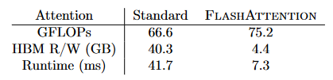
</figure>

## FlashAttention-2
[FlashAttention-2: Faster Attention with Better Parallelism and Work Partitioning](https://arxiv.org/pdf/2307.08691.pdf)

这篇论文补充了许多FlashAttention的细节，主要是在并行性上做了一些优化，使得计算速度更快。
### 1. Introduction

**Key Insights:**

- 减少 non-matmul FLOPs：GPU对matmul的计算有很好的并行性，但是对于其他的操作，比如softmax，mask，dropout等，就不是那么好了，所以可以考虑减少这些操作的计算量

- 在 seqlen这个维度上做并行，从而提高 occupancy；之前仅仅是在batch size, head层面上做，但实际上batch size， head的数量都不是很大，仅仅在这些维度上做并行，还有部分的GPU core是空闲的。在 warps(32 threads) 的层面上做更好的 work partitioning 。

**效果：**
效果使得attention 的计算速度更接近于 pure Matrix Multiplication。

<figure markdown>
  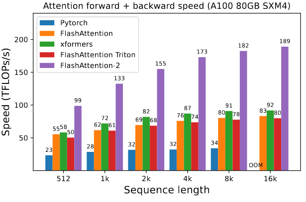
</figure>

### 2. Method
