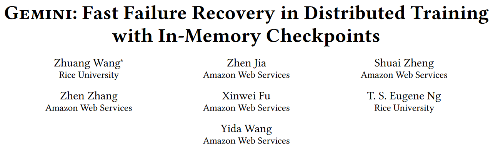

## 1. Overview
<figure markdown>
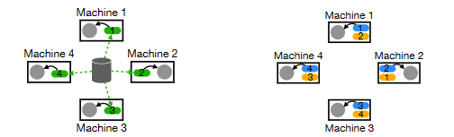{ width=500 }
</figure>

- Existing solutions have significant failure recovery costs due to the severe restriction imposed by the **bandwidth of remote storage in which they store checkpoints**.

- This paper presents Gemini, a distributed training system that enables fast failure recovery for large model training by c**heckpointing to CPU memory of the host machines with much larger aggregated bandwidth.**

**Challenges:**

**How to maximize the probability of failure recovery from checkpoints stored in CPU memory?**

**How to minimize the interference of checkpoint traffic with model training?**

## 2. Background

### 2.1 Frequent failures in model training

- OPT model training reports: training OPT-175B used 992 NVIDIA A100 GPUs, and the training process encountered around **110 failures over a period of two months**[^1]

- Facebook AI's analysis of the **production cluster** shows that checkpoint-related overheads in full recovery can consume an **average of 12% of the total training time**. For the worst 5%, training time slowdown can be **up to 43%**. This 12% overhead can add up to a significant computational cost at scale.[^2]

[^1]: [OPT-175B logbook](https://github.com/facebookresearch/metaseq/tree/main/projects/OPT/chronicles)

[^2]: [Understanding and improving failure tolerant training for deep learning recommendation with partial recovery](https://arxiv.org/pdf/2011.02999.pdf)

### 2.2 Wasted time for failure recovery

!!! example ""
    <figure markdown>
      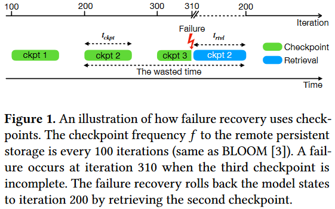{ width=500 }
    </figure>

the average wasted time (denoted as $T_{wasted}$) can be expressed as:

$$
T_{\text {wasted }}=t_{c k p t}+\frac{1}{2 f}+t_{r t v l}
$$

In addition, we have the following constraint:

$$
1 / f \geq \max \left(t_{c k p t}, T_{i t e r}\right)
$$

### 2.3 Limitations of Existing Solutions
To reduce the wasted time, it is critical to reduce checkpoint time $t_{c k p t}$ to enable a higher checkpoint frequency $f$, and the optimal frequency $f$ is every iteration $1 / T_{\text {iter }}$.

It is infeasible to arbitrarily increase the checkpoint frequency because **checkpoint frequency is bottlenecked by the bandwidth of the remote persistent storage**.

??? example "MT-NLG"
    42 minutes to checkpoint the model states of MT-NLG(530B)  to the remote persistent storage when the bandwidth is 20Gbps(AWs FSx). The average wasted time for failure recovery is 42 + 21 + 42 = 105 minutes, which makes the training system less efficient.

    !!! question "Why 42 minutes?"

??? info "related work"

    

### 2.4 Opportunity

- We observe that the CPU memory in GPU machines is sufficient to store a few checkpoints.

<figure markdown>
  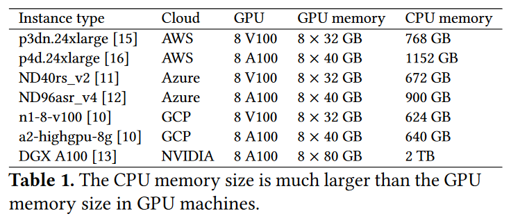{ width=500 }
</figure>

- Because the network connecting GPU instances is optimized for training, its bandwidth is much higher than the bandwidth of the remote persistent storage.

<figure markdown>
  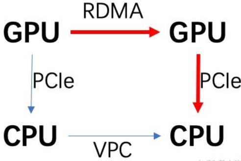{ width=300 }
</figure>

## 3. Designs

### 3.1 Checkpoint Placement

*Given N machines and m checkpoint replicas, what is the optimal placement strategy to distribute the m replicas among the N machines to **maximize the probability of failure recovery** from CPU memory?*

!!! example "Mixed placement strategy" 
    === "N = 4, m = 2"
        <figure markdown>
          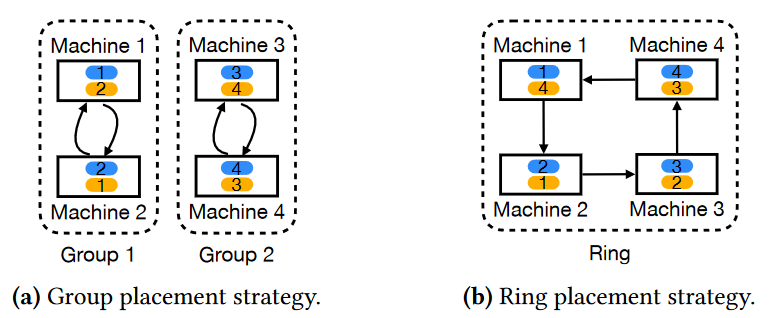{ width = 400 }
        </figure>
    
    === "N = 5, m = 2"
        <figure markdown>
          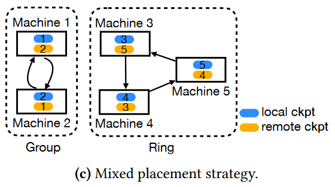{ width = 400 }
        </figure>
    
- When **N is divisible by m**, the mixed placement strategy (equals group placement strategy) **is the optimal placement strategy**.

- When **N is not divisible by m**, the mixed placement strategy minimizes the checkpoint communication time. Its failure recovery probability from CPU memory is **near-optimal** and the **gap is bounded** by $(2 m-3) /\left(\begin{array}{l}N \\ m\end{array}\right)$.

??? info "Corollary"
    When $N$ is divisible by $m$ and $k$ machines are disconnected simultaneously, the probability that GEMINI can recover failures from CPU memory is
    
    $$
    \begin{cases}\operatorname{Pr}(N, m, k)=1, & \text { if } k<m \\
    \operatorname{Pr}(N, m, k) \geq \max \left\{0,1-\frac{N\left(\begin{array}{c}
    N-m \\
    k-m
    \end{array}\right)}{m\left(\begin{array}{c}
    N \\
    k
    \end{array}\right)}\right\}, & \text { if } m \leq k \leq N\end{cases}
    $$

    !!! example ""
        <figure markdown>
          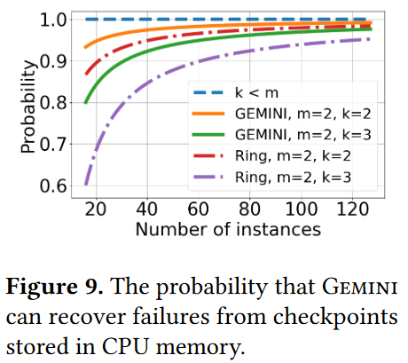{ width = 300 }
        </figure>

    ??? note
        Even for a thousand-scale training cluster, the possibility of two instances having failures at the same time is very limited. Therefore, Gemini with 𝑚 = 2 can recover failures from CPU memory for most cases.

### 3.2 Traffic Interleaving

!!! success "target"
    <figure markdown>
      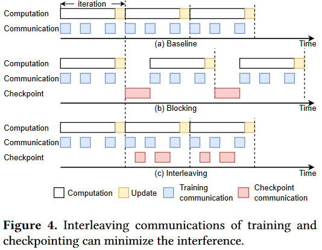{ width=400 }
    </figure>

!!! info "Difficulties and Approaches"
    === "Naive interleave"
        <figure markdown>
          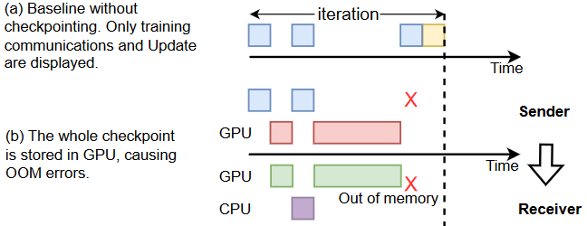{ width=400 }
        </figure>
    === "Checkpoint partition"
        <figure markdown>
          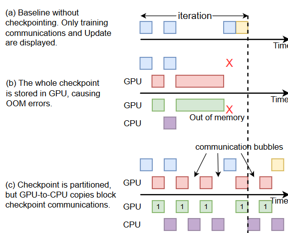{ width=400 }
        </figure>
    === "Partition with Pipeline"
        <figure markdown>
           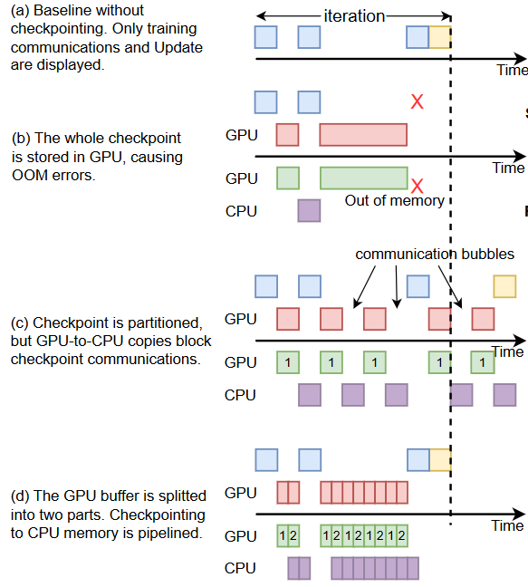{ width=400 }
        </figure>

    ??? example "eval"
        <figure markdown>
          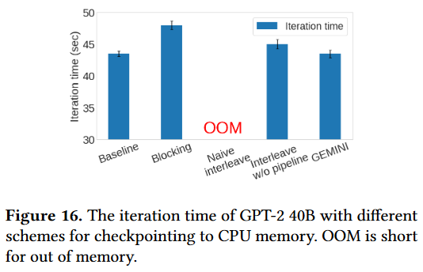{ width=400 }
        </figure>

??? note
    It is still possible that the total time required for checkpointing cannot be fit in the available network idle timespans, Although checkpoint communications hinder the update operation and prolong the iteration time in this case, Gemini can **reduce the checkpoint frequency to amortize the incurred overhead.**

- Gemini adopts online profiling for the first several iterations of training, e.g., 20 iterations in our implementation

- We observed that the profiled timeline remains almost constant across iterations, The normalized standard deviation of the measurements is less than 10%.

### 3.3 System Architecture
<figure markdown>
  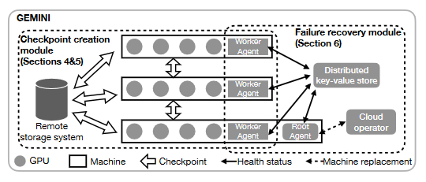
</figure>

??? info "details"
    - Worker agent monitor their own machine’s health status and update it in the distributed key-value store.

    - The root agent periodically checks the health status of each training machine from the distributed key-value store

    - Worker agents also periodically check the root machine’s health status in the distributed key-value store. In the case of a root machine failure, one alive worker machine is promoted as the root machine, and one new worker machine is initialized to replace the failed one.

    - When a training machine replacement is needed, the root agent interacts with the cloud operator to complete the machine replacement and guides the replaced machine where to retrieve its checkpoints

- It leverages CPU memory to store checkpoints for failure recovery, and meanwhile stores checkpoints for other purposes in remote persistent storage.

- Will fall back to using the low-frequency checkpoints stored in the remote persistent storage for failure recovery.

## 4. Evaluation

**setup.**

- **16** p4d.24xlarge instances for evaluations. Each instance has **1152GB CPU memory** and it has **8 NVIDIA A100 (40GB)** GPUs

- p4d.24xlarge instances are connected through a **400Gbps** elastic fabric adaptor (EFA) network

- We adopt FSx as the remote persistent storage and the aggregated bandwidth is **20Gbps**

<!-- - p3dn.24xlarge instances, which have **8 NVIDIA V100 (32GB)** GPUs and are connected to a **100Gbps** EFA network -->

- workload:
<figure markdown>
  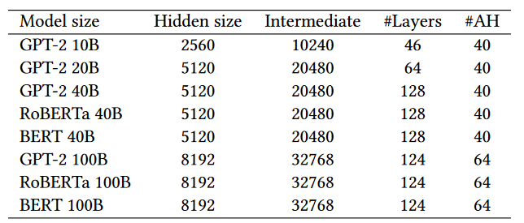{ width=400 }
</figure>

- Use deepspeed **ZeRO-3** setting; optimizer is **Adam**

**Baselines.**

- Strawman: checkpoints model states every three hours[^3], to the remote persistent storage

- HighFreq: As frequently as possible, to the remote persistent storage

[^3]: following the setup in training [BLOOM](https://github.com/bigscience-workshop/bigscience/blob/master/train/tr11-176B-ml/chronicles.md)

### 4.1 Training time

!!! example ""
    Carried out 50 training iterations with Gemini
    
    === "iteration time"
        <figure markdown>
          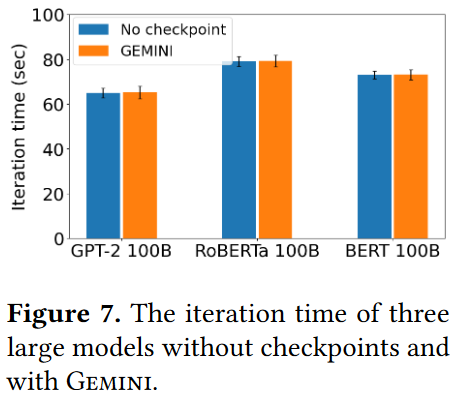{ width=300 }
        </figure>
        
        Gemini does not affect the training iteration times

    === "network idle time"
        <figure markdown>
          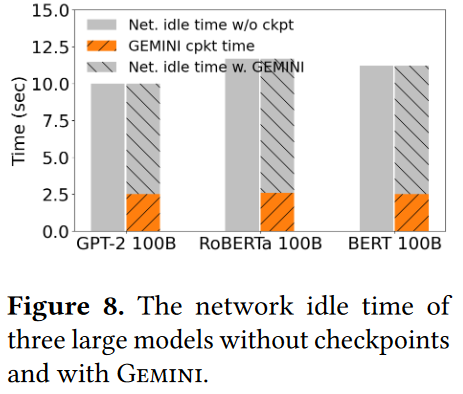{ width=300 }
        </figure>

        there is still available network idle time even after Gemini inserts all the checkpoint traffic

### 4.2 Wasted time
