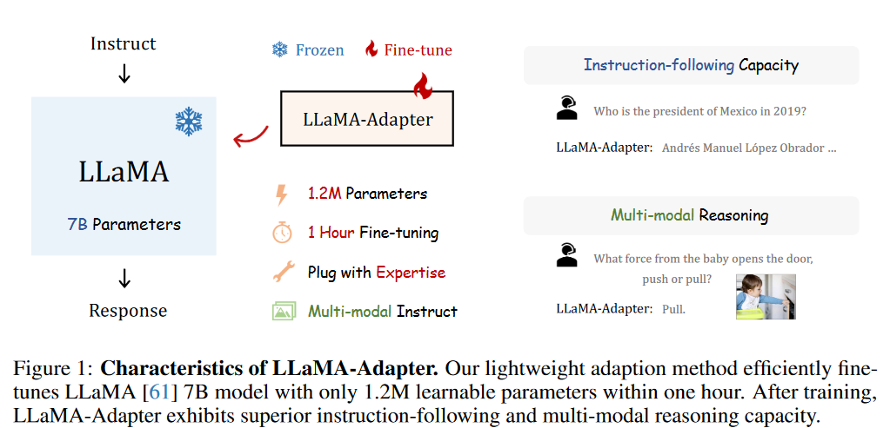
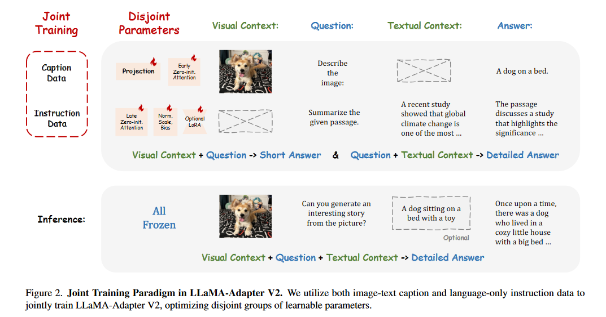

## LLaMA-Adatper
[LLaMA-Adapter: Efficient Fine-tuning of Language Models with Zero-init Attention](https://arxiv.org/pdf/2303.16199.pdf)
### 1. Introduction
之前的Stanford提出的Alpaca，虽然可以微调 7B 个参数的 LLaMA（微调整个模型），需要的存储空间大，微调的速度不够快。也有将Alpaca与LoRA结合的工作。与它们相比，可以看到LLaMA-Adapter的效果：

<figure markdown>
  { width="400" }
</figure>

笼统地讲，LLAMA-Adapter有以下几个显著的优势：
<figure markdown>
  
</figure>

- 1.2M Parameters：Adapter 的训练参数少

- One-hour Fine-tuning：微调时间短，8个 A100上只需要1小时

- Plug with Expertise：针对不同场景，可灵活地插入该场景下的Adapter。

- Multi-modal Instruction：

### 2. Method
learnable adaption prompts 是啥

instruction tokens 是啥
#### 2.1 Learnable Adaption Prompts

现在手上有 Self-Instruct开源的 52K 的 instruction data，和预训练好的有 N-layer transformer 的 LLaMA

将 **learnable adaption prompts** 插入到 transformer 顶部的 L 层中（$L \le N$），目的是在较高层次的语义上对模型进行微调。

!!! question
    这里似乎可以将 learnable adaption prompts 看作是 instruction + instances input + instances output?

!!! question
    为什么可以在较高的层直接插入prompts?

形式化的将要插入到 transformer 顶部的 L 层的 learnable adaption prompts 记为$\{P_l\}_{l=1}^L$，其中$P_l \in \mathbb{R}^{K \times C}$, $K$是prompt的长度，$C$是transformer的 feature dimension。

以第 l 个要被插入 learnable adaption prompt 的层为例（$l \le L$），将该层的输入记为 $T_l \in \mathbb{R}^{M \times C}$，其中 $M$ 是输入序列的长度。 $T_l$ **代表instruction和input和已经生成的部分output**。

The learnable adaption prompt is concatenated with Tl along the token dimension as prefix, formulated as:
$$
\left[P_l ; T_l\right] \in \mathbb{R}^{(K+M) \times C}
$$

以这种方式，可以从 $P_l$ 中学习到的信息用于有效引导 $T_l$ 生成。

#### 2.2 Zero-initiallized Attention

假设模型在$[P_l; T_l]$的基础上正在生成第(M + 1)个单词，且目前处于第 l 个被插入的层。我们将相应的第 (M + 1) 个单词标记表示为 $t_l \in \mathbb{R}^{1 \times C}$

$$
\begin{aligned}
Q_l & =\operatorname{Linear}_{\mathrm{q}}\left(t_l\right) ; \\
K_l & =\operatorname{Linear}_{\mathrm{k}}\left(\left[P_l ; T_l ; t_l\right]\right) ; \\
V_l & =\operatorname{Linear}_{\mathrm{v}}\left(\left[P_l ; T_l ; t_l\right]\right) .
\end{aligned}
$$

Then, the attention scores of $Q_l$ and $K_l$ before the softmax function are calculated as

$$
S_l=Q_l K_l^T / \sqrt{C} \in \mathbb{R}^{1 \times(K+M+1)}
$$

!!! question
    这里为什么不是 self-attention? $Q_l$ 和 $K_l$ 和 $V_l$ 为啥不一样？

$S_l$记录了新词$t_l$与所有K+M+1个token之间的特征相似度。同时，$S_l$ 可以由两个分量重新表示为：
$$
S_l = \left[S_l^K ; S_l^{M+1} \right]^T
$$

其中$S_l^K \in \mathbb{R}^{K \times 1}$表示的是前K个prompt token与第 M + 1个 token之间的 attention score，$S_l^{M+1} \in \mathbb{R}^{M+1 \times 1}$。

前面的$S_l^K$表示 learnable adaption prompt 对生成$t_l$ 贡献了多少信息，这可能会在早期训练阶段造成干扰。

为此，我们采用可学习的**gating factor**（门控因子），表示为$g_l$，来自适应控制$S_l^K$在注意力中的重要性。 $g_l$ 初始化为0，首先可以消除欠拟合提示的影响，然后增加其幅度，为 LLaMA 提供更多的指令语义。因此，我们独立地将softmax函数应用于$S_l$中两个分量，并将第一项乘以gl，公式为：

$$
S_l^g=\left[\operatorname{softmax}\left(S_l^K\right) \cdot g_l ; \quad \operatorname{softmax}\left(S_l^{M+1}\right)\right]^T
$$

单独的 softmax 函数确保第二项与learnable adaption prompt。当$g_l$接近于0时，它基本上可以将LLaMA最初预先训练的知识传递给token $t_l$，以进行可信生成。在实践中，我们采用多个$g_l$对attention内的不同头进行独立学习，有利于多头机制的学习多样性。

最后，使用线性投影层计算第 l 个注意力层的输出：

$$
t_l^o=\operatorname{Linear}_{\mathrm{o}}\left(S_l^g V_l\right) \in \mathbb{R}^{1 \times C}
$$

#### 2.3 Multi-modal Reasoning
现阶段无关略

#### 2.4 Zero-initialized Attention for other Large Models
现阶段无关略

## LLaMA-Adapter V2
[LLaMA-Adapter V2: Parameter-Efficient Visual Instruction Model](https://arxiv.org/pdf/2304.15010.pdf)

目前有用信息：

We first **unfreeze all the normalization layers** in LLaMA. **For each linear layer in the Transformer, we add a bias and a scale factor as two learnable parameters.** We denote the input and pre-trained weights of a certain linear layer as x and W, respectively. In LLaMA-Adapter V2, we modify the linear layer using the bias b and scale s as：

$$
\begin{array}{r}
\mathbf{y}=\mathbf{W} \cdot \mathbf{x} \rightarrow \mathbf{y}=s \cdot(\mathbf{W} \cdot \mathbf{x}+b) \\
\text { where } b=\operatorname{Init}(0), \quad s=\operatorname{Init}(1)
\end{array}
$$