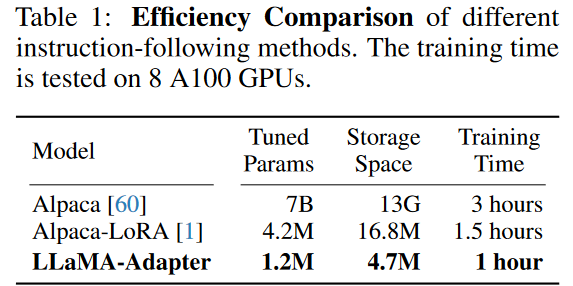

## LLaMA-Adatper
(LLaMA-Adapter: Efficient Fine-tuning of Language Models with Zero-init Attention)[https://arxiv.org/pdf/2303.16199.pdf]
### 1. Introduction
之前的Stanford提出的Alpaca，虽然可以微调 7B 个参数的 LLaMA（微调整个模型），需要的存储空间大，微调的速度不够快。也有将Alpaca与LoRA结合的工作。与它们相比，可以看到LLaMA-Adapter的效果：

<figure markdown>
  { width="400" }
</figure>

## LLaMA-Adapter V2
(LLaMA-Adapter V2: Parameter-Efficient Visual Instruction Model)[https://arxiv.org/pdf/2304.15010.pdf]