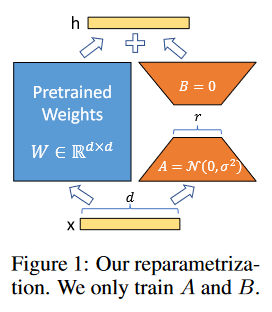
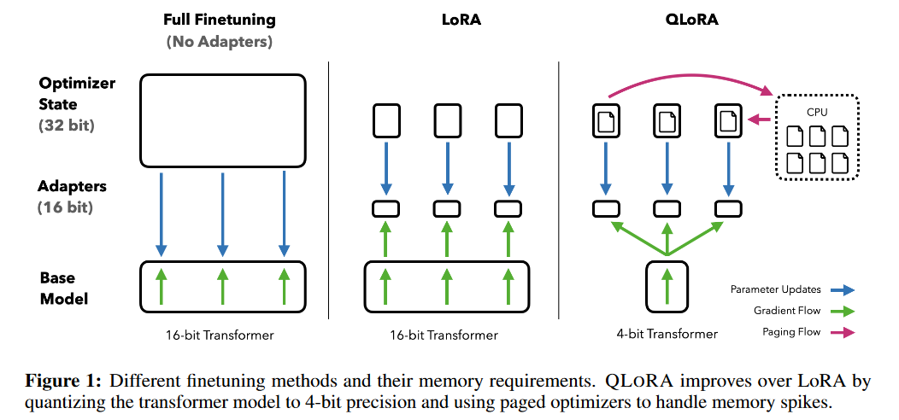

## LoRA: Low-Rank Adaptation of Large Language Models

**想解决的问题：**fine-tune时，如果更新整个模型的参数，会有以下问题：

- 要存储整个模型的参数，需要很大的存储空间

- 直接修改了原本的预训练模型，如果fine-tune的任务不成功，那么预训练模型也已改变，不能再用了

**提出的解决方法：**不更改预训练好的模型（Freezes the pre-trained model），而是原模型基础上加一个adapter，只训练这个adapter

这个adapter的形式很妙：

- 本质是一个低秩矩阵（low-rank matrix），计算时可以以分解后的形式计算，节省计算量

- 与预训练模型对应的部分的形状是一样的，可以直接加到预训练模型上。

<figure markdown>

</figure>

$$
h = W_0 x + \Delta W x = W_0 + BAx = (W_0 + BA)x
$$

预训练的权重矩阵：$W_0 \in \mathbb{R}^{d \times k}$

$B \in \mathbb{R}^{d \times r}, A \in \mathbb{R}^{r \times k}$, and the rank $r \ll \min (d, k)$. 

在fine-tune时, $W_0$ 会被冻结并不进行任何参数更新, 仅仅更新 $A$ 和 $B$. 

原则上，可以将 LoRA 应用于神经网络中的任意权重矩阵，以减少可训练参数的数量。在 Transformer 架构中，self-attention模块中有四个权重矩阵（Wq、Wk、Wv、Wo），MLP 模块中有两个。我们将 Wq（或 Wk、Wv）视为维度为 dmodel × dmodel 的单一矩阵，尽管输出维度通常被切成注意力头。出于简单性和参数效率的考虑，我们的研究仅限于调整下游任务的注意力权重，并冻结 MLP 模块（使其不在下游任务中接受训练）。关于调整 MLP 层、LayerNorm 层和偏置的实证研究，将留待今后的工作中进行。

## QLoRA: Low-Rank Adaptation of Large Language Models
### 简介
对一个 65B参数的 LLaMA 模型进行 regular 16-bit finetuning 需要超过 780 GB 的 GPU 内存。虽然最近的量化方法可以减少 LLM 的内存占用，但这些技术只适用于推理，在训练过程中会导致崩溃。

在LoRA的基础上，对被冻结的预训练模型参数做量化，以减小其空间开销。我们首次证明，可以在不降低性能的情况下对量化后的 4 位模型进行微调。

QLoRA 是一种高效的微调方法，它能减少内存使用量，足以在单个 48GB GPU 上对 65B 个参数的模型进行微调，同时保持完整的 16 位微调任务性能。与 16 位完全微调基线相比，运行时间或预测性能不会降低。

**QLoRA 引入了一系列创新方法，在不牺牲性能的情况下节省内存：**

- **4-bit NormalFloat(NF4)**，这是一种信息论上最优的量化数据类型，适用于正态分布数据，其经验结果优于 4 位整数和 4 位浮点数。
  
- **Double Quantization**，通过量化量化常数来减少平均内存占用，平均每个参数可节省约 0.37 比特（65B参数的模型可节省 3 GB）。

- **Paged Optimizers**，用于管理内存峰值。使用英伟达（NVIDIA）统一内存，以避免在处理序列长度较长的 mini-batch 时出现梯度检查点内存峰值。

### 背景

#### Block-wise k-bit Quantization

最朴素的量化/反量化方式：

$$
\mathbf{X}^{\mathrm{Int8}}=\operatorname{round}\left(\frac{127}{\operatorname{absmax}\left(\mathbf{X}^{\mathrm{FP} 32}\right)} \mathbf{X}^{\mathrm{FP} 32}\right)=\operatorname{round}\left(c^{\mathrm{FP} 32} \cdot \mathbf{X}^{\mathrm{FP} 32}\right)
$$

$$
\operatorname{dequant}\left(c^{\mathrm{FP} 32}, \mathbf{X}^{\mathrm{Int8}}\right)=\frac{\mathbf{X}^{\mathrm{Int8}}}{c^{\mathrm{FP} 32}}=\mathbf{X}^{\mathrm{FP} 32}
$$

可能会有什么问题呢？——如果X内数据分布不均匀，且absmax很大，可能会导致量化的失真率很高。

一个解决方案，将X分成多个block，每个block内自己单独按照上面的方式量化。

#### Low-rank Adapters
这个其实计时LoRA，只不过这篇文章里加了一个标量的缩放因子s:

$$
\mathbf{Y}=\mathbf{X} \mathbf{W}+s \mathbf{X L}_1 \mathbf{L}_2,
$$

where $\mathbf{X} \in \mathbb{R}^{b \times n}, \mathbf{W} \in \mathbb{R}^{n \times o}$, $\mathbf{L}_1 \in \mathbb{R}^{h \times r}$ and $\mathbf{L}_2 \in \mathbb{R}^{r \times o}$, and $s$ is a scalar.

!!! question
    如何理解论文中的这句话:
    > Gradients during stochastic gradient descent are passed through the fixed pretrained model weights to the adapter
#### Memory Requirement of Parameter-Efficient Finetuning

一个重要的讨论点是 LoRA 在训练过程中对内存的需求，包括所使用adapter的数量和大小。由于 LoRA 占用的内存极少，我们可以使用更多adapter来提高性能，而不会显著增加总内存。

主要占内存的还是预训练模型的参数，

### 具体实现

#### 4-bit NormalFloat Quantization

#### Double Quantization

#### Paged Optimizers

使用英伟达unified memory 的 feature，可在 CPU 和 GPU 之间自动进行页到页传输，以便在 GPU 偶尔内存不足的情况下进行无差错 GPU 处理。该功能与 CPU RAM 和磁盘之间的常规内存分页功能类似。我们使用该功能为**优化器状态分**配分页内存，当 GPU 运行到内存不足时，这些内存会被自动驱逐到 CPU RAM，而在优化器更新步骤中需要内存时，这些内存又会被重新分页到 GPU 内存中。

#### Put It All Together

$$
\mathbf{Y}^{\mathrm{BF} 16}=\mathbf{X}^{\mathrm{BF} 16} \text { doubleDequant }\left(c_1^{\mathrm{FP} 32}, c_2^{\mathrm{k}-\mathrm{bit}}, \mathbf{W}^{\mathrm{NF} 4}\right)+\mathbf{X}^{\mathrm{BF} 16} \mathbf{L}_1^{\mathrm{BF} 16} \mathbf{L}_2^{\mathrm{BF} 16},
$$

doubleDequant $(\cdot)$ 被定义为:

$$
\text { doubleDequant }\left(c_1^{\mathrm{FP} 32}, c_2^{\mathrm{k}-\mathrm{bit}}, \mathbf{W}^{\mathrm{k}-\mathrm{bit}}\right)=\operatorname{dequant}\left(\operatorname{dequant}\left(c_1^{\mathrm{FP} 32}, c_2^{\mathrm{k}-\mathrm{bit}}\right), \mathbf{W}^{4 \mathrm{bit}}\right)=\mathbf{W}^{\mathrm{BF} 16},
$$

We use NF4 for W and FP8 for $c_2$. We use a blocksize of 64 for $\mathbf{W}$ for higher quantization precision and a blocksize of 256 for $c_2$ to conserve memory.

!!! question
    > For parameter updates only the gradient with respect to the error for the adapters weights $\frac{\partial E}{\partial \mathbf{L}_i}$ are needed, and not for 4-bit weights $\frac{\partial E}{\partial \mathbf{W}}$. However, the calculation of $\frac{\partial E}{\partial \mathbf{L}_i}$ entails the calculation of $\frac{\partial \mathbf{X}}{\partial \mathbf{W}}$ which proceeds via equation (5) with dequantization from storage $\mathbf{W}^{\mathrm{NF}}$ to computation data type $\mathbf{W}^{\mathrm{BF} 16}$ to calculate the derivative $\frac{\partial \mathbf{X}}{\partial \mathbf{W}}$ in BFloat16 precision.