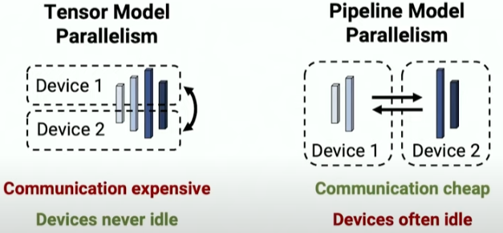
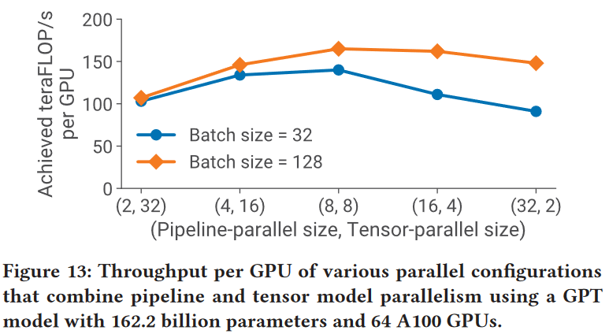
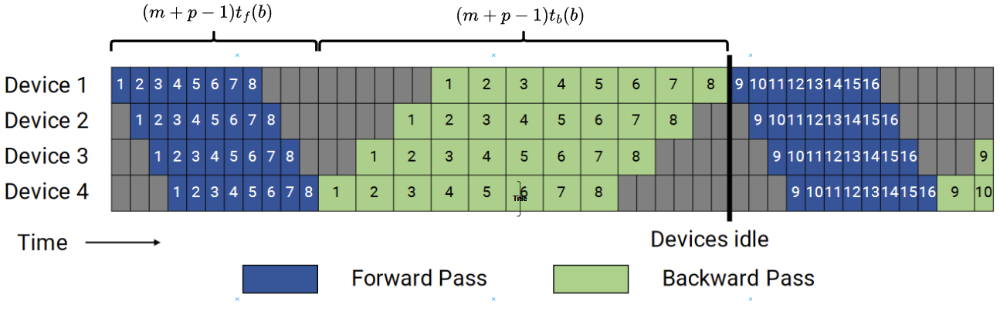
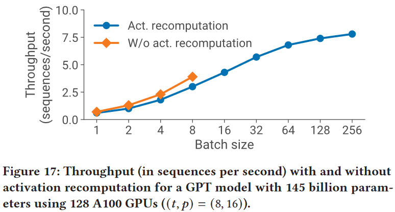

[Efficient Large-Scale Language Model Training on GPU Clusters Using Megatron-LM(SC'21)](https://dl.acm.org/doi/10.1145/3458817.3476209)

## 1. Introduction

<figure markdown>
  { width="300" }
</figure>

The number of parameters in state-of-the-art NLP models have grown at an exponential rate (Figure 1).

<figure markdown>
  { width="300" }
</figure>

Our method leverages the combination of **pipeline parallelism across multi-GPU servers**, **tensor parallelism within a multi-GPU server**.

Our approach allows us to perform training iterations on a model with **1 trillion parameters** at 502 petaFLOP/s on 3072 GPUs (per-GPU throughput of **52% of theoretical peak**).

<figure markdown>
  
</figure>

## 2. Method

Notation:

- $(p, t, d)$ : Parallelization dimensions. $p$ for the pipeline-modelparallel size, $t$ for the tensor-model-parallel size, and $d$ for the data-parallel size.

- $n$ : Number of GPUs. We require $p \cdot t \cdot d=n$.

- B: Global batch size (provided as input).

- $b$ : Microbatch size.

- $m=\frac{1}{b} \cdot \frac{B}{d}:$ Number of microbatches in a batch per pipeline.

### 2.1 PTD-P

In above figure, $p=2, t=2, d=3$
### 2.2 interleaved pipelining schedule

We propose a novel interleaved pipelining schedule that can improve throughput by 10+% with memory footprint comparable to existing approaches.

!!! note "Pipeline Schedule Strategy"
    Assume 1 batch partitioned to $m$ mirco-batch, there are $p$ devices

    === "all-forward, all-backward"
        <figure markdown>
        
        </figure>

        - bubble ratio(bubble/not-bubble): $\frac{p-1}{m}$
    
    === "1F1B"
        <figure markdown>
        
        </figure>

        - bubble ratio(bubble/not-bubble): $\frac{p-1}{m}$

        - **Reduce the memory overhead of activation**: at most stash $p$ microbatches' activation, rather than $m$ in all-forward, all-backward.
        
    === "1F1B with Interleaved Stages"
        <figure markdown>
        
        </figure>
        ??? example
            8 Layer, 4 GPU
            === "1F1B"
                stage_num = GPU_num = 4
                
            === "1F1B with Interleaved Stages"
                v = 2, stage_num = v * GPU_num = 8
                

        - bubble ratio(bubble/not-bubble): $\frac{1}{v} \frac{p-1}{m}$

        - the amount of communication also increases by $v$.

### 2.3 Scatter/gather communication optimization

Each DGX A100 is equipped with 8 InfiniBand (IB) networking cards.

<figure markdown>
  
</figure>

reduce from $bsh$ to $\frac{bsh}{t}$ , where $t$ is the tensor-model-parallel size, $s$ is the sequence length, and $h$ is the hidden size.

## 3. Experiments and Analysis

- Run on [NVIDIA Selene Supercomputer](https://blogs.nvidia.com/blog/2020/12/18/nvidia-selene-busy/), Selene is composed of four SuperPODs, each with a total of 140 nodes, each a NVIDIA DGX A100, giving Selene a total of 560 nodes.

- In this work, use 384 nodes of Selene, each with 8 NVIDIA DGX A100 GPUs, for a total of 3072 GPUs.

- Each cluster node has 8 NVIDIA 80-GB A100 GPUs, connected to each other by NVLink and NVSwitch.

- Each node has eight NVIDIA Mellanox 200Gbps HDR Infiniband HCAs for application communication, with an additional two HCAs per node for dedicated storage.

- The nodes are connected in a threelevel (leaf, spine, core) fat-tree topology with 850 switches.

- The cluster uses an all-NVME shared parallel filesystem for high-performance data access and storage.

- When training a trillion-parameter model on 3072 GPUs, our implementation used an effective bisection bandwidth of 892 GB/s for pipeline-parallel communication, and 13 TB/s for data-parallel communication.

??? question annotate "intra-server communication"
    600GB/s of GPU-to-GPU bidirectional bandwidth (1) ? 

1.  https://www.nvidia.com/en-sg/data-center/dgx-a100/#:~:text=600GB/s%20of%20GPU%2Dto%2DGPU%20bidirectional%20bandwidth 

### 3.1 PTD-P Performance

!!! question "superlinear scalability?"

### 3.2 Estimating end-to-end training time

- $P$: the number of parameters in the model

- $T$: the number of training tokens

- $X$: the number of FLOPs per GPU

- $n$: the number of GPUs

$$
\text { End-to-end training time } \approx \frac{8 T P}{n X}
$$

!!! tip 
    Some [blog](https://zhuanlan.zhihu.com/p/655402388#:~:text=%E6%80%BB%E7%AE%97%E5%8A%9B%EF%BC%88Flops%EF%BC%89%3D-,6%20*%20%E6%A8%A1%E5%9E%8B%E7%9A%84%E5%8F%82%E6%95%B0%E9%87%8F%20*%20%E8%AE%AD%E7%BB%83%E6%95%B0%E6%8D%AE%E7%9A%84%20token%20%E6%95%B0,-%E3%80%82) said that the floating-point operations for GPT architecture is $6TP$, this only consider the forward pass and the backward pass. $8TP$ consider the re-computation for activation checkpointing.

!!! example
    === "GPT-3"
        $P$ = 175 billion, $T$ = 300 billion, $n$ = 1024 A100 GPUs, achieve $X$ = 140 teraFLOP/s per GPU

        -> 34 days
    
    === "1 trillion parameter model"
        $P$ = 1 trillion, $T$ = 450 billion, $n$ = 3072 A100 GPUs, achieve $X$ = 163 teraFLOP/s per GPU

        -> 84 days
    
    > We believe these training times (using a reasonable number of GPUs) are practical.

### 3.3 Pipeline parallelism scalability

How well does pipeline parallelism scale for a **given batch size**?
<figure markdown>
  { width="500" }
</figure>

We evaluate the scaling of the default noninterleaved pipeline-parallel schedule using a weak scaling setup, a GPT model with 128 attention heads and a hidden size of 20480, and a **microbatch size of 1**.

We use a **tensor-parallel size of 8** for all configurations, and vary the total number of A100 GPUs used from 8 to 64.

with a pipelineparallel size of 1, we use a model with 3 transformer layers and 15 billion parameters, and with a pipeline-parallel size of 8, we use a model with 24 transformer layers and 121 billion parameters.

**The higher batch size scales better**

### 3.4 Impact of interleaved schedule and Scatter/gather communication optimization

!!! example "Impact of Methods"
    === "impact of interleaved schedule"
        <figure markdown>
          { width="500" }
        </figure>
        
        This gap closes as the batch size increases due to two reasons: 
        
        - Advantage weakened: as the batch size increases, the bubble size in the default schedule decreases
    
        - Disadvantage magnified: the amount of point-to-point communication within the pipeline is proportional to the batch size, and consequently the non-interleaved schedule catches up as the amount of communication increases

        **Without the scatter/gather optimization, the default schedule performs better than the interleaved schedule at larger batch sizes (not shown)**

    === "Scatter/gather communication optimization"
        <figure markdown>
          { width="500" }
        </figure>

### 3.5 How to Set parallelization dimensions? 

#### 3.4.1 Tensor versus Pipeline Parallelism

Evaluate the impact of pipeline and tensor model parallelism on performance for **a given model and batch size**.
<figure markdown>
  { width="500" }
</figure>
- We observe that tensor model parallelism is best within a node (DGX A100 server) due to its expensive all-reduce communication.

- Pipeline model parallelism, on the other hand, uses much cheaper point-to-point communication that can be performed across nodes without bottlenecking the entire computation.

!!! success "Takeaway 1"
    When considering different forms of model parallelism, tensor model parallelism should generally be used up to degree $g$ when using $g$-GPU servers, and then pipeline model parallelism can be used to scale up to larger models across servers.

#### 3.4.2 Pipeline versus Data Parallelism
From an intuitive perspective, reducing d will result in two outcomes:

- An increase in $p$, leading to a larger bubble ratio.
    
- An increase in $m$, resulting in a smaller bubble ratio.

The results are not obvious.

Pipeline bubble ratio: 

$$
\frac{p-1}{m}=\frac{\frac{n/t}{d}-1}{\frac{B/b}{d}}=\frac{n/t-d}{B/b} .
$$

Overall throughput will thus increase if the all-reduce communication needed for data parallelism does not drastically increase with higher $d$, which should hold since the communication time for a ring-based implementation scales with $\frac{d-1}{d}$.

!!! example "experiment"
    <figure markdown>
    { width="500" }
    </figure>

    For simplicity, we keep the microbatch size equal to 1 in these experiments.

!!! success "Takeaway 2"
    When using data and model parallelism, a total model-parallel size of $M = t \cdot p$ should be used so that the model’s parameters and intermediate metadata fit in GPU memory; data parallelism can be used to scale up training to more GPUs.

### 3.6 How to set microbatch size?

Decreasing microbatch size increases the number of microbatches in the pipeline ($m$):

- leading to a smaller pipeline bubble;

- Reduce GPU utilization by increasing the arithmetic intensity of executed kernels.

Two factors are at odds with each other, which makes the choice of optimal microbatch size challenging.

??? note "Theoretical analysis"
    <figure markdown>
      
    </figure>
    The total time spent computing a batch, ignoring communication cost, is
    $$
    \left(m +p-1\right) \cdot\left(t_f(b)+t_b(b)\right) = \left(\frac{B}{d \cdot b} +p-1\right) \cdot\left(t_f(b)+t_b(b)\right) 
    $$

    Need choose a proper $b$ to minimize the above equation.

<figure markdown>
  { width="500" }
</figure>
For a model with 91 billion parameters $((t,p) = (8, 8))$, the best microbatch size is 2 for this model; 

the optimal microbatch size is different for other models and **model-dependent**.

!!! success "Takeaway 3"
    The optimal microbatch size $b$ depends on the throughput and memory footprint characteristics of the model, as well as the pipeline depth $p$, data-parallel size $d$, and batch size 𝐵.

### 3.7 Impact of activation recomputation

<figure markdown>
  { width="500" }
</figure>

Throughput at large batch sizes with activation recomputation is up to 2× higher than the best throughput achieved without activation recomputation (for a smaller batch size) **due to a smaller pipeline bubble**.